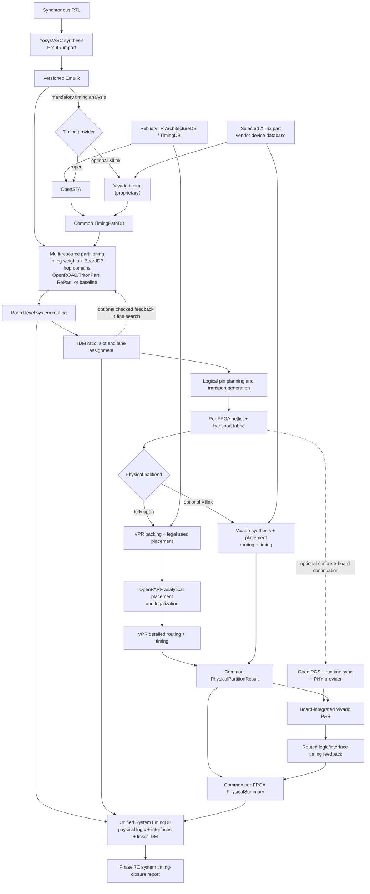

# EmuFlow

> [!IMPORTANT]
> ## Open-source source map
>
> Every selected open-flow engine is stored as editable source and built from
> this repository. This is the compact upstream-source index:
>
> - First-party EmuFlow:
>   [ZeayW/FGPA_emulation](https://github.com/ZeayW/FGPA_emulation)
>   under Apache-2.0
> - Synthesis: [Yosys](https://github.com/YosysHQ/yosys) and
>   [ABC](https://github.com/YosysHQ/abc), including
>   [cxxopts](https://github.com/jarro2783/cxxopts) and
>   [MiniSat](https://github.com/niklasso/minisat)
> - Timing and partitioning:
>   [OpenROAD](https://github.com/The-OpenROAD-Project/OpenROAD),
>   [OpenSTA](https://github.com/The-OpenROAD-Project/OpenSTA), and
>   [RePart](https://github.com/Welement-zyf/RePart), with OpenROAD's retained
>   [ABC](https://github.com/The-OpenROAD-Project/abc),
>   [FastRoute](https://github.com/The-OpenROAD-Project/OpenROAD/tree/master/src/grt/src/fastroute),
>   [Flute3](https://github.com/The-OpenROAD-Project/OpenROAD/tree/master/src/stt/src/flt),
>   [Munkres](https://github.com/The-OpenROAD-Project/OpenROAD/tree/master/src/ppl/src/munkres),
>   and [Material Design Icons](https://github.com/google/material-design-icons)
> - Placement: [OpenPARF](https://github.com/PKU-IDEA/OpenPARF)
> - Open serial PCS and CDC:
>   [Corundum/verilog-ethernet](https://github.com/corundum/corundum/tree/1ca0151b97af85aa5dd306d74b6bcec65904d2ce/fpga/lib/eth)
>   10GBASE-R PCS and Gray-pointer asynchronous FIFO, under MIT
> - Default open academic backend:
>   [VTR/VPR](https://github.com/verilog-to-routing/vtr-verilog-to-routing)
>   editable pack/place/route source plus the flagship heterogeneous XML,
>   pinned by commit and SHA-256; materialized dependencies are
>   [pugixml](https://github.com/zeux/pugixml),
>   [libsdcparse](https://github.com/verilog-to-routing/libsdcparse) and
>   [yaml-cpp](https://github.com/jbeder/yaml-cpp)
> - Architecture interchange:
>   [FPGA Interchange Schema](https://github.com/chipsalliance/fpga-interchange-schema),
>   [Cap'n Proto](https://github.com/capnproto/capnproto), and the required
>   [capnproto-java schema](https://github.com/capnproto/capnproto-java)
>   ([RapidWright](https://github.com/Xilinx/RapidWright) is an optional
>   DeviceResources producer, not an open EmuFlow engine, because its current
>   API-library dependency includes Xilinx-EULA-governed material)
> - Decision diagrams: [CUDD](https://github.com/ivmai/cudd)
> - OpenPARF bundled source:
>   [Ccache.cmake](https://github.com/TheLartians/Ccache.cmake),
>   [Blend2D](https://github.com/blend2d/blend2d),
>   [GoogleTest](https://github.com/google/googletest),
>   [LEMON](https://github.com/The-OpenROAD-Project/lemon-graph),
>   [pugixml](https://github.com/zeux/pugixml),
>   [pybind11](https://github.com/pybind/pybind11),
>   [rapidcsv](https://github.com/d99kris/rapidcsv), and
>   [yaml-cpp](https://github.com/jbeder/yaml-cpp)
> - Retained disabled OpenPARF router source:
>   [clipp](https://github.com/muellan/clipp),
>   [gdstk](https://github.com/heitzmann/gdstk),
>   [Qhull](https://github.com/qhull/qhull),
>   [Clipper](https://sourceforge.net/projects/polyclipping/), and
>   [Taskflow](https://github.com/taskflow/taskflow)
> - External build/runtime dependencies:
>   [CMake](https://github.com/Kitware/CMake),
>   [GNU Make](https://git.savannah.gnu.org/cgit/make.git),
>   [GCC](https://github.com/gcc-mirror/gcc) or
>   [LLVM/Clang](https://github.com/llvm/llvm-project),
>   [Python](https://github.com/python/cpython),
>   [Boost](https://github.com/boostorg/boost),
>   [Bison](https://git.savannah.gnu.org/cgit/bison.git),
>   [Flex](https://github.com/westes/flex),
>   [Tcl](https://github.com/tcltk/tcl),
>   [SWIG](https://github.com/swig/swig),
>   [Eigen](https://gitlab.com/libeigen/eigen),
>   [zlib](https://github.com/madler/zlib),
>   [spdlog](https://github.com/gabime/spdlog),
>   [LEMON](https://github.com/The-OpenROAD-Project/lemon-graph),
>   [OR-Tools](https://github.com/google/or-tools),
>   [PyTorch](https://github.com/pytorch/pytorch),
>   [NumPy](https://github.com/numpy/numpy),
>   [PyYAML](https://github.com/yaml/pyyaml),
>   [Hummingbird](https://github.com/microsoft/hummingbird),
>   [NetworkX](https://github.com/networkx/networkx), and
>   [tqdm](https://github.com/tqdm/tqdm)
> - RTL benchmarks:
>   [SERV](https://github.com/olofk/serv),
>   [PicoRV32](https://github.com/YosysHQ/picorv32),
>   [secworks AES](https://github.com/secworks/aes),
>   [Ibex](https://github.com/lowRISC/ibex),
>   [VTR/Koios](https://github.com/verilog-to-routing/vtr-verilog-to-routing),
>   [VeeR EH1](https://github.com/chipsalliance/Cores-VeeR-EH1), and
>   [NVDLA](https://github.com/nvdla/hw)
> - Public multi-FPGA benchmark specifications:
>   [ICCAD 2019 system-level FPGA routing with TDM](https://www.iccad-contest.org/2019/problems.html),
>   [2023 EDA Elite FPGA die-level system routing](https://eda.icisc.cn/file/cacheFile/4f769715b1704172935438d418702f80.pdf),
>   with cases 01--09 mirrored at a fixed revision in
>   [FPGA-Die-Routing](https://github.com/heyiWF/FPGA-Die-Routing/tree/1f05cfd366b9565eb604380f5feed38b25baaff7/TestCase20231027)
>   and case 10 fetched from the
>   [official 2023 contest archive](https://edaicisc.oss-cn-shanghai.aliyuncs.com/file/eventDocuments/sierxinsaishuju.zip)
>   linked by the
>   [official retrospective](https://cpipc.acge.org.cn/cw/contestPrevious/detail/2c9080158ee9c272018f229208b610a6/2c9080158f815e21018fba6202d92461?page=1)
>   (benchmark files only; participant source is not incorporated),
>   [2024 EDA Elite hypergraph partitioning with logic replication](https://edaoss.icisc.cn/file/cacheFile/2024/8/1/8e6b33de567b411d8b159b961ef117aa.pdf),
>   its fixed-commit public cases in
>   [RePart](https://github.com/Welement-zyf/RePart/tree/211a9d8fd526576387cad7ac6dd3531354aeb31c/testcase),
>   and the
>   [2025 EDA Elite reconfigurable multi-FPGA routing problem](https://edaoss.icisc.cn/file/cacheFile/2025/8/11/1e213a00cbd94e2b91e997740753cb60.pdf),
>   with its public cases 01--04 fetched from the MIT-licensed
>   [EDA-2025-git repository at a fixed commit](https://github.com/nsyw705/EDA-2025-git/tree/45315b739e6678bf04605aaa246285c768bc8e13/data_case)
>   using per-file SHA-256 verification (benchmark inputs only; participant
>   algorithms and the opaque checker binary are not incorporated)
> - Algorithm references (papers are provenance, not incorporated source):
>   Chen et al.,
>   [Timing-Aware Optimization of Die-Level Routing and TDM Assignment for
>   Multi-FPGA Systems](https://numbda.cs.tsinghua.edu.cn/papers/aspdac262.pdf),
>   ASP-DAC 2026, DOI
>   [10.1109/ASP-DAC66049.2026.11420825](https://doi.org/10.1109/ASP-DAC66049.2026.11420825)
> - Public hardware-architecture data:
>   the non-confidential
>   [Arm MPS4 technical reference manual](https://documentation-service.arm.com/static/669a306a43b8ec1e18652768)
>   for the three-board topology, ARC6/GTY links, connectors, and package pins,
>   plus AMD
>   [DS890](https://docs.amd.com/r/en-US/ds890-ultrascale-overview/Virtex-UltraScale-FPGA-Feature-Summary)
>   for XCVU13P resource capacity
> - Optional commercial serial-PHY recipe:
>   the in-tree Tcl is adapted from
>   the [verilog-ethernet VCU108 10G GTY recipe](https://github.com/alexforencich/verilog-ethernet/blob/77320a9471d19c7dd383914bc049e02d9f4f1ffb/example/VCU108/fpga_10g/ip/eth_xcvr_gt.tcl)
>   under MIT; the v3 adapter and recipe are visible source, while Vivado
>   generates vendor-controlled products
>   and therefore does not count as an open-flow implementation
> - CI:
>   [actions/checkout](https://github.com/actions/checkout) and
>   [actions/setup-python](https://github.com/actions/setup-python)
> - Optional proprietary provider (not bundled or open source):
>   [AMD Vivado](https://www.amd.com/en/products/software/adaptive-socs-and-fpgas/vivado.html)
>
> See the **[complete source, revision, and license inventory](OPEN_SOURCE_COMPONENTS.md)**
> for every nested component and dependency. The corresponding
> [machine-readable inventory](OPEN_SOURCE_COMPONENTS.json) is enforced by CI.

EmuFlow is a research-oriented, open multi-FPGA emulation flow. Its purpose is
to compile one synchronous RTL design into multiple FPGA implementations and a
deterministic communication fabric while keeping every stage inspectable,
replaceable, and independently verifiable.

The default research backend uses a fully public VTR academic architecture
model; no commercial board, FPGA database, or Vivado installation is required.
An optional Vivado provider implements the same timing and physical-result
contracts for a concrete Xilinx part. Vivado is proprietary, is not bundled,
and is never required by the default open path.

## Flow roadmap

The timing provider and physical backend are selected independently. Both
physical backends consume the same board-independent multi-FPGA result and
must produce the same provider-neutral result contracts.



Every physical main-path run now carries a complete `TimingPathDB` into
Phase 7C. Timing-driven Phase 3--5 optimization is enabled by default and uses
that database for partition weights, system routing, and TDM. An explicit
`--no-timing-driven` run retains the same timing analysis and final global
WNS/TNS contract, but selects timing-oblivious Phase 3--5 baselines and binds
the route to TimingPathDB only after route selection. On the fully
open route, the VTR architecture supplies public resource and delay data,
OpenSTA supplies pre-partition optimization timing, OpenPARF performs
placement, and VPR performs exact packing, detailed routing, and post-route
timing. VPR's SDC reader has a bounded internal time representation, so the
open adapter records the exact virtual-runtime period separately and caps only
its non-binding local fabric-to-DUT SDC relation below VPR's safe range. Final
system WNS/TNS is always reconstructed from the exact runtime and routed
endpoint data, never from that capped local SDC. On the Vivado route, Vivado
supplies device timing and physical
implementation for a concrete Xilinx part; Vivado itself and its device
database are not included in this repository. Phase 7C does not compare the
local OpenPARF/VPR or Vivado WNS values directly. It combines each scheduled
hop's routed TX/RX endpoint delays with the same concrete board route and TDM
schedule. Both physical backends additionally back-annotate continuous
original-STA endpoint chains through routed FPGA logic. TimingPathDB endpoint
identities let partition projection retain the actual sink of each multicast
member and discard local fanout of otherwise-global nets; provider inputs
without resolvable endpoints retain an explicit conservative per-partition
bound.
Phase 4 and Phase 5 project their cross-FPGA timing population from that
complete original TimingPathDB, so every original path that becomes
cross-partition is optimized and remains identifiable at Phase 7C. An
additional post-partition OpenSTA through-cut query is retained as diagnostic
coverage evidence for the selected cut nets; it is not substituted for the
complete original path population. The projected population seals its source
STA database by content hash rather than a producer-local path, so a validated
checkpoint remains usable after content-addressed import or relocation.
Directed extraction records a sealed
per-cut-net query certificate (driver count and queried/emitted path counts).
The validator independently reconstructs both reachability from sequential
timing startpoints and reachability to sequential data/setup endpoints from
EmuIR connectivity plus the selected timing-cell model. A net may be absent
only when OpenSTA reports zero paths and that independent graph proves there
is no reachable sequential data/setup endpoint. For reconvergent logic,
directed extraction queries each real structural startpoint/endpoint pair
instead of accepting only the globally worst sibling branch. A certificate is
emitted only when the point list returned by OpenSTA actually contains the
requested mapped EmuIR net; the exporter never inserts that net synthetically.
If OpenSTA declines to treat an internal cut-net driver as a timing startpoint
but the independent model proves that the net directly feeds a sequential
data/setup pin, directed extraction additionally queries that exact endpoint
and applies the same returned-point membership check. A queried path whose
launch net was omitted from OpenSTA's point list retains the uniquely bound
launch-net identity explicitly. A zero direct-endpoint result remains valid
only when the same graph proves there is no sequential startpoint for that
endpoint path. This fallback is restricted to structurally identified direct
timing endpoints; it does not
guess endpoint reachability, weaken the final per-net coverage check, or treat
arbitrary internal pins as timing starts. The physical
stage likewise keeps the complete database for same-FPGA and final set-hash
coverage, while using the
projected member identities for routed cross-FPGA logic-segment queries.
Both original-target-clock and virtual-runtime-clock system slack are
reported.

Local Phase 7 physical timing and Phase 7C answer different questions. The
former reports each implemented FPGA's endpoint-complete physical WNS/TNS
under local DUT/fabric constraints. Its minimum WNS and summed TNS are
per-FPGA physical aggregates, not the default whole-design timing result.
Phase 7C forms the exact union of every original TimingPathDB member. It uses
the selected post-route path when its atom-pin chain is unambiguous, otherwise
an explicitly labelled conservative endpoint-longest bound, and composes routed
logic, TDM, and board-link delays for members that cross FPGAs in the
pausible-clock system contract.  WNS/TNS over that complete, disjoint union are
the primary final QoR metrics. A valid end-to-end comparison also reports the
labelled per-FPGA diagnostics, but never substitutes them for global timing.

| Route | Current completion boundary |
| --- | --- |
| Common multi-FPGA frontend | Implemented through partitioning, system routing, TDM, logical pin planning, transport generation, per-FPGA splitting, and independent checks |
| Fully open physical route | Implemented through whole-design physical/TDM timing; historical PicoRV32 and 528,104-instance Koios GEMM A/B artifacts prove all-original-path population coverage but predate the local launch-Tco repair, while the corrected Koios DLA gate now validates the repaired complete-path model on an independent design |
| Vivado physical route | Implemented for routed DUT logic segments and stable RAMB endpoint recovery; its former large Koios evidence is likewise a cross-FPGA subset until same-FPGA original-path timing is exported |
| Bitstream and board bring-up | Outside the current completion gate; requires a concrete board support package |

The flow is board-abstracted. Synthesis, partitioning, routing, TDM, logical
pin assignment, and virtual-platform physical validation can run before a
board is selected. Package-pin binding, board clocks, shell integration,
bitstream generation, and hardware bring-up require a concrete board support
package.

## Why EmuFlow

Commercial prototyping tools tightly couple their intermediate formats and
optimization engines. EmuFlow instead uses versioned artifacts and independent
checkers between stages. This makes it possible to:

- study partitioning, system routing, TDM, pin assignment, and placement as
  separate optimization problems;
- compare academic algorithms without changing the rest of the flow;
- reproduce quality-of-result experiments on real RTL designs;
- validate feasibility and semantics independently of the optimizer that
  produced a result; and
- add a board later without rebuilding the board-independent frontend.

## Current scope

The current semantic model supports a single virtual DUT clock, synchronous
reset, deterministic static communication schedules, and lockstep execution
with a global frame barrier. The safe default restricts partition cuts to
sequential boundaries; combinational loops and hard macros remain atomic. An
opt-in static-exact V1 path can release a conservative mapped-LUT subset only
after binding its dependency schedule, macro-cycle equivalence, and routed
segment deadlines. It rejects zero-clock, multi-clock, generated-clock, and
general CDC designs before releasing exact cuts. Without that opt-in contract,
a large combinational connected component remains one indivisible partition
vertex. The reports expose any balance relaxation needed to place such a
vertex; a run with relaxed balance is a legal capacity/topology result, not
evidence of high-quality balanced partitioning. Static-exact mode is a staged
semantic contract, not a partitioner tuning flag.
The characterization increment is deliberately read-only:

```bash
emuflow combinational-cut characterize \
  --ir build/phase1/design.emuir.json \
  --output build/comb-cut/characterization.json
emuflow combinational-cut validate \
  --ir build/phase1/design.emuir.json \
  build/comb-cut/characterization.json
```

It independently reconstructs combinational SCCs, a conservative
single-driver LUT-only potential-cut set, complete potential-cut dependencies,
depth-1/depth-2 distributions, and theoretical atomic-component reductions.
Graph construction uses indexed instance membership rather than repeated
linear scans; a regression guard prevents sparse large-netlist
characterization from falling back to quadratic membership work. Canonical
EmuIR identity is hashed from the deterministic JSON token stream instead of
materializing a second pretty-printed copy of the complete design in memory.
Its qualification is explicitly
`analysis-only-no-partition-or-equivalence-claim`: it does not change Phase 3
output or any default provider. An explicit Phase 3 depth-1 or depth-2
experiment can release only independently eligible LUT nets and emit a
provisional semantic contract:

```bash
emuflow phase3 \
  --ir build/phase1/design.emuir.json \
  --platform platforms/virtual/xcvu3p_2fpga_p2p.json \
  --provider greedy \
  --cut-mode static-exact-combinational \
  --max-cross-fpga-dependency-depth 1 \
  --comb-segment-budget-slots 1 \
  --out build/phase3-exact
```

That opt-in Phase 3 artifact is qualified only as
`partition-legality-only-provisional`. Phase 4 can now propagate the contract
through the timing-oblivious native router, and Phase 5 can produce and
independently reconstruct a deterministic dependency-aware schedule with
path-local source-ready and final-capture certificates.  A reconvergent TX
source retains every transported predecessor and any local architectural
register, memory, or primary-input launch as separate timing branches; the TX
is ready only after all applicable branches are ready:

```bash
emuflow phase4 \
  --assignment build/phase3-exact/assignment.json \
  --platform platforms/virtual/xcvu3p_2fpga_p2p.json \
  --provider native-load-balanced-v1 \
  --out build/phase4-exact
emuflow phase5 \
  --routes build/phase4-exact/routes.json \
  --platform platforms/virtual/xcvu3p_2fpga_p2p.json \
  --out build/phase5-exact
```

Those gates are qualified as `route-contract-propagation-pass` and
`dependency-schedule-readiness-pass`; neither is a functional-equivalence or
physical-timing claim. Phase 6 now materializes preserved TX/RX boundary
identities, rejects hidden cross-FPGA bypasses, and validates each exact
schedule with three event-driven macro-cycle traces. Small models additionally
enumerate every architectural state and non-reset primary input for one
macro-step. The report distinguishes randomized validation from exhaustive
small-model proof. Canonical Experiment v2 publication performs one independent
Phase 6 replay after generation; downstream lookahead and Phase 7 nodes reuse
that evidence only from an immutable byte-sealed checkpoint carrying a valid
independent-validation certificate, instead of repeating the same replay for
each physical seed. Unsealed standalone inputs remain full-replay by default.
Phase 7C now independently reconstructs every exact
segment's routed settle window and refuses missing evidence or a late
source/capture even when aggregate virtual-runtime slack is positive. This is
sealed by the checked-in
`schemas/static-exact-segment-deadlines-v1.schema.json` report contract. This is
not limited to the representative paths retained by the original STA export:
the physical query set also walks each cut-net fan-in cone, measures every
local primary-input/state launch, every transported RX-to-TX dependency, and
every final RX-to-capture requirement. Incoming cut nets are explicit cone
stop points, so parallel and reconvergent semantic branches cannot inherit the
timing evidence of an unrelated representative path. A constant cone with no
timed launch remains explicitly incomplete rather than being assigned a
fabricated zero delay. The stop rule is directional per FPGA: a net that
originates locally and is also transported to another FPGA remains an ordinary
local fan-in on its source FPGA; only a transported net entering the current
FPGA stops the local launch-cone walk. This prevents a locally originated
register or memory launch from disappearing merely because another partition
also consumes that net. This is
also reflected at the one-command CLI boundary: exact mode defaults slot
refinement to zero, while an explicit nonzero request remains fail-closed until
that optimizer is dependency-qualified. This is
implemented qualification machinery. Small real-RTL physical acceptance
exercises the exact-cut path. A scalable open-physical acceptance now also
exists on the naturally connected DLA design and a four-FPGA academic
BoardDB: the unconstrained partition selected five real combinational cuts
among 6,069 transported cuts, and the independent Phase 7 replay covered all
157,811 exact source/capture segments with endpoint-exact routed evidence,
zero missing segments, and zero failed segment deadlines. The same replay
covered all 195,532 original timing paths exactly once and reported
whole-design target-clock WNS/TNS of -181.086692873 ns and
-681,968.5909773472 ns, with 8,700 negative paths; virtual-runtime WNS/TNS
were 14,566,048.913307127 ns and 0 ns. These numbers prove complete timing
accounting and the static-exact causal deadlines, not 10 ns target-clock
closure or a QoR improvement over sequential-only mode.

Canonical Experiment v2 defaults the static-exact combinational-cut threshold
to zero. This permits a real design to complete the full flow when the legal
partition happens to use only sequential boundaries; it must be reported as
static-exact compatible, not as an exercised combinational-cut result. Set
`--minimum-combinational-cut-nets 1` only for an explicit exercise contract.
The checked-in `static_exact_acceptance` RTL and
`static_exact_acceptance_2fpga` BoardDB are the deliberately capacity-limited
functional/physical fixture for that gate; they are not a QoR benchmark and
must not be mixed into benchmark-comparison tables.

The production-wide default is generalized Static Exact v2
(`assignment-derived-acyclic-v2`) with PATRON, a dependency-depth safety cap of
eight, and path beta zero. PATRON's endpoint-exact objective derives its
transported classes from this cluster policy, so combinational candidates are
modeled rather than discarded as non-sequential traffic. The physical-feedback
PATRON refinement remains opt-in because it requires a prior physical timing
artifact. Unlike the
legacy `potential-frontier-depth-v1` policy, v2 does not confuse a net's depth
in the graph of *possible* boundaries with its depth after the partitioner has
selected actual transported boundaries.  It releases every structurally legal
candidate, rebuilds the selected dependency DAG from the final assignment,
and supports any positive configured depth.  Phase 3 rejects an assignment if
that selected DAG is cyclic, exceeds the configured safety cap, has no board
path, or cannot meet the virtual-frame commit even under an uncongested
minimum-latency lower bound.  TritonPart seed selection includes this
certificate and uses timing-weighted cut cost, lower-bound capture slack,
selected depth, and cut count as deterministic ranking evidence.  Phase 4 and
the exact Phase 5 list scheduler then bind the concrete routes, link latency,
lane capacity, relay readiness, and capture deadline; Phase 6/7 retain the same
macro-cycle-equivalence and routed physical-segment gates.

The legacy policy remains readable for controlled A/B comparison, but it is
never inferred from omitted arguments. A legacy rerun must explicitly select
`--static-exact-candidate-policy potential-frontier-depth-v1`, a depth of one
or two, and any other noncurrent objective parameters. In that
three-arm comparison, the positive `--minimum-combinational-cut-nets` exercise
gate applies to generalized v2 only. Legacy v1 runs the complete Phase 1--7
chain with a zero minimum: if its potential-frontier filter selects no real
combinational boundary, the final certificate labels it a
`vacuous-negative-control` rather than failing the experiment or claiming that
Static Exact was exercised. The sequential arm must still contain zero
combinational cuts, while generalized v2 must satisfy the requested positive
minimum. Promotion of v2 to the production default additionally requires a
canonical real-RTL, contest-BoardDB Phase 1--7 comparison against
`sequential-only` and legacy v1,
with one physical seed by default and final whole-design target-clock WNS/TNS,
virtual frequency, resource, runtime, and exact-cut evidence.  Small exhaustive
tests establish semantics but are not QoR evidence.

The three policies have different assignments, routes, and schedules, so the
ordinary Phase 6 provider comparator is intentionally not used for this gate.
Compile one content-addressed DAG that shares only the byte-identical frontend
and TimingPathDB, forks at Phase 3, and terminates in a dedicated cross-policy
certificate.  The comparison uses one explicit Phase 3 seed for every arm;
it never lets each policy search a multi-seed portfolio and then compares
unrelated winners.  Physical seed remains a separate paired axis.  For the
canonical case6 exercise, seed 4 is the sealed controlled seed used by the
completed three-arm comparison; it releases a non-vacuous generalized
boundary while every arm still receives exactly one partition attempt:

```bash
emuflow benchmark-static-exact-ab-compile \
  --config "$CANONICAL_CASE_CONFIG" --repository-root "$SOURCE" \
  --legacy-max-depth 2 --generalized-max-depth 8 \
  --partition-seed 4 \
  --minimum-combinational-cut-nets 1 \
  --out "$EXPERIMENT/static-exact-ab-spec.json"
```

The final DAG node is equivalent to this explicit checkpoint command:

```bash
emuflow experiment-stage static-exact-qor-compare-run \
  --platform "$PLATFORM" \
  --arm sequential-only 1 "$SEQ_SHARED" "$SEQ_LOOKAHEAD" "$SEQ_PHASE6" "$SEQ_PHASE7" \
  --arm legacy-static-exact-v1 1 "$V1_SHARED" "$V1_LOOKAHEAD" "$V1_PHASE6" "$V1_PHASE7" \
  --arm generalized-static-exact-v2 1 "$V2_SHARED" "$V2_LOOKAHEAD" "$V2_PHASE6" "$V2_PHASE7" \
  --out "$EVIDENCE/static-exact-qor"
```

The compiler removes the unrelated placement-aware/Chimew Phase 6 arms from
the sequential branch, so only three physical terminals are run per requested
seed.  The independent replay requires byte-identical EmuIR, complete TimingPathDB,
partition weights, BoardDB, constraints, timing model, and physical channel
width across all arms.  It also replays each partition report and requires
`seed_attempts == 1`, requested seed equal to selected seed, and the same
selected partition seed across all arms.  A comparison with different selected
partition seeds fails closed and cannot provide promotion evidence.  It
permits only the intended Phase 3--6 differences,
revalidates each complete Phase 7 chain, reports whole-design target/runtime
WNS and TNS, per-FPGA diagnostics, virtual frequency, transport/physical cell
counts, cut count, scheduled bit-hops, frame size, completion slot, and sealed
wall-clock times for Phase 3--7 and the physical lookahead/Phase 7 pair.  Node
wall time is stored in the immutable checkpoint manifest rather than mutable
farm state, so the final bundle can replay the runtime comparison without the
original attempt directories.  Historical imported checkpoints without this
field remain readable but cannot supply runtime evidence. The checker refuses
default promotion if the generalized arm is vacuous or its target-clock WNS/TNS
result is not improved. A vacuous legacy arm remains an honest compatibility
negative control and is never presented as exercised Static Exact evidence.

The completed controlled DLA + EDA 2023 case6 experiment gives the following
single-physical-seed result. These are whole-original-design target-clock
metrics after complete open Phase 7/7C, not per-FPGA timing summaries:

| cut policy | real combinational cuts | maximum dependency depth | global WNS (ns) | global TNS (ns) | failing paths | completion slot |
|---|---:|---:|---:|---:|---:|---:|
| sequential-only | 0 | 0 | -84.5812926868 | -277276.1497366623 | 7360 | 8 |
| legacy Static Exact v1 | 0 | 0 | -87.4214476040 | -488195.76014116284 | 8162 | 6 |
| generalized Static Exact v2 | 102 | 3 | -187.85581036 | -548934.0510065886 | 9310 | 15 |

All three arms routed with zero DRC violations, zero unrouted nets, and zero
per-FPGA physical TNS. Generalized v2 nevertheless increased the WNS deficit
by 122.10% and the TNS deficit by 97.97% relative to sequential-only, while
adding 2,717 scheduled bit-hops and 7,383 transport cells. The result proves
that generalized dependency handling, shadow transport, macro-cycle
equivalence, and routed segment deadlines work on real depth-three cuts; it
also proves that this candidate selection is not a timing-QoR improvement on
the canonical case. That unguarded generalized configuration was therefore
not promoted. The later guarded model described below passed the physical
comparison and is the generalized policy now selected by default. The current
PATRON combination is a distinct implementation choice; this historical table
must not be read as a new PATRON-plus-Static-Exact QoR claim.

The earlier guarded follow-up cost model kept TritonPart as the partition
provider and applied one optional, direction-aware MFSPart FM post-refinement to its
sealed assignment. It reconstructs driver/sink identity from EmuIR (never from
TritonPart's undirected hypergraph) and combines aggregate
cut/connectivity/hop gain with a class-weighted worst-sink-hop term. In Static
Exact mode, every initially transported non-combinational net receives an
immutable worst-sink-distance non-regression guard. Combinational candidates
remain movable and pay their ordinary timing-weighted cut/connectivity/hop
cost, but are not rejected merely because they were local in the TritonPart
assignment. The guard is checked by both the native optimizer and the
independent certificate checker. Sequential-only mode retains the legacy
objective. The checkpoint identity seals the weight, guard evidence, and the
complete native certificate; reuse re-executes the independent C++
global-best/best-prefix checker without writable scratch.
Use `--mfspart-post-refinement`,
`--mfspart-post-refinement-early-stop`, and
`--mfspart-post-refinement-bottleneck-beta` on the reusable Phase 3 stage for
controlled studies. A frozen 367,129-cluster diagnostic passed the native
checker and kept the previously identified worst-path driver on its nearer
FPGA at weights 192 and 256 while still reducing aggregate cut and weighted
hop cost. A controlled 62-move prefix then completed full Phase 7/7C with
global WNS/TNS of -84.913220755 ns / -159994.95141046078 ns and 4,218 failing
paths, versus -84.5812926868 ns / -277276.1497366623 ns and 7,360 paths for
sequential-only. Thus the prefix preserved a 42.30% TNS-deficit reduction
while reducing the earlier full-prefix WNS regression from 1.054 ns to 0.332
ns. This is useful cost-model evidence, but it is not a default-promotion
result because the prefix was selected diagnostically rather than by the
sealed automatic Phase 3 policy. The guarded class-weighted policy is the
automatic successor under validation.

The next cost-model revision adds a path-level objective to that guarded FM
step. Net weights alone add the cost of every crossed net and therefore do not
model the Boolean question that determines whole-path timing: whether an
original timing path crosses *any* FPGA boundary. In refiner input v4, each
original TimingPathDB path is mapped to the ordered net-driver clusters plus
its structured launch/capture clusters; paths with the same cluster set are
aggregated by count. The FM gain charges each distinct path once while it is
split and removes that charge only when all of its clusters become local. It
deliberately does not add every sink of every high-fanout net, which would turn
an ordered timing path into unrelated fanout branches and inflate the
objective. `--mfspart-post-refinement-timing-path-beta` controls this term
(default `0.0`; nonzero values are explicit research options). Direct Static
Exact flows using TritonPart enable the guarded
post-refinement and bind it to the generated TimingPathDB; non-Static-Exact
flows retain the prior behavior.

The native optimizer and its independent checker maintain per-path part
counts and verify every selected move, raw gain, stable rank, capacity/fixed
constraints, global-best choice, best prefix, and final assignment. The
checkpoint validator separately rematerializes the compressed objective from
the sealed EmuIR, clusters, and original TimingPathDB and compares the exact
PATH-record digest, group count, and pin count. Small exhaustive and full
repository tests pass. Canonical DLA + EDA 2023 case6 screening is now complete
at partition seed 4 and physical seed 1 with eight physical workers. Both the
path-objective-disabled control and the `beta=1.0` candidate selected two real
combinational cuts with maximum dependency depth two, routed with zero DRC
violations and zero unrouted nets, and covered the same 195,532 original timing
paths. Their complete Phase 7/7C global result was identical: WNS
-83.890257153 ns, TNS -189,339.41826577744 ns, and 5,069 negative paths. The
path-level term changed the partition assignment but not the routed Phase 4/5
schedule, Phase 6 split, or final timing QoR on this case, so it provides no
incremental promotion evidence and remains a research option.

The guarded automatic generalized policy itself is nevertheless better than
the register-only control on this canonical run. Relative to register-only WNS
-84.5812926868 ns, TNS -277,276.1497366623 ns, and 7,360 negative paths, it
improves WNS by 0.6910355338 ns, reduces the TNS deficit by
87,936.73147088484 ns (31.71%), and removes 2,291 negative paths. This evidence
supports the guarded cost model, not the additional path-level beta term; a
nonzero path beta therefore remains optional. The same-input,
same-partition-seed, same-physical-seed result promotes this guarded
generalized configuration. It is now the default cut policy; explicit
`--cut-mode sequential-only` remains the register-boundary comparison arm.

An audit of the identical sealed EmuIR explains why the accepted guarded run
uses only two real combinational cuts. The 379,357-instance design contains
73,767 combinational nets. Sequential-only forms 246,387 clusters with a
724-instance maximum; legacy v1 releases 16,251 combinational candidates and
forms 304,300 clusters with a 154-instance maximum; generalized v2 releases
49,695 candidates and forms 367,129 clusters with a 52-instance maximum. V2
therefore removes candidate-space and large-atomic-cluster bias. Selecting two
cuts from that enlarged space is the guarded objective's QoR decision, not a
remaining eligibility shortage; the flow never forces additional cuts merely
to increase an activity count. The full distribution and interpretation are
documented in `docs/STATIC_EXACT_COMBINATIONAL_CUT.md`.

The managed shared-Phase-1--5 view intentionally contains only consumer
artifacts, not duplicate timing/partition evidence reports.  For that layout,
the comparator follows the immutable shared checkpoint's dependency keys back
to the original validated timing and partition checkpoints and rechecks their
full reports, while separately rehashing every consumer artifact against the
shared report.  Dependency lookup is by the sealed checkpoint stage, not by an
experiment-local node label such as `seq-partition` or `v2-partition`, and it
fails closed unless exactly one dependency provides each required stage.  An
unmanaged historical view with neither evidence reports nor
managed dependency metadata is accepted only at the explicitly lower
`managed-shared-v1-core-source-seal` qualification and cannot satisfy a
canonical default-promotion claim.
`--reuse-validated-phase6-equivalence` is
allowed only for immutable managed checkpoints carrying an independent
validation certificate; standalone roots receive full replay.

```bash
emuflow phase6 \
  --ir build/phase1/design.emuir.json \
  --assignment build/phase3-exact/assignment.json \
  --schedule build/phase5-exact/schedule.json \
  --platform platforms/virtual/xcvu3p_2fpga_p2p.json \
  --out build/phase6-exact
```

The same path is wired through the one-command flow. Exact mode currently
requires the native route tree with post-route timing annotation, the dedicated
dependency scheduler, a fixed frame, and no unqualified ratio/slot optimizer:

```bash
emuflow multi-fpga compile design.v \
  --top top --clock clk --clock-period clk=10 \
  --platform platforms/virtual/xcvu3p_2fpga_p2p.json \
  --cut-mode static-exact-combinational \
  --max-cross-fpga-dependency-depth 1 \
  --comb-segment-budget-slots 1 \
  --frame-slots 32 --physical --out build/exact-flow

emuflow multi-fpga validate \
  --flow build/exact-flow \
  --minimum-combinational-cut-nets 1 \
  --require-physical
```
The validator rehashes every declared flow artifact, compares the live Phase
3--6 reports with the sealed top-level report, independently reruns Phase 3--6
legality/equivalence checks, reconstructs the runtime contract, replays Phase
7C QoR, and rejects a physical acceptance claim when Phase 7 is absent.  It is
the read-only validator for a monolithic full-flow Experiment v2 checkpoint;
the minimum-cut gate prevents a vacuous exact-mode result.
The shared slot-edge convention, semantic contract, fail-closed policy, and
Phase 3--7 acceptance sequence are specified in
[Static exact combinational-cut mode](docs/STATIC_EXACT_COMBINATIONAL_CUT.md).
The production default is generalized Static Exact v2 plus PATRON. Static
Exact remains fail-closed outside its declared single-clock, synchronous-reset,
deterministic-schedule envelope; selecting it by default does not broaden that
semantic scope. Legacy Static Exact v1 and sequential-only remain explicit
comparison policies.
Static-exact physical evidence preserves each reached state-capture input pin
and bit through lowering; a VTR query rejects an endpoint that is absent from
the emitted primitive contract before physical routing begins.
For Xilinx-mapped flip-flops, `FDRE.R` and `FDSE.S` are synchronous controls
and are therefore legal second-round `register_input` transport boundaries,
just like `D` and `CE`. `FDCE.CLR` and `FDPE.PRE` remain asynchronous and are
never reclassified as transport-safe boundaries. This distinction prevents a
high-fanout synthesized synchronous reset or set from incorrectly gluing an
otherwise partitionable design into one combinational atomic component.

| Stage | Implementation source | Honest integration status |
| --- | --- | --- |
| Architecture database | In-tree C++ VTR XML importer; optional FPGA Interchange C++ importer | The default open VTR path imports layout, heterogeneous primitive capacity, primitive/interconnect arcs, switches, segments, and directs into provider-neutral ArchitectureDB/TimingDB artifacts; VPR consumes the original XML for exact mode-aware packing |
| Synthesis/import | In-tree Yosys/ABC plus EmuIR importer | The public VTR flagship profile maps LUT6/DFF logic, 9/18/36-bit multiplier modes, and inferred synchronous single/dual-port RAM modes from repository source; the importer distinguishes synchronous FDRE/FDSE controls from asynchronous FDCE/FDPE controls when classifying legal transport cuts |
| Static timing | In-tree standalone OpenSTA or optional external Vivado | Both emit the same `sta-path-database/v1` artifact. OpenSTA consumes the public Architecture TimingDB, retains bounded alternate endpoint paths, and can query explicitly selected cut nets; Vivado uses the selected Xilinx part database |
| Partitioning | In-tree OpenROAD/TritonPart and RePart | Default providers build and run repository source |
| System routing | In-tree C++17 hybrid topology kernel plus independent checker and exact small-instance oracle | The academic provider evaluates shortest-path, DAC 2025-informed delay-demand-balanced, directed metric-closure, nearest-terminal Steiner, shallow-light, and adaptive-hop multicast trees, then applies checked batch-conflict timing-path rerouting. It exports the complete checked pool and selected refined tree for each demand. Hard SLL saturation is enforced during search; scaled utilization pressure balances scarce inter-die links |
| TDM | Selectable in-tree C++17 path-Lagrangian or ASP-DAC 2026 timing-DAG continuous optimizer, TODAES 2020 displacement DP, deterministic concrete-slot LNS, optional medium-case OR-Tools CP-SAT oracle, and independent checkers | The timing-DAG provider implements arrival propagation (Eq. 8), KKT ratio/domain-dual updates (Eqs. 13/19), delay-cost multiplier flow (Eqs. 16/17), path-dual normalization (Eq. 15), and residual scaling (Eq. 20). Both continuous providers share the same checked discrete legalization and concrete scheduling contracts; CP-SAT is an optional validation extra rather than a production dependency |
| Netlist/transport | In-tree generator, RTL, simulator, and checker | Working source implementation |
| Pin planning | In-tree C++17 grouping; sparse min-cost-flow for parallel I/O; fixed differential binding for serial BoardDB endpoints | Parallel-I/O optimization is validated with a synthetic BSP. The source-backed MPS4 model binds documented J48/J49 GTY package pins; the optional Vivado device-DB adapter derives and independently checks their exact GTYE4 channel sites without claiming missing reference-clock/reset package bindings |
| Placement | Root-built OpenPARF or optional external Vivado | The open provider runs VPR packing followed by OpenPARF analytical placement/legalization; the Vivado provider runs vendor placement for a concrete Xilinx part |
| FPGA routing/timing | Root-built VTR/VPR or optional external Vivado | Both providers must pass the common cell-accounting, zero-unrouted-net, zero-DRC, clock, and timing-result contract before Phase 7C; the open route additionally exports and independently checks endpoint-complete WNS, TNS, and failing-endpoint counts. Phase 6 boundary IDs key exact routed TX source-to-port and RX port-to-shadow-register delays returned by either provider |
| Proprietary provider | First-party adapters/Tcl plus external Vivado | Selectable but not source-complete; produces vendor-device implementation results, not board/bitstream sign-off |
| Hardware BSP | In-tree open PCS/runtime-sync RTL plus source-backed Arm MPS4 topology/pin inventory | Phase 6C derives channel/common quad topology and binds the open PCS to source-visible GTY recipes; the optional Vivado gate jointly routes DUT, TDM, PCS, sync, and GT, then feeds routed FPGA logic/boundary timing back into Phase 7C. Real refclk/reset binding, measured board-link/elastic-buffer latency, bitstream, and hardware qualification remain open gates |

`emuflow multi-fpga compile` is the board-independent multi-FPGA integration
gate. Its default public VTR mapping preserves multiplier and synchronous
single/dual-port RAM hard blocks while mapping remaining logic to LUT6/FF. It
then binds EmuIR import, partitioning, system routing, TDM scheduling,
per-FPGA splitting, transport generation, independent checks, and
cycle-equivalence in one report.

The default flow uses
`--route-provider timing-aware-global-candidate-v1`, the checked multi-tree
global Phase 4 provider, and the ASP-DAC 2026 timing-DAG Phase 5 provider.
The historical `timing-aware-route-tdm-cooptimized-v1` and path-Lagrangian
providers remain selectable as explicit rollback and A/B baselines. Use
`--route-candidate-workers N` to parallelize its deterministic candidate
generation. These options propagate through direct, minimum-frame, and
cross-stage Phase 3--5 execution, so a complete Phase 7 WNS/TNS experiment
cannot silently fall back to the historical routing provider.

After both physical arms finish, the in-tree comparison gate independently
rehashes and validates both complete flows, requires identical EmuIR,
assignment, TimingPathDB, and partition weights, checks the frozen provider
pair, and reconstructs whole-design Phase 7 WNS/TNS and closure deltas.  The
default WNS/TNS terminology means the exact population union of every original
TimingPathDB path: routed same-FPGA paths plus routed intra-FPGA/boundary
stages and concrete Phase 5 slot wait/board-link delay for cross-FPGA paths.
Optimizer-compressed representatives are expanded before global TNS is
summed. Each result separately reports whether its physical logic delay is an
exact selected-chain sum or a conservative cone bound; population completeness
must never be presented as physical-delay exactness. Per-FPGA backend WNS/TNS
and cross-FPGA-only WNS/TNS remain separately
labelled diagnostic/subset data and are not the default global result:

```bash
emuflow multi-fpga compare-routing-tdm \
  --baseline build/routing-tdm-baseline \
  --upgrade build/routing-tdm-upgrade \
  --output build/routing-tdm-comparison.json
```

The report is labelled
`complete-phase7-whole-design-timing-source-bound-ab` and requires exact,
disjoint coverage of 100% of original local and cross-FPGA paths. Its timing
certificate is byte-bound to the arm's actual EmuIR, assignment, routes, and
TimingPathDB; the A/B gate independently rehashes and cross-checks all four. A Phase
4/5-only run, mixed
upstream artifacts, a changed flow report, incomplete TimingPathDB member
coverage, or either arm with an unrouted net/DRC violation is rejected rather
than reported as QoR evidence.

An earlier frozen connected-PicoRV32 acceptance run completed both physical arms on
4 FPGAs and 67,674 instances, with zero unrouted nets, zero DRC violations,
and zero cycle-equivalence mismatches. It covered 24 selected cross-FPGA paths
but did not include the same-FPGA TimingPathDB population. Its historical
baseline cross-FPGA-subset WNS/TNS was `-83.052828595 ns` /
`-1268.355281124 ns`; the global-candidate routing plus timing-DAG TDM path produced
`-83.055118320 ns` / `-1275.5335078091 ns`. Thus subset WNS regressed by
`0.002289725 ns` and subset TNS regressed by `7.1782266851 ns`.
Runtime-clock subset WNS changed from `546.947171405 ns` to
`546.944881680 ns`, and both subset TNS values were zero. The candidate's
per-FPGA physical WNS diagnostic improved
from `18.16787 ns` to `18.31778 ns`, which demonstrates why that local metric
must not substitute for whole-design timing. These historical subset numbers
are retained as integration evidence but are explicitly superseded as final
QoR; they cannot support a default-provider promotion.

If an external physical tool environment is repaired after Phase 1--6 has
already passed, the checked resume gate seals that independently completed
physical directory and reruns Phase 7C without repeating earlier optimization:

```bash
emuflow multi-fpga finalize-physical \
  --flow build/routing-tdm-upgrade \
  --physical build/routing-tdm-upgrade/physical-resumed
```

The standalone physical command also accepts `--resume`. It reuses a completed
VPR pack/place checkpoint only after independently checking the architecture
and circuit hashes, seed, exact packed-netlist and placement paths, byte counts,
artifact hashes, reconstructed log metrics, and the VPR success marker. It then
continues with OpenPARF placement and checked VPR detailed routing. A partial,
mixed-run, or modified checkpoint is rejected instead of being silently reused.

For public instances too large for a complete physical run, the scale gate
independently reconstructs both Phase 4 route legality/timing and Phase 5
ratio/slot legality against one byte-identical assignment, platform, and
TimingPathDB. It reports algorithmic scale evidence, never Phase 7 QoR:

```bash
emuflow multi-fpga compare-routing-tdm-scale \
  --assignment imported/assignment.json --platform imported/platform.json \
  --route-constraints imported/route-constraints.json \
  --timing-paths imported/timing-paths.json \
  --baseline-route baseline-route --baseline-tdm baseline-tdm \
  --upgrade-route upgrade-route --upgrade-tdm upgrade-tdm \
  --baseline-runtime-seconds 123.4 --upgrade-runtime-seconds 98.7 \
  --output routing-tdm-scale-comparison.json
```

The v2 scale report additionally seals the normalized route constraints and
the academic ratio plan, records independently reconstructed compact
routing/TDM timing, load, frame, collision, and bit-hop metrics, and recomputes
every candidate-minus-baseline delta.  Runtime is the measured combined Phase
4/5 wall time supplied by the sealed orchestrator.  These metrics remain
communication-graph algorithm evidence, not physical Phase 7 WNS/TNS.

The stable Phase 6 default is `--phase6-provider baseline`, which preserves
the checked static split/lane behavior. Chimew remains an explicit research
path: `--phase6-provider chimew` selects it directly, while an explicit
`--phase6-provider auto` selects it only for an open physical run with at
least one scheduled inter-FPGA signal. That path runs a frozen baseline
physical prepass, derives byte-bound Chimew lookahead inputs from the resulting
VPR/OpenPARF artifacts, and emits `phase6-comparison/comparison-report.json`.
It seals the common EmuIR, assignment, routes, schedule, and BoardDB hashes and
reports baseline-versus-Chimew pin metrics, wirelength, critical path,
per-FPGA and aggregate WNS/TNS, failing endpoints, closure, and runtime. A
compile without open physical lookahead retains the baseline because it cannot
honestly invent placement evidence.

The academic adapter divides normalized OpenPARF placement into explicit
virtual regions for the Chimew crossing encoding and synthesizes a virtual
single-ended package-pin inventory from BoardDB lane capacity. These inputs
are labelled `academic-virtual-physical-model`: they validate the algorithm
and its integration, not real SLR/SLL routing or BSP electrical closure. Raw
physical-site coordinates still drive position refinement, RUDY, and the
two-stage distance objective. Real hardware qualification continues to
require revision-controlled device regions and package/electrical data.
When a timing-critical Phase-5 lane is guarded, the adapter keeps every
existing mux member together as one fixed Phase-6 electrical group, even if
the paper-defined position refiner assigned those members separate group IDs.
The original refinement artifact is retained and hash-bound; this lane
coalescing is explicitly reported as an EmuFlow timing-preservation extension,
not attributed to Chimew.

### Phase 6 provider promotion and Phase 7 timing acceptance

A Phase 6 legality check, pin-plan comparison, or contest-scale result is an
intermediate milestone, not a final QoR result. Promoting a Phase 6 provider
requires a frozen baseline/candidate A/B on real synthesizable RTL, with both
canonical splits continuing through the complete physical Phase 7 flow under
identical architecture, constraints, seed, and backend settings. Both arms
must retain zero unrouted nets, zero DRC violations, complete cell accounting,
and independently valid timing reports.

The required comparison contains labelled per-FPGA physical WNS/TNS, global
WNS (the minimum composed original-path slack), global TNS (the sum of negative
composed original-path slack without compression or double counting), failing
paths/endpoints, coverage, critical path, runtime, and absolute
baseline-to-candidate deltas. Percentage improvement is negative-slack deficit
reduction: for a negative baseline, compare the reduction in `-WNS` or `-TNS`;
if the baseline already closes, the percentage is `N/A` and a closure
transition is reported separately. Phase 6 crossing, grouping, RUDY, position,
wirelength, and pin-distance metrics remain diagnostic explanations.
The versioned `emuflow.system-route-tdm-ab/v6` comparison artifact records
those percentages and closure transitions for target-clock and virtual-runtime
global WNS/TNS, and independently recomputes them when the bundle is validated;
signed slack values are never divided to manufacture a percentage. It also
seals exact selected-chain, conservative cone-bound, and unmeasured fallback
path counts, requires those populations to match across both arms, and rejects
a conservative physical model mislabeled as exact. The same
gate now also freezes the normalized BoardDB, Phase-3 and Phase-4 constraints,
and compares the Phase-7 backend descriptor, architecture SHA-256, FPGA order,
worker configuration, VPR pack/place seed, route channel width, and hashes of
the external executables recorded by the physical reports.  Newly generated
top-level flow reports seal those inputs directly.  A pre-v5 flow can still be
compared only when its formerly unlisted BoardDB and normalized constraints
are present at their canonical checked locations below the flow root; this
keeps already-running physical jobs usable without weakening the v6 evidence.

The open VPR route now provides this endpoint-complete contract and binds its
machine-readable WNS, TNS, logical failing endpoints, and failing endpoint
constraints back to the console report. The current Vivado physical adapter
still exports WNS but not independently reconstructed endpoint-complete TNS;
therefore it can provide routed implementation evidence, but it cannot support
a final Phase 6 TNS claim until that extraction is added. The repository-wide
acceptance policy is recorded in [AGENTS.md](AGENTS.md).

With `--cross-stage-iterations N`, the same command runs the checked Phase
3--5 TDM-feedback line search. The selected candidate—not merely the initial
partition—is promoted to the canonical partition, route, and schedule, then
continues through Phase 6, the requested physical backend, and Phase 7C. The
top-level validator requires the selected candidate's independent Phase 3/4/5
results to match those consumed by all later stages. TritonPart seed-sweep,
minimum-partition repair, and multi-resource balance-repair settings are
propagated unchanged from the initial partition into every feedback trial.
Candidate reports retain the literal FPGA-ID migration count and also report a
symmetry-aligned count. The latter may remove a label permutation only when it
is an exact automorphism of the BoardDB and normalized route constraints;
otherwise the identity mapping is used conservatively.
The optimizer also assigns every evaluated partition a canonical class under
those same exact symmetries. Repeated classes terminate outer-loop cycling only
after the candidate's routing/TDM QoR has been evaluated.

The same command can continue through the checked serial BSP boundary after a
provider recipe has been materialized. It then runs Phase 6B, constructs the
runtime synchronization tree, derives GT sites when needed, runs Phase 6C, and
elaborates every FPGA shell with exactly one selected tool:

```bash
emuflow multi-fpga compile design.v --top top \
  --clock clk --clock-period clk=10 \
  --platform build/platforms/arm-mps4-3board.json \
  --serial-bsp-phy-provider build/providers/vivado-gty-10g/serial_phy_provider.json \
  --serial-bsp-runtime-sync-provider providers/runtime_sync_tree/provider.json \
  --serial-bsp-vivado /path/to/Vivado/bin/vivado \
  --out build/full-flow
```

An already completed compile can be resumed with `emuflow multi-fpga bsp
--flow build/full-flow ...` without repeating synthesis through Phase 7C. The
integrated report preserves a hash-bound `board-independent-flow-report.json`
and a separate hardware-BSP report. Successful OOC elaboration remains
non-release validation; it does not imply board clock/reset proof, routed
timing closure, bitstream generation, or hardware training.

For a flow that already completed either physical branch, the next gate lowers
the provider-neutral partition to Vivado when needed, then places and routes
the DUT, TDM transport, open PCS, runtime sync, and GTY provider together
instead of checking the serial shell separately:

```bash
emuflow multi-fpga board-implement \
  --flow build/full-flow \
  --bsp build/full-flow/hardware-bsp \
  --platform build/platforms/arm-mps4-3board.json \
  --phy-provider build/providers/vivado-gty-10g/serial_phy_provider.json \
  --vivado /path/to/Vivado/bin/vivado \
  --out build/board-implementation

emuflow multi-fpga board-validate build/board-implementation

emuflow multi-fpga board-timing \
  --flow build/full-flow \
  --board build/board-implementation \
  --platform build/platforms/arm-mps4-3board.json \
  --vivado /path/to/Vivado/bin/vivado \
  --out build/board-timing
```

This is deliberately an OOC board-integrated P&R qualification. Bitstream
generation is rejected until fabric-clock generation, synchronous reset
release, every remaining top-level package pin, board synchronization latency,
and zero board-level DRC errors are source-backed. `board-timing` reopens those
routed checkpoints and measures the mapped partition's logical segments and
TX/RX boundaries. Phase 7C composes them as a staging-aware chain: an exact
launch/transition segment replaces the conservative TX endpoint delay that it
subsumes, while unreplaced RX/interface stages remain explicit. If a
provider-neutral hard-macro arc is not physically realized after Vivado
technology mapping, the exporter instead measures the worst real path through
the preserved cut-net driver and labels it `cut-net-cone-upper-bound`; it is
never presented as endpoint-exact. Only a segment with neither proof remains
unmeasured and retains the conservative per-partition fallback.
The result remains model-only across the PCB/GT/PCS link and is not final
hardware timing sign-off until that latency is source-backed or measured.

Board-flow report v3 is relocatable and `board-validate` independently rehashes
its complete declared implementation artifacts and logs. It also seals the raw
post-route Vivado congestion report and the official machine-readable
congestion CSV (including congestion levels 3 and above),
per-SLR utilization report, and SLR-crossing report for every FPGA. A
single-SLR device carries an explicit `single-slr-not-applicable` marker rather
than fabricating crossing counts. These artifacts are the authoritative
physical evidence required by the Chimew correlation gate; collecting them
does not by itself claim that lookahead RUDY or SLL estimates correlate with
Vivado.
Relocatable report v2 remains readable for compatibility; it predates the CSV
artifact.

Board-link timing is a separate versioned input rather than an undocumented
constant. Generate the explicit model from BoardDB, then replace individual
directed records with characterized or measured upper bounds and validate the
result:

```bash
emuflow platform link-timing-model \
  --platform build/platforms/arm-mps4-3board.json \
  --output build/platforms/arm-mps4-link-timing.json

emuflow platform link-timing-validate \
  --platform build/platforms/arm-mps4-3board.json \
  --input build/platforms/arm-mps4-link-timing.json

emuflow multi-fpga compile design.v --top top \
  --clock clk \
  --platform build/platforms/arm-mps4-3board.json \
  --timing-driven --clock-period clk=10 \
  --board-link-timing-db build/platforms/arm-mps4-link-timing.json \
  --cross-stage-iterations 2 \
  --physical --physical-backend open \
  --out build/full-flow
```

`BoardLinkTimingDB` covers every legal link direction and distinguishes
`model-only`, `characterized-upper-bound`, and `measured-upper-bound` evidence.
Its functional `latency_cycles` must match BoardDB; a different cycle count
requires regenerating the TDM schedule and transport RTL rather than changing
only a timing report. During compilation, these bounds are applied to the C++
timing-aware system router, C++ TDM-ratio optimizer, and C++ timing-path-guided
concrete-slot refinement, then independently reconstructed and retained for
Phase 7C physical timing.
The routing constraints, Phase 4 C++ router, Phase 5 C++ optimizer, independent
checkers, and Phase 7C all preserve direction-exact bounds, including
asymmetric full-duplex links.

`emuflow vpr fpga-open` is the separate integration gate for one FPGA's open
physical backend. It binds synthesis, baseline VPR packing and
auto-layout sizing, ArchitectureDB/TimingDB import, OpenPARF placement, final
VPR routing, and the independent route checker in one versioned report.

The open heterogeneous OpenPARF-to-VPR placement-and-routing path is
implemented for the pinned VTR flagship profile: VTR architecture import,
LUT6/DFF plus multiplier/RAM mapping, exact VPR packing, the checked
packed-cluster contract, OpenPARF placement, VPR placement handoff, detailed
routing, timing analysis, independent route/RR-graph verification, and
endpoint-keyed interface timing extracted directly from VPR's routed Tatum
graph. Long virtual DUT periods produced by large emulation frame ratios are
preserved in the provider-neutral runtime and system-timing contracts; the
VPR-only runtime SDC records its bounded effective values explicitly. Additional
architecture mapping profiles remain open gates.
EmuFlow does not claim an open Xilinx bitstream flow. The Vivado provider ends
at routed checkpoints and timing reports; success there cannot satisfy the
default open-flow completion gate or replace board-level sign-off.

## Design principles

- **Versioned boundaries:** EmuIR, BoardDB, ArchitectureDB, placement,
  transport, physical boundary identity/timing, lane-map, and BSP artifacts
  have explicit schemas.
- **Independent correctness gates:** coverage, capacity, cut legality,
  reachability, link capacity, scheduling, placement, routing, and cycle
  behavior are checked separately from optimization.
- **Provider-based algorithms:** optimization engines can be replaced while
  preserving the surrounding artifact contracts and checkers.
- **Deterministic experiments:** fixed inputs and seeds produce auditable
  outputs with tool revisions, configurations, hashes, runtime, and memory.
- **Board abstraction:** logical communication planning is separated from
  package pins and hardware-specific shell constraints.

## Build

The supported entry point is the root CMake project. The default `release`
preset builds the first-party C++ kernels and all selected in-tree engines:
Yosys/ABC, CUDD, standalone OpenSTA, RePart, OpenROAD/TritonPart, OpenPARF,
VTR/VPR, and the VTR and FPGA Interchange ArchitectureDB importers.
It does not download any flow engine or install a precompiled provider.

All builds require:

- CMake 3.20 or newer, GNU Make, and a C++17 compiler;
- Python 3.9 or newer as the orchestration and checker runtime; and
- Boost `system`, `thread`, and `serialization`.

The complete default build additionally needs the development packages used by
OpenROAD and OpenPARF: Bison, Flex, Tcl, SWIG 4, Eigen3, zlib, spdlog, LEMON,
OR-Tools C++, OpenMP, PyTorch, NumPy, PyYAML, and Hummingbird. CUDA is optional
and disabled by default. GUROBI is not required because OpenPARF's experimental
router is disabled.

Configure, compile, and test from the repository root:

```bash
cmake --preset release
cmake --build --preset release --parallel
ctest --preset release
```

The build is self-contained below `build/native/`. Its main products are:

```text
build/native/install/bin/emuflow
build/native/install/bin/emuflow_vtr_arch_importer
build/native/install/bin/emuflow_fpgaif_arch_importer
build/native/install/bin/yosys
build/native/install/bin/yosys-abc
build/native/install/bin/vpr
build/native/install/bin/repart
build/native/install/bin/sta
build/native/install/bin/openroad
build/native/install/bin/emuflow_tlr_router
build/native/install/bin/emuflow_tdm_ratio_optimizer
build/native/install/bin/emuflow_tdm_timing_dag_optimizer
build/native/install/bin/emuflow_tdm_slot_optimizer
build/native/install/bin/emuflow_tdm_partition_feedback
build/native/install/bin/emuflow_pin_planner
build/native/install/bin/emuflow_bsp_pin_solver
build/native/install/openparf/
```

Dependencies installed in a non-system prefix can be exposed without changing
the source tree:

```bash
cmake --preset release \
  -DEMUFLOW_CMAKE_PREFIX_PATH=/absolute/path/to/dependency-prefix \
  -DEMUFLOW_OPENPARF_PYTHON=/absolute/path/to/python
```

Multiple dependency prefixes may be supplied as a semicolon-separated CMake
list. The root build preserves that list as one child-CMake argument and
resolves the exact Bison/Flex executables plus `FlexLexer.h` from those
prefixes before forwarding them to OpenROAD, OpenSTA, VPR, and OpenPARF. The
matching relocatable Bison data directory is also fixed in every parser-build
environment instead of relying on a system `/usr/share/bison` path.
OpenROAD and standalone OpenSTA are both configured without Tcl readline so
their configuration cannot disagree between the two builds. OpenROAD's
readline-script discovery helper is compiled only when readline is enabled;
batch-only builds do not require the optional `TCLRL_VERSION_STR` macro.
OpenSTA writes
its generated configuration header into each binary tree rather than the
shared imported source tree, so concurrent standalone and OpenROAD builds
cannot race or contaminate a clean checkout. OpenROAD likewise promotes the
headers belonging to the exact `spdlog` package selected by CMake ahead of
broad dependency include roots and keeps imported includes in their declared
order; a distro copy of `spdlog` can therefore not be compiled against a
different selected `spdlog`/`fmt` library ABI. The public OpenROAD logger
interface propagates external `fmt`'s ostream-compatibility definition to every
consumer that instantiates a logging template, so streamable OpenROAD types
continue to use their existing `operator<<` contracts with `fmt` 9; critical
timer and guide call sites additionally use explicit streamed views.
The Yosys external build likewise binds its parser regeneration to the
configured versioned Bison and Flex executables (including Flex's runtime
header) instead of assuming those tools are installed in the host `PATH`.
The CUDD external build consumes the checked-in Autotools outputs directly and
disables timestamp-triggered regeneration. A clean clone therefore does not
silently depend on the historical `aclocal-1.14` executable or modify imported
source files merely because checkout order changed their mtimes.

The selected Python must be the same interpreter and PyTorch ABI used when
OpenPARF's C++ operators are compiled; merely being able to import a different
PyTorch installation is insufficient. Set
`EMUFLOW_OPENPARF_ENABLE_CUDA=ON` only when that PyTorch installation and the
CUDA toolkit are compatible. See the upstream links and license information in
[Open-source components and provenance](OPEN_SOURCE_COMPONENTS.md).

The bundled OpenPARF integration keeps utilization reporting masks separate
from the live optimization subspace. Once a resource type is legalized and
locked, its density remains reportable but it is removed from the electric
potential solve, multiplier normalization, and position-gradient updates. An
empty active subspace is a finite no-op and terminates global optimization;
zero-curvature Nesterov estimates retain the previous finite step instead of
evaluating a zero-gradient division. Non-finite inputs remain hard failures
rather than being hidden by an arbitrary epsilon.

For fast work on EmuFlow's first-party kernels and artifact contracts, a
developer may explicitly disable the large imported engines. This is a partial
developer build, not the source-complete release configuration:

```bash
cmake -S . -B build/core -DCMAKE_BUILD_TYPE=Release -DBUILD_TESTING=ON \
  -DEMUFLOW_BUILD_YOSYS=OFF \
  -DEMUFLOW_BUILD_CUDD=OFF \
  -DEMUFLOW_BUILD_REPART=OFF \
  -DEMUFLOW_BUILD_OPENROAD=OFF \
  -DEMUFLOW_BUILD_OPENSTA=OFF \
  -DEMUFLOW_BUILD_VPR=OFF \
  -DEMUFLOW_BUILD_OPENPARF=OFF
cmake --build build/core --parallel
ctest --test-dir build/core --output-on-failure
```

### Two-core GitHub Codespaces development profiles

The checked-in `.devcontainer` configuration is a deliberately partial
Ubuntu 24.04 environment for low-cost development.  It requests the two-core
Codespaces machine and uses two build jobs by default.  Set
`EMUFLOW_CODESPACES_JOBS` explicitly only when a different machine should use
a different local parallelism.  One container is extended through isolated
build profiles instead of creating drifting images for each tool:

| Profile | Build root | Development scope | Required gate |
| --- | --- | --- | --- |
| `core` | `build/codespaces-core` | Phase 1 import, Phase 3 partitioning, topology/feedback refinement, Phase 4 routing, and Phase 5 TDM | partition smoke, then the broader partition suite |
| `frontend` | `build/codespaces-yosys` | RTL synthesis, mapping, and EmuIR frontend debugging | pinned SERV Phase 1 benchmark |
| `timing` | `build/codespaces-opensta` | CUDD/OpenSTA TimingPathDB extraction and timing-driven Phase 3--5 integration | counter timing smoke, then pinned SERV timing flow |
| `physical` | server/HPC install | OpenROAD/TritonPart, architecture import, OpenPARF, VPR/Vivado, Phase 7, and canonical QoR | content-addressed registered experiment and complete physical validators |

The `core` profile is created automatically and builds the first-party
partition, routing-feedback, and TDM support programs including the MFSPart
serial chain and hop refiner.  `frontend` and `timing` are opt-in builds in the
same Codespace.  The physical profile is intentionally not a Codespaces build.
This environment is a diagnostic development machine, not a source-complete
release or canonical evidence machine.

Use `emuflow-<profile>-dev-<cores>c` for Codespace display names.  Build trees
remain `build/codespaces-<profile>`.  Every diagnostic attempt uses
`build/codespaces-runs/<design>/<gate>/attempt-NNNN`; detached logs, PID files,
and exit status use the matching flattened name below
`build/logs/codespaces/`.  Increment the attempt number instead of overwriting
or relabelling an earlier result.

After Codespaces finishes its automatic bootstrap, run the compact regression
and the checked greedy-versus-MFSPart Phase 3 comparison:

```bash
scripts/codespaces/test-partition.sh smoke
scripts/codespaces/run-small-partition.sh \
  build/codespaces-runs/counter/partition-smoke/attempt-0001
```

Use a new output directory for every attempt; the helper refuses to overwrite
earlier diagnostic artifacts.  The broader partition suite remains practical
on the same machine:

```bash
scripts/codespaces/test-partition.sh partition
```

Build the in-tree Yosys frontend only when advancing from the checked-in
counter JSON fixture to pinned SERV, PicoRV32, or secworks AES RTL:

```bash
scripts/codespaces/build-yosys.sh
python3 scripts/benchmarks/fetch.py fetch serv
emuflow benchmark benchmarks/runs/serv_l1.json \
  --source-root third_party/rtl/serv \
  --yosys build/codespaces-yosys/install/bin/yosys \
  --out build/serv-phase1-001
```

The standalone OpenSTA timing stage is another opt-in Codespaces build.  It
builds only CUDD and OpenSTA, then the counter smoke checks a real TimingPathDB,
its independent validator, and timing-derived partition net weights:

```bash
scripts/codespaces/build-opensta.sh
scripts/codespaces/test-timing.sh \
  build/codespaces-runs/counter/timing-smoke/attempt-0001
```

After both Yosys and OpenSTA pass, run pinned SERV through the timing-driven
board-independent integration gate.  The foreground helper fetches the pinned
RTL, runs the checked Xilinx-soft-logic benchmark mapping, builds the complete
OpenSTA path database and partition weights, and validates Phase 3 partition,
Phase 4 system routing, Phase 5 TDM, and the baseline Phase 6 split:

```bash
scripts/codespaces/run-serv-timing-flow.sh \
  build/codespaces-runs/serv/timing-flow/attempt-0001
```

For a laptop/network-independent run, use the detached launcher instead.  It
records the log, PID, and final exit status under `build/logs/`; disconnecting
the browser or SSH client does not terminate the process.  Stopping the entire
Codespace still terminates every process in it.

```bash
scripts/codespaces/start-serv-timing-flow.sh \
  build/codespaces-runs/serv/timing-flow/attempt-0001
tail -f build/logs/codespaces/serv-timing-flow-attempt-0001.log
cat build/logs/codespaces/serv-timing-flow-attempt-0001.status
```

These helpers refuse to overwrite either an earlier output tree or detached
control artifacts.  SERV fits on one virtual FPGA, so this diagnostic forces
two used FPGAs to exercise routing and TDM.  If Phase 3 reports
`balance_auto_relaxed`, the helper prints an explicit warning: that run proves
functional integration only and is not fair partitioning QoR evidence.  Any
benchmark or algorithm claim must use the repository's content-addressed
experiment lifecycle with a naturally capacity-constrained design and a
feasible frozen balance contract.

The two-core setup intentionally does not attempt TritonPart/OpenROAD or the
Phase 2/7 physical stack.  Those are separate opt-in builds after the
first-party Phase 3 regressions and small real-RTL frontend gates pass.
The container also enables the standard Dev Containers SSH feature so the
GitHub CLI can run and collect the same tests non-interactively.

## Quick start

Quick Start uses the CLI produced by the root build; it does not perform an
editable package installation or bypass the installed launcher with a direct
Python module invocation. Add the local build products to `PATH`:

```bash
export PATH="$PWD/build/native/install/bin:$PATH"
emuflow --help
```

Fetch the pinned, SHA-256-verified VTR flagship architecture:

```bash
emuflow arch fetch-default-vtr \
  --output build/architectures/vtr-flagship.xml
```

Compile RTL through the board-independent multi-FPGA flow using the public
academic platform:

```bash
emuflow multi-fpga compile examples/rtl/counter.v \
  --top counter \
  --clock clk \
  --clock-period clk=10 \
  --platform platforms/virtual/academic_vtr_2fpga_p2p.json \
  --out build/counter-multi-fpga
```

The command writes a hash-bound `multi-fpga-flow-report.json` only after
partition, route, schedule, split, and cycle-equivalence checks pass. The
default partition configuration is source-built endpoint-exact PATRON with
generalized Static Exact v2. PATRON creates a TritonPart initial assignment
when no frozen initial assignment is supplied, then refines and independently
validates the complete result.
The default `--mapping-profile vtr-hard-blocks` retains public VTR RAM/DSP
resources. `--mapping-profile generic-soft` is available for architecture-
neutral LUT6/FF experiments, but may expand memory-heavy designs substantially.
TritonPart assignments are legalized against the independently checked
cells/LUT/FF/BRAM/DSP balance bounds by default; pass
`--no-partition-repair-balance` only for an explicit raw-partitioner study.
For a design that naturally collapses into one zero-cut partition, pass
`--partition-repair-min-used-fpgas`; every repair move remains explicit in the
partition artifact and is checked independently.

When route constraints define `max_route_hops`, Phase 3 loads the BoardDB
topology instead of waiting for Phase 4 to discover an infeasible cut. The
baseline initializer restricts candidate FPGA domains against already
assigned neighbors. Every initial provider then passes through the
source-built C++ `topology-constrained-fm-v1` audit/refiner; an already legal
assignment remains unchanged. Its
lexicographic objective first removes unreachable and over-hop source/sink
pairs, then minimizes weighted hop distance and cut cost while preserving
fixed/group, capacity, multi-resource balance, and minimum-used-FPGA
constraints. A separate Python checker reconstructs all cut-net hop distances.
To prevent accidental quadratic repair on large illegal assignments, the
current post-refiner rejects move search above 50,000 clusters; large designs
must be made hop-legal by the topology-aware constructive provider. This
explicit scale gate will be removed when multilevel candidate propagation
replaces post-partition repair.
This is a TopoPart/DATE-2024-informed constrained-FM increment, not a claim of
faithful TopoPart, MaPart, MFSPart, or HoPart reproduction; multilevel
candidate propagation and paper-level ablations remain on the roadmap.

An explicit non-default `--provider mfspart` supplies the separate
source-complete MFSPart serial reproduction. Its affinity hierarchy, delayed
propagation initializer, direct K-way FM uncoarsening, fixed-anchor margin
coarsening, and minimum-used legalizer remain isolated from the default
TritonPart provider. Compact refinements are checked move-for-move by both an
exhaustive and an incremental Python oracle. Larger levels use the independent
`emuflow_mfspart_refiner_checker`: a multidimensional range-maximum tree proves
the globally best capacity-legal move, raw gain, early stop, and best-prefix
rollback while capacity changes modify query bounds instead of scanning every
threshold-crossing node. Python still performs the linear artifact/hash and
initial/final cut, connectivity, hop, capacity, and fixed-node checks. The
checker can be overridden for source-build validation with
`--mfspart-refiner-checker`; installed builds resolve it automatically.

The partitioning-upgrade branch also exposes the compact, exhaustive PATRON
reference with `emuflow partition-pressure-reference`.  It consumes a frozen
EmuIR, normalized Phase 3 clusters/constraints, TimingPathDB, BoardDB route
constraints, and initial assignment.  The emitted source-bound model and move
trace independently reconstruct target-specific directed-link pressure,
predicted TDM ratio, ordered timing-path delay, capacity/topology legality, and
the globally best improving step.  PATRON v6 preserves structured timing-path
launch/capture clusters and reconstructs the concrete fanout branch used by
each path by walking transported nets backwards from capture to launch.  A
path without sufficient endpoint information is explicitly retained under a
conservative worst-fanout fallback.  Global directed-domain load still sets
the TDM ratio.  The v3/v4 logarithmic boundary-fanout surrogate is retained as
rejected research evidence but has scale zero in v5/v6: the frozen canonical
diagnostic showed that optimizing it could preserve proxy WNS while degrading
the original TNS proxy, so fanout may not override the original timing/TDM
objective.
The source-built native PATRON engine matches that oracle move-for-move on
compact graphs and switches above 256 clusters to an indexed,
criticality-ordered best-target coordinate descent.  It performs up to four
strictly improving sweeps, allowing capacity released late in one sweep to
make an earlier cluster movable in the next; each candidate still updates only
incident nets, paths, resource loads, and capacity domains, plus paths indexed
under a domain whose TDM ratio changes.  After direct moves converge, v6 adds
a bounded deterministic ejection-pair refinement: up to 2,048 critical
clusters are paired with up to 32 low-exposure donors in each target
partition.  The critical cluster moves into the donor's block while the donor
may move either to the critical cluster's source block or to a third block.
The two moves are committed atomically only when the final multidimensional
capacities, fixed constraints, topology, original timing proxy, and TDM
pressure are legal and lexicographically better.  This is a deliberately
bounded flow-inspired neighborhood for the capacity "corking" that a
single-vertex move or exact swap cannot cross; it is not described as a
maximum-flow implementation.  Compact mode exhaustively enumerates both
direct moves and all legal two-vertex ejections; the scaled independent replay
checks the complete selected schedule, while the production checker
reconstructs every transition and endpoint without rerunning the heuristic.
The default Phase 3 combination is now `--partition-provider patron` with the
generalized Static Exact v2 boundary policy.  PATRON derives the transported
net classes from the sealed cluster policy, so real combinational cut nets are
included in its endpoint-exact timing-path and routing-pressure objective
instead of being filtered as sequential-only traffic.  The common Phase 3
assignment builder reconstructs the Static Exact dependency contract after
refinement, and independent validation rechecks that contract, the complete
transition chain, assignment legality, and initial/final metrics.  The
scalable sweep remains a deterministic heuristic and is not claimed globally
optimal.  The former TritonPart/sequential baseline remains available only by
explicitly selecting `--partition-provider tritonpart --cut-mode
sequential-only`; it is not an implicit fallback for omitted options.
The cold-start producer records an explicit algorithm version.  Version 6 is
selected by the current omitted-option default, while the previously measured
ranked-frontier version 9 is reproducible with
`--patron-algorithm-version 9`.  Version 11 must name both a frozen initial
assignment and a matching prior complete-global `system-timing/v2` artifact;
it is never inferred from cache presence.  The older
`--patron-flow-refinement` spelling remains an explicit version-10 producer
alias when no physical-feedback input is present.  A four-arm complete-flow
gate for Static Exact v2 plus v6, v9, v6-to-v11, and v9-to-v11 is pending;
until it completes, v6 is a code default rather than a claimed Phase 7 QoR
promotion.
Canonical experiment configs may set
`partition_provider=patron`, reuse `patron_initial_assignment`, and restrict
`phase6_providers` plus `physical_seeds` (for example Chimew/seed 1) so an A/B
run computes only the missing branch.  Such a restricted run terminates at
its independently validated Phase 7 checkpoint; the canonical QoR comparison
node is emitted only for a complete baseline/placement-aware/Chimew provider
matrix.  A frozen assignment is rebound through
its exact instance-to-FPGA map when a compatible source revision changed only
cluster identifiers; every current cluster must remain wholly on one frozen
FPGA and the rebuilt instance map must be byte-for-byte equivalent, otherwise
the import fails closed.  Scalable native endpoint metrics are re-anchored by
a full reconstruction after incremental search, and the Python checker
requires exact discrete metrics plus 1e-12 relative agreement for accumulated
slack.  The primary real-large-design Phase 7 gate has now passed on the
canonical `koios-dla-medium__eda2023-case6` case at physical seed 1.  The
frozen existing-flow arm and PATRON arm used the same EmuIR and 195,532-path
timing population, Chimew Phase 6 implementation manifest, physical worker
count (8), route channel width (300), and complete-global timing
qualification.  Both reached
zero unrouted nets and zero DRC violations.  Complete-global target-clock WNS
improved from -95.310052262 ns to -82.4981025395 ns (+12.8119497225 ns;
13.4424% negative-slack-deficit reduction), while TNS improved from
-499,996.7265938718 ns to -324,776.89798473305 ns (+175,219.82860913873 ns;
35.0442% deficit reduction).  The failing-path count changed from 7,965 to
8,803, so that diagnostic is reported as a regression rather than hidden.
Both arms retained 100% original-path coverage and the accepted result is
sealed by an independently replayed nine-file Phase 7 evidence manifest.
These complete-flow numbers are the accepted PATRON v1 baseline.  Endpoint-
exact v2 completed the same canonical Phase 7 gate with
`-83.408581897 ns` WNS and `-101,871.67583775386 ns` TNS: TNS improved by
68.6333%, but WNS regressed by `0.9104793575 ns`, so v2 was correctly rejected.
Fanout-only v3 was also rejected before Phase 7: on the frozen canonical
Phase 3 model its original-objective WNS proxy stayed at `1.1606340893904894`
while its negative-slack objective worsened from `3,232.26875` to
`3,574.2201128740244`; the worst reset branch lost only one of 50 remote sink
clusters.  No expensive physical run was launched for that failed candidate.
Fanout-aware multipass v4 was rejected before Phase 7.  Its second sweep found
256 additional strict improvements under the surrogate (1,380 total steps),
but independent reevaluation with the accepted original objective held the
worst-slack proxy at `1.1606340893904894` while worsening the negative-slack
objective to `3,855.7736748538337`, versus the accepted v1 endpoint's
`3,232.26875`.  PATRON v5 returned to the original objective and tried exact
block-pair swaps.  Four frozen canonical searches (critical limits
2,048/8,192 and donor limits 32/128) produced the same byte-identical result:
257 direct moves, zero swaps, unchanged worst-slack proxy
`1.1606340893904894`, and only a small negative-slack improvement to
`3,230.8125185219201`.  It was therefore rejected before Phase 7.  PATRON v6
generalizes the pair into an atomic ejection whose donor may use the third
block.  It is accepted only if a new cached canonical Phase 7 comparison
improves both
`-82.4981025395 ns` WNS and `-324,776.89798473305 ns` TNS; proxy-only
improvement is insufficient.
The experimental flow-refinement family is enabled explicitly with
`--patron-flow-refinement`.  It adds a sealed `FLOW` record to the native
input rather than consulting process environment variables.  The fixed
configuration identifies bidirectional FlowCutter-style piercing, a
four-hop hypergraph corridor, eight legal cut candidates, and at most 512
timing-polish moves.  A selected multi-cluster reassignment is emitted as one
atomic batch.  The independent Python checker rebuilds the complete before
and after objectives and assignment legality; compact regression graphs also
enumerate the complete relevant target space and require deterministic
agreement with its best rank.  If no legal dual-improving cut exists, the flow
provider
retains the v6 assignment and emits a valid zero-batch certificate.  The
frozen large-design v7 proxy improves from `1.1606340893904894` to
`0.93029154656116964` on worst normalized slack and from
`3230.8125185217859` to `2961.3962653127187` on total negative normalized
slack.  Its canonical seed-1 Phase 7 reached `-88.0781786658 ns` WNS and
`-111,714.59245574732 ns` TNS.  V8 added an endpoint-exact worst-frontier tail
repair and improved those physical results to `-86.8172150516 ns` WNS and
`-110,390.50669188293 ns` TNS, with zero unrouted nets and zero DRC
violations.  Both substantially improved TNS but failed the accepted v1 WNS
gate of `-82.4981025395 ns`, so neither was promoted.

V9 addresses the diagnosed early-stop condition rather than merely increasing
an iteration limit.  V8 stopped as soon as the exact worst proxy rank was
locally immovable, even when another near-critical path could still improve
global TNS without degrading WNS.  V9 first preserves the cheap exact-worst
search; only when that frontier stalls does it deterministically expand to the
256 worst ranked paths through an incrementally maintained deterministic
ranking index.  Every accepted move must still improve the complete
lexicographic timing/TDM objective, and the bounded closure permits at most
256 moves.  The input, output, trace schema, provider, algorithm identifier,
frontier selection, and bounds are versioned independently, while V7/V8
artifacts retain their original validation contracts.  On the frozen large
design V9 accepted 154 repair moves and improved worst normalized slack to
`-0.83226518752689782` and total negative normalized slack to
`-2914.1576328328747`.  The 256-, 4096-, and 16384-path windows produced
byte-identical assignments and traces, establishing that the 256-path bound
reached the same fixed point.  Canonical seed-1 Phase 7 for V9 reached
`-83.891239479 ns` WNS and `-108,268.13829710225 ns` TNS with 2,544 negative
paths, zero unrouted nets, and zero DRC violations.  Relative to accepted V1,
TNS improved by 66.66% and the negative-path count fell by 71.10%, but WNS
regressed by `1.3931369395 ns`; V9 is therefore rejected rather than promoted.

V10 addresses the measured proxy-to-physical residual instead of widening the
already converged frontier.  The rejected V9 worst physical path used two
routed BoardDB hops and exposed `11.448265 ns` of local/interface delay that
the Phase 3 transport proxy did not represent.  V10 adds a sealed
`5 ns * routed_hops` physical-interface risk guard to every concrete path
branch.  It is deliberately a pre-route risk term, not fabricated placement
or a replacement for Phase 7.  Python and native implementations charge it
once per route arc; its value, algorithm identity, input/output version,
provider, and trace schema are independently validated while V7--V9 retain
their original zero-guard contracts.  Frozen large-design screens at
2.5/5/7.5/10 ns per hop all produced the exact V9 assignment and move trace.
V10 is therefore rejected without spending another Phase 7 run: a uniform hop
term cannot distinguish the path-specific physical residuals that caused the
V9 WNS miss.

V11 instead consumes an explicitly versioned
`emuflow.partition-physical-feedback/v1` artifact reconstructed from a prior
complete-global Phase 7 `system-timing/v2` result.  For each cross-FPGA
TimingPathDB member it records only the positive residual between measured
logic/interface delay and the pre-placement model.  The residual is charged
only while the candidate path's current launch and capture FPGA exactly match
the observed endpoint pair; moving either endpoint makes that record
inapplicable rather than transferring a stale physical cost to a different
route.  The pressure model, observed assignment, complete system-timing path
population, periods, endpoint chain, and source hashes are independently
reconstructed and sealed.  Compact tests compare the native C++ objective
against an independent Python full recomputation; scalable validation checks
complete initial/final objectives and every emitted transition without running
a second large optimizer.

Canonical iterative configs opt in with
`patron_physical_system_timing` and a positive
`patron_physical_feedback_scale` together with `partition_provider=patron` and
`patron_flow_refinement=true`.  The prior timing artifact becomes a normal
content-addressed partition input, so changing it invalidates only Phase 3 and
its descendants.  The frozen canonical DLA/EDA2023-case6 seed-1 Phase 1--7
gate used the same EmuIR hash, 195,532-path timing population, Chimew Phase 6,
eight physical workers, route channel width 300, and complete-global timing
qualification as accepted V1.  V11 reached `-82.496046406 ns` WNS and
`-104,893.24759878777 ns` TNS, versus V1's `-82.4981025395 ns` and
`-324,776.89798473305 ns`: WNS improved by `0.0020561335 ns` and TNS deficit
fell by `67.7030%`.  Negative-slack paths fell from 8,803 to 2,641; both arms
had zero unrouted nets and zero DRC violations.  V11 therefore passes the
declared two-metric promotion gate, while the very small WNS margin is reported
explicitly rather than presented as a broad topology-independent result.
The V11 physical-feedback refinement remains opt-in because it consumes a
prior physical timing artifact and therefore cannot be the clean first-run
default.  A clean run may explicitly select endpoint-exact PATRON v6 or the
ranked-frontier v9 profile; the resulting complete-global Phase 7 timing is a
valid sealed input to a matching v11 iteration.  Case7/case9 topology
replication remains additional QoR evidence after the primary case6 gate.  The
complete design, literature basis, and gate are documented in
[the timing/TDM partitioning upgrade plan](docs/PARTITIONING_TIMING_TDM_UPGRADE.md).

### Automatic validation archives

A successful full-flow run can be archived as part of the same command. The
archive is written outside the run directory, validated before the command
returns, and can optionally gate deletion of the large working directory:

```bash
emuflow multi-fpga compile design.v --top top \
  --clock clk --clock-period clk=10 \
  --platform platforms/virtual/academic_vtr_2fpga_p2p.json \
  --physical --physical-backend open \
  --out /scratch/runs/design-r1 \
  --archive-out /data/emuflow-archives/design-r1 \
  --archive-run-id design-r1 \
  --archive-cleanup
```

The versioned `archive-manifest.json` records the run ID, EmuFlow revision and
dirty state, complete CLI configuration, host/runtime identity, optional
`--archive-tool-version NAME=VERSION` entries, final flow summary, external RTL
source hashes, and every retained artifact's path, size, role, and SHA-256.
Every regular run file is inventoried. Files larger than 64 MiB are kept as
size/SHA-256 records by default; change the threshold with
`--archive-max-copy-bytes`. This legacy threshold is a copy policy, not a
replay guarantee. The complete top-level flow report is always copied
regardless of that threshold. Intermediates deliberately pruned by a
stage, such as a VPR RR graph, remain explicit `intentionally-pruned` records
with their original size and SHA-256 rather than silently disappearing.

Archiving and cleanup may also be run separately:

```bash
emuflow archive create --flow /scratch/runs/design-r1 \
  --out /data/emuflow-archives/design-r1 --run-id design-r1
emuflow archive validate /data/emuflow-archives/design-r1
emuflow archive cleanup /data/emuflow-archives/design-r1 \
  --flow /scratch/runs/design-r1
```

`archive cleanup` revalidates the sealed manifest, every copied archive file,
the source flow report, and every recorded source artifact before removal. A
path mismatch, changed file, broken hash, missing report, symlink, or nested
archive/run layout blocks deletion. Any hash-only file also blocks cleanup, so
the historical 64 MiB default cannot delete a run whose large EmuIR,
placement, route, checkpoint, or tool artifact may be needed for replay.
Successful cleanup leaves a hash-bound `cleanup-receipt.json` in the archive.
New experiments should prefer the role-aware `experiment-cache
evidence-create` bundle below: it retains every required replay artifact
regardless of size and omits only explicitly prunable scratch. Validation archives are experiment
outputs and remain outside this source repository.

### Parallel validation farm

Independent validations can be distributed across shared-filesystem compute
nodes with the versioned `validation-farm` interface. A farm pins an immutable
install directory whose basename is the full source commit, assigns every task
to a node, creates a unique `attempt-NNNN` directory for every execution, and
rejects mutable `install/current` aliases and duplicate submissions.  Workers
publish heartbeats and expiring leases. `validation-farm reconcile` probes an
expired worker PID on its assigned node; only a confirmed-absent process
becomes retryable, and its next execution cannot overwrite the earlier
attempt. When a shared `known_hosts` file is sealed into a farm, the launcher
also disables OpenSSH host-key auto-updates so the remote worker can verify the
same immutable binding. For example:

```json
{
  "schema": "emuflow.validation-farm-spec/v1",
  "farm_id": "routing-ablation",
  "source_commit": "0123456789abcdef0123456789abcdef01234567",
  "install_dir": "/research/d4/gds/ziyiwang21/emuflow/install/0123456789abcdef0123456789abcdef01234567",
  "nodes": ["compute1", "compute2"],
  "slots_per_node": 1,
  "tasks": [
    {
      "id": "baseline",
      "command": ["{install}/bin/emuflow", "multi-fpga", "compile", "/research/d4/gds/ziyiwang21/designs/top.v", "--top", "top", "--clock", "clk", "--clock-period", "clk=10", "--platform", "/research/d4/gds/ziyiwang21/platforms/board.json", "--partition-provider", "tritonpart", "--out", "{run_dir}"]
    },
    {
      "id": "candidate",
      "command": ["{install}/bin/emuflow", "multi-fpga", "compile", "/research/d4/gds/ziyiwang21/designs/top.v", "--top", "top", "--clock", "clk", "--clock-period", "clk=10", "--platform", "/research/d4/gds/ziyiwang21/platforms/board.json", "--partition-provider", "mfspart", "--out", "{run_dir}"]
    }
  ]
}
```

Prepare and inspect the collision-free plan before launching it from a host
that can SSH directly to the listed nodes:

```bash
emuflow validation-farm prepare --spec farm.json --out /research/d4/gds/ziyiwang21/runs/farm-001
emuflow validation-farm validate /research/d4/gds/ziyiwang21/runs/farm-001
emuflow validation-farm launch /research/d4/gds/ziyiwang21/runs/farm-001
emuflow validation-farm status /research/d4/gds/ziyiwang21/runs/farm-001
emuflow validation-farm reconcile /research/d4/gds/ziyiwang21/runs/farm-001
```

Remote workers detach into their own sessions, acquire a per-node slot lock,
and atomically record queued, running, pass, or failure state. Commands are
argv arrays rather than shell fragments. This farm-level concurrency is
orthogonal to `--physical-workers N`, which parallelizes the FPGA partitions
inside one Phase-7 task.

### Content-addressed experiment DAG and checkpoint reuse

The validation farm schedules tasks; `experiment-cache` decides which tasks
still need to exist.  This is the repository-wide execution policy for every
repeated, multistage, expensive, or evidence-producing experiment, including
correctness and determinism validation, benchmarks, A/B and ablation studies,
scalability measurements, contest evaluation, synthesis, partitioning,
routing, scheduling, physical implementation, and complete flows.  Before
execution, inventory and validate prior artifacts, import compatible results,
and run only the smallest missing DAG frontier.  Renaming an experiment,
starting a new comparison, changing a report, or moving to another branch does
not justify recomputing an unchanged checkpoint.

On the project validation servers, every EmuFlow-controlled writable path must
reside below `/research/d4/gds/ziyiwang21`.  Run roots, cache objects, staging,
temporary files, farm state, logs, build scratch, physical work directories,
and archives must not use `/dev/shm`, `/tmp`, `/var/tmp`, `/uac`, or another
node-local filesystem.  There is no automatic alternate-filesystem fallback:
the launcher must preflight the user quota and leave a frontier blocked until
enough space has been reclaimed through evidence-aware retention or archive
cleanup.  Tool scratch such as `TMPDIR` must likewise point to an isolated
directory under the required `/research` root.
The boundary is enforced by the direct `experiment-stage`, canonical
experiment compiler/QoR aggregator, DAG planner, farm-spec builder, checkpoint,
evidence, GC, migration, and farm entry points; it is not merely a launcher
convention.

A full-flow Phase 6 provider comparison is one concrete example.  The reusable
ancestor is a chain, not a monolithic `shared Phase 1--5` directory:

```text
frontend/synthesis -> timing preparation -> partition -> system route -> TDM
                                                                  |
                                                  baseline Phase 6 split
                                                    |             |
                                      fixed physical lookahead    +-> Phase 7 seed 1 (default)
                                           |              |
                              placement-aware Phase 6   Chimew Phase 6
                                           |              |
                                      Phase 7 seed 1 each
```

The checked-in `experiment-stage` commands implement these semantic
boundaries. The executable pairs are `frontend-run/validate`,
`timing-run/validate`, `partition-run/validate`,
`cut-timing-run/validate`, `route-run/validate`, and `tdm-run/validate`.
`shared-materialize` then creates a small same-filesystem hard-linked view of
their validated consumer artifacts, and `shared-validate` rechecks that view.
The canonical compiler binds `shared-materialize` to the same route constraints
and optional partition constraints, TritonPart solution, PATRON initial assignment
and physical system timing as the partition producer. Standalone callers must
pass the corresponding `--route-constraints`, `--constraints`,
`--tritonpart-solution`, `--patron-initial-assignment` and
`--patron-physical-system-timing` inputs when used by their partition checkpoint.
This preserves independent model/trace validation instead of reconstructing a
custom PATRON pressure model with default link limits or missing feedback. A
materialization-only repair does not require recomputing valid upstream stages;
regenerate the DAG and reuse checkpoints with matching content identities.
The canonical compiler also preserves the configured `tools.openparf_python`
invocation path, including a virtual environment's `bin/python` symlink. It
validates and hashes the interpreter target without replacing the runtime path
with the base Python, which may lack PyTorch and other OpenPARF dependencies.
The interpreter-binding implementation is sealed in physical-lookahead and
Phase 7 closures only; correcting it does not invalidate completed Phase 1--6
ancestors. Regenerate the DAG before retrying an affected physical stage.
The hard links do not duplicate file allocation; on a cross-filesystem test
environment the command safely falls back to copying. v2 DAGs still model the
six producing stages separately. `phase6-run --provider baseline` consumes Phase 5
directly and needs no lookahead. `lookahead-run --baseline-phase6 ...`
performs one fixed-seed open physical prepass and materializes
the source-bound placement/congestion inputs; `phase6-run` accepts
`baseline`, `placement-aware`, or `chimew`; and `phase7-run` executes exactly
one provider/physical-seed terminal plus Phase 7C. Every run command has a
matching independent `*-validate` command suitable for an experiment DAG
node. The experiment runner pre-creates an empty staging directory, which the
stage commands intentionally accept while rejecting any non-empty output.
For the lookahead seed, baseline Phase 7 reuses the frozen prepass rather than
running physical implementation again.

Each unchanged frontend/timing/partition/routing/scheduling node is therefore
built and independently validated once. A change invalidates only the affected
node and descendants. Each Phase 6 provider has one checkpoint independent of
physical seed. Only Phase 7 expands across provider and seed. When an algorithm needs placement/congestion lookahead,
that prepass is a separate fixed-seed checkpoint shared by every applicable
provider; it is not silently regenerated for each final physical seed.
Experiment DAG stages are not limited to the Phase 1--7 names, and a node may
depend on multiple earlier checkpoints when its semantic contract requires
them.  Publishing/import and explicit checkpoint or evidence validation hash
every declared artifact. Repeating a planner invocation fully rehashes mutable
external references; for a managed checkpoint it instead validates the sealed
digest table, non-writable manifest, and immutable output tree without rereading
multi-gigabyte payloads. The planner reports each node as:

Within one stage process, nested validators share a validation session. A
dependency already checked by that process is not reparsed when the producer
self-validates its output or when a child validator reaches the same ancestor.
The cache exists only for that process: every later standalone validator starts
a fresh session and therefore still detects filesystem changes. This avoids
quadratic NFS reads without converting a previous run's `pass` label into trust.

- `reuse`: a byte-valid content-addressed checkpoint already exists;
- `revalidate`: execution output is reusable but the independent validator
  implementation changed and must certify it again;
- `ready`: every dependency is cached and this node must run;
- `waiting`: an exact dependency checkpoint is not yet available.

In v2, the Git commit is recorded as provenance rather than used as a global
invalidation hammer. The execution key binds explicit input SHA-256 values,
configuration, argv/environment contract, dependency execution keys,
algorithm/provider, seed/backend/worker settings, artifact contract, and a
portable implementation closure listing the exact source, scripts, and
binaries used by that stage. The validation key independently binds the
validator's own closure and argv. Thus a Phase 4 implementation change does
not invalidate Phase 1--3, and a validator-only change produces `revalidate`
without recomputing output.
Closures include transitive stage algorithms as well as their orchestration;
for example, the physical-lookahead identity seals the Chimew grouping and
position-refinement modules and native kernels that materialize its outputs.
Runtime argv and identity argv are deliberately separate. Absolute versioned
install and source paths remain in the executable command, while the identity
argv replaces them with labels such as `{input:tool.yosys}` whose SHA-256 is
already sealed in the node inputs. Relocating identical bytes therefore keeps
the execution key; changing the bytes changes it. The spec validator derives
this substitution independently and rejects a claimed portable identity that
does not match its runtime bindings. Stage-specific policy also lives in a
stage-specific closure component, so a partition-only change cannot invalidate
the frontend through an unrelated shared orchestration file.
For Python orchestration modules that intentionally expose several independent
stage runners, a component may use `path.py::entrypoint,...`.  EmuFlow hashes a
recursive canonical-AST closure of those entry points, including referenced
module helpers, constants, and imports.  A change to an unrelated runner or
formatting therefore preserves the stage key, while a called helper change
still invalidates it.  Directories, binaries, Tcl, and other components remain
byte-exact whole-file closures.
Changing any node input invalidates only that node and its descendants.  For
example, a Chimew parameter invalidates only Chimew Phase 6 and its Phase 7
descendants, while changing RTL or BoardDB invalidates the shared Phase 1--5
node and all descendants.  A corrupt or modified checkpoint is rejected rather
than silently rerun or reused.

### Canonical MFSPart Phase 3 qualification

Partition-provider development can stop at the first independently validated
Phase 3 checkpoint without claiming that Phase 4--7 or a physical backend was
qualified.  Start from
`benchmarks/partition_qualification.config.example.json`, copy it outside the
source tree, and replace every placeholder with a pinned regular file.  The
compiler validates the same real-RTL run spec, contest-derived BoardDB report,
route constraints, mapping profile, clocks, and timing model used by the full
canonical experiment.  It accepts exactly one deterministic MFSPart seed and
forbids post-provider balance repair.

Every MFSPart native program is an explicit byte-sealed input.  The generated
runtime command therefore does not depend on `EMUFLOW_NATIVE_ROOT` or another
mutable machine-wide tool selection.  Compile and plan the three-node
`frontend -> timing -> partition` DAG with:

`source_commit` must be the lowercase SHA-1 of the clean repository checkout
used to build the implementation closures.  The compiler rejects a mismatched
commit, tracked source edits, and direct symbolic links supplied in place of
pinned source, platform, timing, or tool files.

```bash
emuflow benchmark-partition-experiment-compile \
  --config /absolute/path/dla-case6-mfspart.config.json \
  --repository-root "$PWD" \
  --out /absolute/path/dla-case6-mfspart.spec.json
emuflow experiment-cache plan \
  --spec /absolute/path/dla-case6-mfspart.spec.json \
  --cache /absolute/path/checkpoints \
  --out /absolute/path/dla-case6-mfspart.plan.json
```

The partition checkpoint retains the MFSPart hierarchy, assignment, clusters,
normalized constraints, Phase 3 report, and independent experiment report.
Replanning must resolve all three nodes to `reuse`.  This gate is a canonical
real-RTL MFSPart Phase 3 qualification, not full-flow or physical evidence.

Plan the first full-flow frontier:

```bash
emuflow benchmark-experiment-compile \
  --config /research/d4/gds/ziyiwang21/experiments/koios-case6.config.json \
  --repository-root /research/d4/gds/ziyiwang21/emuflow/source/$COMMIT \
  --out /research/d4/gds/ziyiwang21/experiments/koios-case6.json
emuflow experiment-cache plan \
  --spec /research/d4/gds/ziyiwang21/experiments/koios-case6.json \
  --cache /research/d4/gds/ziyiwang21/emuflow/checkpoints \
  --out /research/d4/gds/ziyiwang21/experiments/koios-case6.plan.json
```

The canonical compiler requires byte-addressed RTL, BoardDB, the corresponding
`boarddb_report.json` and `route_constraints.json`, timing/device models, the
physical architecture, the versioned OpenPARF manifest, and every external executable used by synthesis,
STA, partitioning, routing, scheduling, and physical implementation.  The case
ID must exist in `benchmarks/end_to_end_validation_matrix.json`; the compiler
checks the RTL filename/top/clocks against that case's run spec and checks the
BoardDB and route-constraint bytes, contest-case identity, and contest-matrix
digest against its materialization report. The same normalized contest
constraints feed Phase 3 hop legality, Phase 4 routing, and Phase 5 ratio
quantum/frame bound, and each independent validator rechecks that chain.
Canonical timing-enabled experiments explicitly bind Phase 4 to
`timing-aware-global-candidate-v1` and Phase 5 to
`aspdac26-timing-dag-lagrangian-v1`; they do not rely on mutable CLI defaults.
An opt-in canonical config with
`"cut_mode": "static-exact-combinational"` instead binds the Phase 3 cut
policy (including `max_cross_fpga_dependency_depth` and
`comb_segment_budget_slots`), native route-tree timing annotation, and the
dependency-aware exact Phase 5 scheduler into the Experiment v2 task keys and
independent validators.  That qualification DAG intentionally emits only the
unmodified baseline Phase 6 transport and the configured physical seeds: placement-aware
and Chimew rescheduling are not permitted to rewrite an exact dependency
schedule, and no inapplicable ratio-plan artifact is claimed.
For a controlled exact-cut exercise, an optional
`"partition_constraints": "/absolute/path/to/constraints.json"` is a
byte-sealed Phase 3 input: the canonical compiler passes it to both the
partition producer and independent checkpoint validator, records its digest in
the Phase 3 configuration, and invalidates only Phase 3 and descendants when
it changes. It is suitable for forcing a previously characterized legal
candidate across an FPGA boundary; it is not post-processing and must remain
part of the replayable experiment specification.
The canonical single-arm config and lower-level managed
`experiment-stage partition-run` command also accept
`"tritonpart_solution": "/absolute/path/candidate.part.N"` and
`--tritonpart-solution PATH` for importing an externally computed `.part`
candidate without rerunning the partition search.  The producer copies the
solution through TritonPart's normal import path and records its SHA-256 in the
Phase 3 checkpoint; `partition-validate` must receive the same option and
rehashes the external source before authorizing reuse.  This is intended for
controlled partition-policy experiments whose upstream frontend and timing
checkpoints are already frozen.  It does not make an unsealed manual result a
canonical benchmark, and it is rejected for non-TritonPart providers.
Because the sequential, legacy-v1, and generalized-v2 policies have different
cluster orders, the three-arm Static Exact A/B compiler deliberately rejects a
single shared precomputed solution; imported solutions belong in a separately
sealed single-arm candidate DAG.
They also bind `partition_seed_attempts` and the explicit
`partition_repair_balance` policy into both the Phase 3 producer and independent
validator identities. A multi-seed TritonPart sweep therefore searches for an
independently legal multi-resource-balanced assignment without weakening the
balance gate. When repair is enabled, a deterministic cut-delta-ranked pass
moves only the atomic clusters required to remove provider balance violations;
the ordinary independent Phase 3 validator still enforces the original
per-resource bounds. Changing either policy invalidates Phase 3 and its
descendants while leaving unchanged frontend and timing checkpoints reusable.
`route_candidate_workers` defaults to `physical_workers`, is recorded in the
route node configuration and command, and is independently checked against the
Phase 4 candidate-generation certificate. Changing either provider or worker
count therefore changes the route checkpoint identity and every descendant,
without invalidating frontend, timing, or partition checkpoints.
All native Phase 4 providers emit this certificate, including the single-worker
post-route timing annotation used by static exact combinational cuts; a route
checkpoint is rejected if its recorded worker contract disagrees with the
planned command.
The workload run spec also fixes the target clock period (10 ns for the
canonical Koios DLA-medium study); an experiment config with another period is
rejected rather than producing incomparable WNS/TNS.
It separately fixes the physical frontend mapping profile
(`vtr-hard-blocks` here); this is distinct from the run spec's vendor
logic-only synthesis policy and cannot be changed by the transient config.
Supplying an arbitrary design or merely renaming a platform therefore cannot
enter the canonical QoR matrix. By default it emits exactly one reusable Phase
6 checkpoint per provider, three physical Phase 7 nodes (three providers at
fixed seed 1), and one final paired QoR-comparison node. The comparison independently
reconstructs every whole-design target/runtime-clock WNS/TNS result, verifies
the common frozen Phase 1/3/4 hashes, records the shared Phase 5 schedule, and
verifies that every configured physical seed for each provider consumes one
identical provider-effective Phase 6 schedule and split manifest. Set the
canonical config's `physical_seeds` explicitly (for example `[1, 2, 3]`) only
for a statistical variance study; the normal acceptance default is `[1]`.
This distinction is
required because a Phase 6 provider may legitimately materialize a schedule
that differs from the shared Phase 5 checkpoint. The report includes paired
per-seed deltas plus mean/median statistics. Tool bytes and per-stage
implementation closures are part of node
identity, so a router-only change preserves frontend, STA, and partition
checkpoints while invalidating routing and its descendants.  The OpenPARF
manifest is itself an `experiment-implementation-closure/v1` rooted at the
explicit OpenPARF package directory and must cover both `openparf.py` and the
complete `openparf/` package; a label-only or empty manifest is rejected.
The frontend checkpoint copies every supplied RTL/Yosys input into a sealed
`source-input` artifact directory, so final evidence retains the exact source
bytes rather than only an external path and digest.
The lookahead, Phase 6, and Phase 7 independent validators also receive the
declared architecture/provider/seed/worker/channel-width contract and compare
it with the physical reports (including per-FPGA VPR configuration); a valid
physical result from a different arm cannot be relabelled and imported.
An explicitly supplied VTR architecture is copied into the immutable
lookahead physical checkpoint.  Later Phase 7 seeds consume that sealed copy,
so deleting or changing the original fetch directory cannot break replay.
Each terminal evidence bundle retains the runtime/QoR directory plus the
physical summary and full multi-FPGA physical-flow report. The much larger
per-FPGA placement/routing work directory is a diagnostic artifact: it remains
available in the checkpoint until retention/GC policy collects it, but it is
not multiplied into every permanent evidence bundle.
Phase 7 checkpoint reports use a compact v2 QoR projection for design/platform,
whole-design target/runtime WNS/TNS, and physical closure counters.  The full
QoR and physical-flow reports remain immutable artifacts covered by SHA-256,
and the standalone validator still reconstructs the projection from the full
QoR and replays Phase 7C.  Legacy v1 reports embedding the full QoR remain
readable.  Canonical nine-arm aggregation parses each full artifact once rather
than repeatedly embedding or rereading hundreds of megabytes of timing paths.

New experiment specs use `emuflow.experiment-dag-spec/v2`; v1 remains readable
only for migration compatibility. A deliberately
non-runnable schema example is installed from
`benchmarks/experiment_dag.schema.example.json`.  Every node declares
its stage, dependencies, content hashes, implementation and validator
closures, configuration, argv, environment, peak/retained storage estimate,
independent validator argv, and role-labelled artifact files/directories that
prove completion. Commands write only to
`{output_dir}` and may read a dependency through
`{dependency:<node-id>}`.  This makes the dependency path itself irrelevant to
identity while the dependency's content key remains sealed.

Compile only the current cache-miss frontier into the existing HPC farm:

```bash
emuflow experiment-cache farm-spec \
  --plan /research/d4/gds/ziyiwang21/experiments/koios-case6.plan.json \
  --install-dir /research/d4/gds/ziyiwang21/emuflow/install/$COMMIT \
  --worker-launcher /absolute/path/to/container-runtime-launcher \
  --experiment-node phase7-baseline-seed1 \
  --experiment-node phase7-placement-aware-seed1 \
  --node hpc1 --node hpc2 --node hpc3 --node hpc4 \
  --farm-id koios-case6-frontier1 \
  --out /research/d4/gds/ziyiwang21/experiments/koios-case6.frontier1.farm.json
```

`--worker-launcher` is optional for native-compatible hosts.  When validation
nodes require an outer container or environment launcher, the compiler places
that launcher before the pinned install's `emuflow` command and records its
absolute path and SHA-256 in the farm manifest.  Preparation, validation, and
submission all reject a replaced launcher.  The launcher enters the worker
runtime once; experiment-stage commands and independent validators execute
inside that same worker rather than nesting containers per tool invocation.
For a multi-argument wrapper, repeat `--worker-arg` in exact argv order;
`{install}` is expanded by the validation farm on the selected node. For
example:

```bash
emuflow experiment-cache farm-spec \
  --plan /research/d4/gds/ziyiwang21/emuflow/experiments/design.plan.json \
  --install-dir /research/d4/gds/ziyiwang21/emuflow/install/$COMMIT \
  --node hpc1 --farm-id wrapped-frontier \
  --worker-arg /research/d4/gds/ziyiwang21/emuflow/bin/emuflow-run \
  --worker-arg env \
  --worker-arg 'PYTHONPATH={install}/lib' \
  --worker-arg '{install}/bin/emuflow' \
  --out /research/d4/gds/ziyiwang21/emuflow/experiments/design.frontier.farm.json
```

Omitting both options retains the direct-install worker used by self-contained
installations. `--worker-launcher` and `--worker-arg` are mutually exclusive.
The former additionally seals the launcher executable bytes; the latter seals
the exact wrapper argv in the farm specification and is intended for stable,
externally qualified runtime commands.

Omit `--experiment-node` to submit the complete ready/revalidate frontier.
Repeat it to submit a storage-bounded subset of that same sealed frontier; a
waiting, reused, unknown, or duplicate selection is rejected.  This is the
normal way to batch large Phase 7 arms when the sum of every ready task's peak
estimate would exceed the shared quota. Deferred ready nodes remain unchanged
and are selected from the next plan/farm invocation; they are not recomputed.

After the farm passes, run `experiment-cache plan` again.  The completed
frontier becomes `reuse` and only newly unblocked nodes become `ready`.  Thus a
successful baseline or any other unchanged stage is never submitted again in
a later experiment.  A failed downstream task resumes from its last valid
dependency rather than restarting valid ancestors.

Previously completed results do not need to be recomputed.  Define the same
node identity and expected artifact list, create a plan, then import the old
artifact root.  Import ancestor checkpoints first (shared Phase 1--5, then the
provider's Phase 6) so the Phase 7 result is bound to those exact dependency
keys:

```bash
emuflow experiment-cache import \
  --plan /research/d4/gds/ziyiwang21/experiments/koios-case6.plan.json \
  --node phase7-baseline-seed1 \
  --artifact-root /research/d4/gds/ziyiwang21/archives/old-baseline-seed1
```

Import first runs the same independent semantic validator used after a new
execution, then recomputes and seals every declared file or directory.  For an
artifact outside the object store, the cache keeps a validated external
reference instead of copying a large physical run; if it is later changed or
removed, subsequent planning fails loudly and therefore rehashes it at every
reuse boundary.  An imported output already owned by the object store is made
read-only and registered as a managed alias, so later plans check immutable
metadata while explicit validation still rehashes its bytes.
Directory names, mtimes, and a report that merely says `pass` never authorize
reuse.  Experiment plans and resulting farm tasks remain outside the source
repository, while reusable policy and canonical registries stay checked in.
Force-runs are exceptional (for example, deliberate nondeterminism or noise
replication), must record their reason, and must use a distinct declared
identity instead of overwriting or bypassing a valid checkpoint.

An interrupted physical-lookahead node can reuse validated per-FPGA VPR
pack/place work without pretending that the partial node passed.  Copy-on-write
materialize the failed `physical/` tree into a new attempt, complete it with
`multi-fpga physical --resume`, then finish the stage around that physical tree:

```bash
emuflow experiment-stage lookahead-resume \
  --shared /research/d4/gds/ziyiwang21/checkpoints/shared-phase1-5 \
  --baseline-phase6 /research/d4/gds/ziyiwang21/checkpoints/phase6-baseline \
  --platform /research/d4/gds/ziyiwang21/inputs/boarddb.json \
  --architecture /research/d4/gds/ziyiwang21/inputs/vtr-flagship.xml \
  --seed 1 --workers 8 --region-count 4 --route-channel-width 300 \
  --out /research/d4/gds/ziyiwang21/attempts/lookahead-recovered
```

The output root must contain only the completed `physical/` directory before
this command starts.  It rechecks the physical report, Phase 6 manifest, FPGA
coverage, seed, worker count, architecture digest, and channel width before
materializing the lookahead artifacts.  Only the resulting complete root may
be passed to `experiment-cache import`; the original failed attempt remains
append-only evidence.  The per-FPGA VPR validators accept a content-sealed
materialization below the new `physical/` root even while that original source
still exists: every input, placement, route, timing artifact, and checker
certificate is rehashed and semantically revalidated, and its relative path
below `physical/` must remain identical.  Mixed layouts or modified bytes are
rejected.  The validator returns runtime paths rebased only into the validated
new copy; external inputs and the immutable source attempt are never rewritten.
During `--resume`, the packed-netlist importer independently re-extracts the
current native netlist and compares its complete contract with the retained
one. Only the absolute source path may differ after relocation; the original
contract bytes and provenance are preserved so a completed route's SHA-256
certificate remains valid. Changed netlist content, architecture/circuit
identities or contract payloads are rejected without overwriting the retained
file. Fresh runs are unchanged. The packed-contract implementation is included
in the physical-lookahead and Phase 7 implementation closures; changing it
invalidates those nodes, not unchanged upstream partitioning checkpoints.

Build and verify the portable implementation closure used by a v2 node:

```bash
emuflow experiment-cache implementation-closure \
  --root /path/to/versioned/source \
  --component 'src/emuflow/experiment_upstream.py::run_route_checkpoint,validate_route_checkpoint' \
  --component src/emuflow/phase4.py \
  --component install/bin/emuflow-system-router \
  --out /research/d4/gds/ziyiwang21/experiments/phase4-implementation.json
emuflow experiment-cache implementation-validate \
  /research/d4/gds/ziyiwang21/experiments/phase4-implementation.json \
  --root /path/to/versioned/source
```

Managed checkpoints are published atomically and their output tree becomes
read-only. Attempts, including failure logs and per-tool scratch, live outside
the object. Required retention is role-based: `consumer-checkpoint`,
`source-input`, and `evidence-critical` survive; diagnostics are optional; only
`regenerable-scratch` is prunable. The exact replay footprint is therefore the
sum of required artifact bytes in `experiment-cache inventory`, not a global
file-size cutoff. Existing medium open-flow checkpoints observed during this
migration require roughly 292--374 MiB for the complete frontend-through-split
chain; the large NVDLA frontend plus partition checkpoint is roughly 1.9 GiB.
These are measured examples, not universal limits; the per-node estimate and
inventory are authoritative for a new design.

```bash
emuflow experiment-cache inventory --cache /research/d4/gds/ziyiwang21/emuflow/checkpoints \
  --out /research/d4/gds/ziyiwang21/experiments/cache-inventory.json
emuflow experiment-cache evidence-create --plan experiment.plan.json \
  --terminal qor-comparison --out /research/d4/gds/ziyiwang21/emuflow/evidence/run-001
emuflow experiment-cache evidence-validate /research/d4/gds/ziyiwang21/emuflow/evidence/run-001
```

An evidence bundle recursively materializes every required artifact for its
terminal nodes and ancestors and validates without the source cache. Cache
reclamation is a separate two-step operation. `gc-plan` roots active plans,
including both each logical execution key and any cache-local immutable
payload-object alias recorded by an imported or re-keyed checkpoint's
`output_dir`, records every candidate's current content digest, and performs no mutation;
`gc-apply` requires the exact plan-file SHA-256 and aborts if an object changed
or became referenced. Removal makes only candidate directories writable; it
never changes a regular file's mode, so deleting one hard-linked pathname
cannot make a surviving immutable checkpoint or evidence artifact writable.
Legacy `runs` first receive a read-only migration plan:

```bash
emuflow experiment-cache migration-plan --root /research/d4/gds/ziyiwang21/emuflow/runs \
  --out /research/d4/gds/ziyiwang21/experiments/legacy-migration.json
emuflow experiment-cache retirement-plan \
  --migration-plan /research/d4/gds/ziyiwang21/experiments/legacy-migration.json \
  --name retired-noncanonical-run --reason "retired synthetic regression" \
  --out /research/d4/gds/ziyiwang21/experiments/retirement.json
emuflow experiment-cache retirement-apply \
  --plan /research/d4/gds/ziyiwang21/experiments/retirement.json \
  --expected-plan-sha256 "$RETIREMENT_PLAN_SHA256" \
  --receipt-root /research/d4/gds/ziyiwang21/experiments/retirement-receipt
# Only after an interrupted apply left a sealed in-progress receipt:
emuflow experiment-cache retirement-resume \
  --receipt-root /research/d4/gds/ziyiwang21/experiments/retirement-receipt \
  --expected-receipt-sha256 "$CURRENT_RETIREMENT_RECEIPT_SHA256"
emuflow experiment-cache gc-plan --cache /research/d4/gds/ziyiwang21/emuflow/checkpoints \
  --root-plan experiment.plan.json --out /research/d4/gds/ziyiwang21/experiments/gc.json
emuflow experiment-cache gc-apply --plan /research/d4/gds/ziyiwang21/experiments/gc.json \
  --expected-plan-sha256 "$GC_PLAN_SHA256"
```

The migration plan reports logical and allocated size separately, plus
`exclusive_reclaimable_bytes` after accounting for hard links outside each
tree; deleting a second pathname to shared blocks must not be advertised as
newly freed capacity.  Its totals also distinguish bytes reclaimable by
retiring one entry from bytes freed only when the complete inventoried root is
retired. Generated symlinks inside an explicitly selected legacy tree are
sealed by their link text and are never followed; top-level symlink candidates
remain refused, and changing an internal link target invalidates the plan.
Live and dangling internal symlinks are unlinked without chmod'ing either link
target. If recursive removal is interrupted after the atomic quarantine rename,
`retirement-resume` revalidates the copied plan, exact current receipt, original
name absence, quarantine name, retirement marker, and remaining content before
removing another byte.

Retirement is only for an explicitly selected noncanonical legacy tree.  It
content-seals the complete tree, revalidates all candidates before deleting the
first byte, rejects evidence/archive candidates, and retains marker tombstones
with a receipt labelled as non-evidence.  It is not a substitute for importing
reusable checkpoints or building replay-complete evidence.  A legacy farm is
also protected while any task is prepared, submitting, waiting, running,
retryable, storage-blocked, submit-failed, malformed, or otherwise
unreconciled.  An expired lease is still protected: run the normal farm
reconciler, which probes the pinned worker, rather than inferring process death
from time.  Retirement accepts only farms whose task states are all final
`pass` or `failed`, requires every farm to have a safe `launch.lock`, and holds
all such locks while sealing and committing a `RETIREMENT_PENDING` marker.
Launchers check that marker both before and after acquiring the same lock. The
retirement path atomically renames the selected top-level tree to a sealed
quarantine path while still locked, then closes every lock descriptor before
recursive removal. This avoids NFS `.nfs*` remnants without reopening a
concurrent-launch race, and a partial removal cannot restore the original farm
path.

On linux10/hpc1--hpc8 all controlled writes and temporary files are
code-enforced below `/research/d4/gds/ziyiwang21`. Every v2 node supplies a peak
storage estimate. The farm checks shared filesystem free space and user quota,
adds a reserve, rewrites `TMPDIR`, `TMP`, `TEMP`, and `XDG_CACHE_HOME` below the
attempt, and reports `blocked_storage` without submitting SSH work when space
is insufficient.

Experiment-management validation uses two deliberately separate gates. A
small deterministic design is the primary correctness gate for cache
hit/miss behavior, selective invalidation, byte-identical tool relocation,
validator-only revalidation, tamper rejection, failed attempts, lease
reconciliation, storage blocking, standalone evidence replay, and
reference-aware GC. These control-plane properties do not require a large
netlist and should not consume one while being debugged. One canonical
medium/large complete Phase 1--7 run follows only after that gate passes; it
checks production-scale checkpoint size, long-running leases, cross-node
recovery, quota estimates, and final whole-design WNS/TNS. Its validated
ancestors are then reused across provider and seed comparisons.

### Public contest compatibility

EmuFlow keeps a contest's exact abstract machine model separate from BoardDB
instead of presenting it as a physical board. The 2023 EDA Elite adapter reads
the official `design.fpga.die`, `design.die.position`,
`design.die.network`, and `design.net` files, preserving the physical-FPGA to
die hierarchy, absolute SLL capacity, per-Wire direction, and ratio-4 TDM:

```bash
python3 scripts/fetch_eda2023_benchmarks.py \
  --case case1 --out build/benchmarks/eda2023/case1

emuflow contest eda2023-import \
  --case-dir build/benchmarks/eda2023/case1 \
  --name eda2023-case1 --out build/eda2023

emuflow phase4 \
  --assignment build/eda2023/partition_assignment.json \
  --platform build/eda2023/boarddb.json \
  --constraints build/eda2023/route_constraints.json \
  --timing-paths build/eda2023/contest_timing_paths.json \
  --out build/eda2023/routed

emuflow contest eda2023-optimize \
  --instance build/eda2023/contest_instance.json \
  --routes build/eda2023/routed/routes.json \
  --out build/eda2023/solution

emuflow contest eda2023-evaluate \
  --instance build/eda2023/contest_instance.json \
  --routes build/eda2023/routed/routes.json \
  --tdm-plan build/eda2023/solution/tdm_plan.json
```

The in-tree C++ router operates on dies, enforces hard SLL capacity during
search, and combines multicast delay with load pressure and the contest's
exact Wire TDM-delay model. Its initial timing weight is normalized from the
physical-FPGA graph diameter so capacity balance dominates short platforms
while accumulated TDM delay dominates long multi-hop platforms. The C++
Lagrangian/KKT ratio optimizer uses
range-normalized path multipliers, lane-budget-aware grouping, and global plus
per-domain minimax refinement to legalize signals into physical Wires with one
direction and one ratio per Wire. The independent checker recomputes multicast
paths, SLL capacity, Wire direction/ratio legality, and the published maximum
`RoutingWeight`; the optimizer also writes official `design.route.out` and
`design.tdm.out` files.

The normalized die hierarchy can also become an RTL-capable physical-FPGA
BoardDB. In this projection, intra-FPGA SLLs are absorbed into the device and
every inter-FPGA Wire bank remains a separate parallel shared-capacity link:

```bash
emuflow contest eda2023-materialize-boarddb \
  --instance build/eda2023/contest_instance.json \
  --device-template platforms/virtual/academic_vtr_4fpga_mesh.json \
  --name eda2023-case1-academic-rtl \
  --output build/eda2023/rtl-boarddb.json
```

The published Wire-bank capacity becomes the abstract lane count; optional
`--lane-scale` changes it explicitly. BoardDB provenance records the source
instance, collapsed SLL count, device template, and fixed-direction lane-group
semantics. This remains a reproducible academic architecture rather than a
claim about package pins or measured board wiring.

The 2025 EDA Elite adapter reads
the published `design.info`, `design.net`, `design.topo`, and
`design.fpga.out` formats and emits both a normalized contest instance and the
BoardDB/partition/route-constraint artifacts consumed by the C++ system
router:

```bash
python3 scripts/fetch_eda2025_benchmarks.py \
  --case case04 --out build/benchmarks/eda2025/case04

emuflow contest eda2025-import \
  --info build/benchmarks/eda2025/case04/design.info \
  --net build/benchmarks/eda2025/case04/design.net \
  --topology build/benchmarks/eda2025/case04/design.topo \
  --assignment build/benchmarks/eda2025/case04/design.fpga.out \
  --name eda2025-case04 \
  --out build/eda2025-case04

emuflow phase4 \
  --assignment build/eda2025-case04/partition_assignment.json \
  --platform build/eda2025-case04/boarddb.json \
  --constraints build/eda2025-case04/route_constraints.json \
  --timing-paths build/eda2025-case04/contest_timing_paths.json \
  --out build/eda2025-case04/phase4

emuflow contest eda2025-optimize-routing \
  --instance build/eda2025-case04/contest_instance.json \
  --routes build/eda2025-case04/phase4/routes.json \
  --max-rounds 4 \
  --out build/eda2025-case04/optimized

emuflow contest eda2025-evaluate \
  --instance build/eda2025-case04/contest_instance.json \
  --routes build/eda2025-case04/optimized/selected/routed/routes.json \
  --new-topology build/eda2025-case04/optimized/selected/design.newtopo \
  --runtime-seconds 0 \
  --official-out build/eda2025-case04/official \
  --output build/eda2025-case04/contest_evaluation.json
```

The generated contest timing paths make the C++ route/TDM-co-optimized
provider minimize the contest's maximum source-to-sink delay rather than a
generic untimed route metric. The independent evaluator recomputes unique
routed-net load per FPGA pair,
quantizes the TDM ratio to eight, applies the published
`beta + alpha * ratio` hop delay, checks `Rmax`, per-FPGA external-channel
limits, the 30% topology-change bound, exact cut-net coverage, and multicast
reachability, then reports the published runtime-adjusted score. The generated
BoardDB remains explicitly `virtual`; it is a reproducible academic benchmark
architecture, not a claim about package pins or a commercial board.
The topology step uses a first-party C++ quantized-minimax kernel. It evaluates
capacity-refinement and optional direct-link shortcut neighborhoods, respects
every FPGA's external-IO and the global topology-change budget, and emits fresh
generic Phase 4 contracts. When a critical FPGA reaches its external-IO limit,
the kernel can move channels from the lowest-delay-penalty donor edges and
accounts for both the donor delay increase and target delay reduction before
proposing the swap. `eda2025-optimize-routing` reruns Phase 4 for each
neighborhood and accepts only the best independently evaluated result; a local
surrogate prediction is never reported as the final contest result. Accepted
results feed the next round automatically until no strict improvement, the
topology-change budget, or `--max-rounds` terminates the search. An existing
solution can seed another run with `--topology`.
The public benchmark bundle sets `Rmax` to 512, which is therefore the adapter
default; callers can still override it for a different contest release.

The contest's interconnect can also serve as the topology of a real-RTL
experiment. The materializer copies a homogeneous FPGA capacity/part template,
but not its links or package pins, onto every contest FPGA and preserves both
sources in BoardDB provenance:

```bash
emuflow contest eda2025-materialize-boarddb \
  --instance build/eda2025-case04/contest_instance.json \
  --device-template platforms/virtual/academic_vtr_4fpga_mesh.json \
  --name eda2025-case04-academic-rtl \
  --fabric-clock-mhz 50 \
  --latency-cycles 2 \
  --output build/eda2025-case04/rtl-boarddb.json

emuflow multi-fpga compile design.v \
  --top top \
  --clock clk \
  --clock-period clk=10 \
  --platform build/eda2025-case04/rtl-boarddb.json \
  --route-constraints \
    build/eda2025-case04/rtl-boarddb.route_constraints.json \
  --out build/design-on-eda2025
```

The contest describes channel counts and topology, not package pins or a
published electrical bit width. `lane_scale=1` therefore maps each contest
channel to one *abstract* BoardDB lane. Changing `--lane-scale` is an explicit
architecture study and remains recorded in every link; it is never silently
inferred from the device template or presented as measured board data.
The materializer also emits a companion
`rtl-boarddb.route_constraints.json`: it preserves the contest's shared
bidirectional channel domains, `Rmax` frame bound, and ratio quantum using the
materialized link IDs. Link delay remains the explicitly configured BoardDB
clock/latency model; the contest's `beta + alpha * ratio` formula remains in
the separate official-score adapter.

### Benchmark taxonomy and canonical full-flow matrix

EmuFlow deliberately separates three benchmark classes.  Mixing them produces
plausible-looking but invalid comparisons:

| Class | Design payload | Platform payload | Valid claim |
| --- | --- | --- | --- |
| RTL regression | Small or medium upstream RTL | A generic development BoardDB | Correctness, schema, determinism, and stage integration |
| Public contest algorithm case | The contest's communication graph | The contest's topology/capacity model | Import, routing/TDM/topology scoring, and BoardDB materialization |
| Canonical end-to-end QoR case | A naturally connected upstream RTL/EmuIR | A contest-derived BoardDB topology and link capacity | Complete Phase 1--7 physical closure and global WNS/TNS comparison |

The third class is the only one accepted for Phase 6 provider promotion and
final physical QoR.  The contest case does **not** replace RTL: its graph nodes
are not synthesized cells.  EmuFlow synthesizes and partitions the real RTL,
then maps that workload onto the separately materialized contest BoardDB.

The canonical registry is
`benchmarks/end_to_end_validation_matrix.json`.  Its first qualification set
is one real, naturally connected Koios DLA-medium workload on three different
public EDA 2023 BoardDBs:

- `koios-dla-medium-l5__eda2023-case6` — primary QoR case;
- `koios-dla-medium-l5__eda2023-case7` — topology replication;
- `koios-dla-medium-l5__eda2023-case9` — topology replication.

Each case replaces the generic platform in the Phase 1 run contract with the
contest-derived BoardDB.  The academic VTR template supplies an explicitly
labelled public device model; EDA 2023 supplies FPGA identities, topology, and
link capacities.  This is an academic physical projection, not a claim about
an unpublished contest board's package pins.

The matrix is executable policy rather than prose.  Its validator checks the
RTL catalog and run contract, contest catalog and BoardDB gate, repository-safe
paths, unambiguous IDs, the three Phase 6 arms (`baseline`,
`placement-aware`, and `chimew`), physical seed 1 by default, complete Phase 1--7/7C
gates, frozen A/B hashes/options/workers, zero DRC/unrouted requirements, and
the QoR contract:

```bash
emuflow benchmark-matrix-validate \
  benchmarks/end_to_end_validation_matrix.json
```

Whole-design target-clock WNS and TNS after physical Phase 7/7C are the
primary metrics.  Per-FPGA WNS/TNS, crossings, congestion, RUDY, critical
paths, and runtime remain required diagnostics but cannot replace the global
metrics.  All three providers use the same frozen Phase 1/3/4/5 artifacts,
backend options, worker count, and configured seed set. Additional seeds are
an explicit robustness study, not part of the default gate. A case marked `planned` is exactly
that: it is not completed evidence.  Promotion to `qualified` requires a
content-addressed replayable manifest; machine paths and transient HPC state
are never written into the repository.

This naming rule is mandatory in reports and run directories: always use the
full `<workload>__<suite>-<case>` ID.  Bare names such as “case6” are prohibited
because they hide whether the run used the contest communication graph, Koios,
NVDLA, or another workload.

The repository-level **raw contest algorithm** qualification plan is recorded in
`benchmarks/contest_validation_matrix.json`.  This versioned matrix covers
every hash-pinned public EDA 2023, RePart/EDA 2024, and EDA 2025 case plus the
embedded ICCAD 2019 official sample.  `qualification` deliberately separates
mere catalog coverage from adapter regression, real-case validation, and a
complete EmuFlow run; a planned target gate is never reported as completed
evidence.  `emuflow.contest_validation_matrix` validates gate order, immutable
source revisions, unique deterministic case IDs, and emits a canonical SHA-256
for validation-farm task sealing. Validate the checked-in plan with:

```bash
emuflow contest matrix-validate benchmarks/contest_validation_matrix.json
```

The same matrix can be compiled into collision-free fetch tasks for a pinned
validation-farm install. Fetchers and the matrix are copied into that install,
so workers never depend on a mutable source checkout. Each worker recomputes
the downloaded Git-blob SHA-1 or SHA-256 and checks the exact revision and byte
count before emitting `fetch_report.json`:

```bash
emuflow contest matrix-fetch-farm-spec \
  benchmarks/contest_validation_matrix.json \
  --source-commit "$COMMIT" \
  --install-dir "/research/d4/gds/ziyiwang21/emuflow/install/$COMMIT" \
  --node hpc1 --node hpc2 --tier smoke \
  --farm-id public-contest-smoke --output farm.json

emuflow validation-farm prepare --spec farm.json --out /research/d4/gds/ziyiwang21/runs/public-smoke
emuflow validation-farm launch /research/d4/gds/ziyiwang21/runs/public-smoke
```

On coordinators without a persistent default SSH trust store, pass a reviewed
shared file with `validation-farm prepare --ssh-known-hosts /research/d4/gds/ziyiwang21/runtime/known_hosts`.
The farm seals its SHA-256, forces strict host-key checking, and revalidates the
file before launch and each submission. This avoids both interactive prompts
and an insecure `StrictHostKeyChecking=no` fallback.

Minimal containers may not include a usable system CA store. In that case pass
an absolute, shared CA bundle with `--ssl-cert-file /research/d4/gds/ziyiwang21/runtime/ca.crt` when
compiling the fetch farm. The compiler seals both its path and SHA-256 into each
task environment, and `fetch-public` rechecks the bytes before any network
request. Ordinary host `SSL_CERT_FILE` use remains unchanged when this explicit
farm seal is not requested; TLS verification is never disabled.

After that farm passes, compile a second, separately pinned farm for semantic
import.  The compiler accepts only `pass` fetch tasks, rechecks their provenance
and content digests, and gives every importer a new isolated run directory:

```bash
emuflow contest matrix-import-farm-spec \
  benchmarks/contest_validation_matrix.json \
  --fetch-farm /research/d4/gds/ziyiwang21/runs/public-smoke \
  --source-commit "$COMMIT" \
  --install-dir "/research/d4/gds/ziyiwang21/emuflow/install/$COMMIT" \
  --node hpc1 --node hpc2 --tier smoke \
  --farm-id public-contest-import-smoke --output import-farm.json
```

The unified `import-public` gate dispatches the EDA 2023 and EDA 2025 execution
adapters and a structural EDA 2024/RePart importer.  The latter parses and
cross-checks all problem inputs but explicitly records that no participant
solution has been evaluated. A separately sealed BoardDB gate revalidates the
fetch provenance and every imported artifact before applying an explicitly
labelled academic FPGA-device projection:

```bash
emuflow contest materialize-public-boarddb \
  --matrix benchmarks/contest_validation_matrix.json \
  --case-id eda2024-repart.case01 \
  --source-dir fetched/input --import-dir normalized \
  --device-template platforms/virtual/academic_vtr_4fpga_mesh.json \
  --unweighted-link-lanes 4 --out boarddb-gate
```

For shared HPC validation, `matrix-boarddb-farm-spec` accepts only passed,
sealed fetch and import farms and schedules each case in a fresh run directory.
The versioned install carries the matrix and academic device template, so a
worker does not read either input from a mutable checkout.

Public evaluation is also a separately sealed gate for EDA 2023, RePart/EDA
2024, and EDA 2025. It copies the exact fetched source, normalized import,
candidate, independent score report, and official-format outputs into one
bundle. Candidate directories are suite-specific: EDA 2023 uses `routes.json`
plus `tdm_plan.json`, EDA 2024 uses `design.fpga.out`, and EDA 2025 uses
`routes.json` plus an optional `design.newtopo`. The validator rechecks every
upstream seal and byte, semantically reimports the source, reruns the
independent evaluator, and requires byte-identical regenerated official
outputs:

The multi-suite bundle uses `public-contest-evaluation-report/v2`; the earlier
EDA 2025-only v1 bundle remains readable by the validator.

```bash
emuflow contest evaluate-public \
  --matrix benchmarks/contest_validation_matrix.json \
  --case-id eda2025.case01 \
  --source-dir fetched/input --import-dir normalized \
  --routes routed/routes.json --out evaluation

emuflow contest validate-public-evaluation \
  --matrix benchmarks/contest_validation_matrix.json evaluation
```

`matrix-evaluate-farm-spec` accepts only passed fetch/import farms and a
candidate root containing the corresponding files under `<suite>-<case>/`.
This keeps competing candidates isolated across HPC nodes while fixing the
commit, install, and every candidate-file SHA-256 value in each task before it
is submitted. Replacing a candidate after farm planning is therefore rejected
before evaluation.

BoardDB projection and Phase 3–7 remain separate raw-contest matrix gates and are not
upgraded merely because fetch, import, or evaluation passed.

ICCAD 2019 Problem B is supported in its official text format. The adapter
preserves the undirected, bidirectionally shared edge capacity and the exact
harmonic constraint `sum(1 / ratio) <= 1`:

```bash
emuflow contest iccad2019-import \
  --input SampleInput --name iccad2019-sample --out build/iccad2019

emuflow phase4 \
  --assignment build/iccad2019/partition_assignment.json \
  --platform build/iccad2019/boarddb.json \
  --constraints build/iccad2019/route_constraints.json \
  --timing-paths build/iccad2019/contest_timing_paths.json \
  --out build/iccad2019/routed

emuflow contest iccad2019-optimize \
  --instance build/iccad2019/contest_instance.json \
  --routes build/iccad2019/routed/routes.json \
  --output build/iccad2019/SampleOutput

emuflow contest iccad2019-evaluate \
  --instance build/iccad2019/contest_instance.json \
  --solution build/iccad2019/SampleOutput
```

The routing and ratio computation use the in-tree C++ kernels. Ratio
assignment uses continuous Lagrangian/KKT optimization, exact upward-even
harmonic legalization, and capacity-preserving lexicographic critical-group
refinement. The lexicographic objective can cross tied worst-group plateaus
without accepting any regression in the sorted group-delay vector. An
ICCAD-specific routing mode evaluates each multicast net as the sum of its
unique routed tree-edge ratios, matching the published group objective while
leaving the normal source-to-sink timing model unchanged. An
independent parser/checker recomputes multicast connectivity, shared capacity,
and the official maximum net-group total-ratio objective.

The same public FPGA graph can drive an RTL experiment independently of the
contest nets. Each undirected contest edge becomes a BoardDB link that permits
both route directions while merging them into one shared capacity domain:

```bash
emuflow contest iccad2019-materialize-boarddb \
  --instance build/iccad2019/contest_instance.json \
  --device-template platforms/virtual/academic_vtr_4fpga_mesh.json \
  --name iccad2019-sample-academic-rtl \
  --lane-scale 2 \
  --output build/iccad2019/rtl-boarddb.json
```

Here too, `lane_scale=1` means one abstract lane per contest edge. Use at
least two lanes when an arbitrary RTL workload must carry traffic in both
directions on the same edge, because each scheduled lane group has one fixed
direction. The output records `shared-bidirectional-tdm-projection`
provenance: it preserves the published graph and shared capacity semantics,
but does not claim package pins, electrical width, or a measured board
implementation.

The 2024 logic-replication cases remain in their exact upstream RePart
format. Selected benchmark data is fetched on demand at a fixed commit and
verified against the recorded Git blob ids, rather than copied into this
repository:

```bash
python3 scripts/fetch_repart_benchmarks.py \
  --case case03 \
  --out build/benchmarks/repart/case03

build/install/bin/repart \
  -t build/benchmarks/repart/case03 \
  -s build/benchmarks/repart/case03/design.fpga.out \
  -r 1

emuflow contest eda2024-evaluate \
  --case-dir build/benchmarks/repart/case03 \
  --output build/benchmarks/repart/case03/evaluation.json
```

The checker is independent of RePart. It reparses all four official input
files and the `*` replica records, then recomputes eight-resource capacity,
per-FPGA external communication, maximum-hop legality, weighted total hop
distance, and the runtime-adjusted contest score. This separates provider
optimization from acceptance and scoring.

The same public graph can drive a real RTL flow. The 2024 contest specifies
an unweighted topology and per-FPGA external-communication limits, but it does
not specify physical bandwidth per edge. Consequently the materializer
requires an explicit abstract lane count instead of silently treating either
contest quantity as board wiring:

```bash
python3 scripts/fetch_repart_benchmarks.py \
  --case case05 \
  --out build/benchmarks/repart/case05

emuflow contest eda2024-materialize-boarddb \
  --case-dir build/benchmarks/repart/case05 \
  --device-template platforms/virtual/academic_vtr_4fpga_mesh.json \
  --name eda2024-case05-academic-rtl \
  --lanes-per-edge 16 \
  --output build/benchmarks/repart/case05/rtl-boarddb.json
```

The command writes both `rtl-boarddb.json` and
`rtl-boarddb.route_constraints.json`. The BoardDB preserves the official
vertices, edges, external limits, and eight-resource records as provenance;
the companion constraints file makes the contest's maximum hop count an
operational Phase-3 and Phase-4 constraint. Phase 3 restricts candidate FPGA
domains, runs native constrained-FM legality refinement, and independently
audits every cut-net sink. The C++ router then searches only source-to-sink
paths within the same bound, and the route checker recomputes the hop depth.
Device capacity comes from the selected FPGA template;
`--lanes-per-edge` remains visibly qualified as a configured academic
parameter. Use at least two lanes when an arbitrary RTL workload must carry
both directions on an edge, because each scheduled lane group has one fixed
direction. Pass the generated constraint into a full RTL run with:

```bash
emuflow multi-fpga compile design.v --top top --clock clk \
  --clock-period clk=10 \
  --platform build/benchmarks/repart/case05/rtl-boarddb.json \
  --route-constraints \
    build/benchmarks/repart/case05/rtl-boarddb.route_constraints.json \
  --physical --physical-backend open \
  --out build/eda2024-case05-rtl
```

Add `--physical` to select the default open physical provider and feed routed
timing back into Phase 7C:

```bash
emuflow multi-fpga compile examples/rtl/counter.v \
  --top counter \
  --clock clk \
  --clock-period clk=10 \
  --platform platforms/virtual/academic_vtr_2fpga_p2p.json \
  --physical \
  --physical-workers 2 \
  --out build/counter-multi-fpga-physical
```

This runs transport synthesis, VTR eBLIF emission, VPR packing and seed
placement, ArchitectureDB/TimingDB import, seeded OpenPARF analytical
refinement and legalization, final VPR routing, independent RR-graph checking,
and physical timing closure for every partition. It requires neither a board
nor vendor device data. The resulting timing is qualified against the public
academic architecture and is not vendor sign-off.
Independent FPGA partitions run concurrently when `--physical-workers N` is
greater than one; their artifacts remain isolated and the aggregate report is
written deterministically in BoardDB FPGA order. The equivalent standalone
`emuflow multi-fpga physical` command uses `--workers N`. The compile default
is deliberately `N=1`; large HPC runs should set it explicitly and record the
same value for both sides of an A/B comparison. For a 32-FPGA run, start from a
measured value such as 8 and raise it only after checking memory and tool-token
pressure.

Canonical Experiment v2 normally reserves a conservative 48 GiB peak for each
physical node. Its JSON config may set a positive `physical_peak_gib` only when
an independently validated run with the same workload, platform, backend, and
physical options has measured a smaller peak. The selected value is sealed in
every physical node's configuration and storage estimate; it does not alter
the physical algorithm or QoR contract. Do not use it to bypass preflight for
an unprofiled workload.

Partition nodes default to conservative 24 GiB peak and 6 GiB retained
estimates. A canonical config may set positive `partition_peak_gib` and
`partition_retained_gib` values only after an independently validated run of
the same design, platform, provider, and partition options has measured a
smaller footprint. Both values are sealed into the partition node's
configuration, content identity, and storage estimate. They are scheduling
metadata rather than partition-QoR controls and must not be lowered merely to
bypass quota preflight.

Non-baseline Phase 6 candidate nodes default to a conservative 12 GiB peak. A
canonical config may set a positive `phase6_candidate_peak_gib` only after an
independently validated run of the same design, platform, provider, and Phase 6
options has measured a smaller footprint. The value is sealed into each
placement-aware or Chimew candidate node. It deliberately does not alter the
baseline Phase 6 node, so a measured candidate override cannot invalidate a
previously validated baseline or the physical-lookahead node that consumes it.

Endpoint-complete physical timing retains the complete pre-partition
`path-database.json` as its single original-member namespace. Canonical v3+
checkpoints project it into Phase 4/5, use it for same-FPGA local paths, and use
the same member IDs for routed cross-FPGA logic segments. A separate
`cut-segment-qualification.json` binds every partition cut to independently
reconstructed EmuIR timed-endpoint reachability, any enumerated original path
members, and the static-exact source/capture segment identities. Its pre-route
delay evidence is explicitly `contract-budget-provisional`; endpoint-exact or
conservative routed segment delay remains mandatory in Phase 7. Canonical
experiment stages inspect the sealed projection provenance and bind
`--logic-path-database` to the complete namespace automatically. Legacy v2
checkpoints that projected a through-cut database remain readable, but they are
not valid evidence for endpoint-complete whole-design WNS/TNS.

To use the identical flow boundary with a concrete Xilinx part, select the
Vivado provider and a platform whose FPGA `part` fields are valid Vivado parts:

```bash
emuflow multi-fpga compile examples/rtl/counter.v \
  --top counter \
  --clock clk \
  --clock-period clk=10 \
  --mapping-profile generic-soft \
  --platform platforms/virtual/xcvu3p_2fpga_p2p.json \
  --physical \
  --physical-backend vivado \
  --physical-vivado /opt/Xilinx/Vivado/bin/vivado \
  --out build/counter-multi-fpga-vivado
```

This provider lowers generic LUT/FF EmuIR to Xilinx primitives, runs Vivado
synthesis/place/route/timing for every partition, and emits the same
`physical-partition-result/v1` and `physical-summary/v1` contracts as the open
provider. Both `generic-soft` and `vtr-hard-blocks` inputs are accepted; VTR
multiplier and single/dual-port RAM macros are inferred into Xilinx DSP/BRAM
resources while preserving logical-instance coverage. Board XDC and bitstream
generation remain later gates. Xilinx BoardDB files expose conservative VTR
planning aliases (`dsp = dsp48`, `bram = floor(bram18k / 2)`); the Vivado
result independently checks the realized DSP48 and RAMB18/RAMB36 counts.

Timing-driven optimization is enabled by default. Supply an explicit
`--clock-period CLOCK=PERIOD_NS` for every analyzed clock; the flow runs the
default OpenSTA provider, derives timing-critical partition weights, projects
timing paths onto selected cut nets, and drives timing-aware system routing and
TDM. Designs containing architecture-specific hard blocks must also provide the
matching `--architecture-timing-db`; the flow rejects uncovered hard macros
instead of inventing delay data. Pass `--no-timing-driven` only for a
controlled algorithmic baseline.
That switch disables use of timing in Phase 3--5 optimization, but still
generates and projects TimingPathDB and still requires complete physical
Phase 7C global WNS/TNS. It does not restore the historical timing-less
physical flow.
Passing a public VTR TimingDB with
`--architecture-timing-db build/architecture/timing.json` supplies the hard-
block delay model in either optimization mode; it does not override an
explicit `--no-timing-driven`. OpenSTA retains one bounded alternate path per
endpoint in
the global export rather than collapsing a clock group to a single worst path.
Hierarchical Verilog escaped identifiers are resolved back to canonical EmuIR
launch/capture identities even when OpenSTA's Tcl export adds a second
backslash-escaping layer.  The adapter accepts only a unique exact alias and
rejects ambiguous spellings, so a structured endpoint certificate cannot be
silently attached to the wrong instance.
OpenSTA 2.6 directed internal-net queries are not used as the cut qualification
gate. In a reconvergent cone, both `-through` and an internal driver `-from`
constraint can return the unrelated worst sibling path; inserting the requested
net into that returned path would be unsound. The reusable v4 cut-timing
checkpoint instead seals `cut-segment-qualification.json`. Its independent
validator rebuilds the cut-net set, structural endpoint reachability, original
member associations, and segment identities from EmuIR, the assignment, the
timing-cell contract, and the complete original TimingPathDB. Functional-only
cuts are allowed to have no bounded enumerated member, but they still require
the normal routed Phase 7 segment deadline evidence before physical
qualification.

For a Xilinx platform, `--timing-backend vivado --timing-vivado PATH` replaces
only that TimingPathDB producer. The downstream partitioning, system routing,
TDM, and checker interfaces are unchanged. The timing and physical backend
selectors are independent, although an all-Vivado device run normally selects
both.

For emulation-speed optimization, pass a known-feasible upper bound such as
`--frame-slots 4096 --optimize-frame-slots`. The flow then searches for the
minimum frame that still passes route capacity, ratio legalization, concrete
lane/slot scheduling, precedence, barrier, collision, and transport checks.
The open physical backend constrains the actual fabric and DUT clock nets in
VPR and exports the complete Tatum setup endpoint population. Each
partition is required to carry a DUT clock only when its original split
netlist declares one. A legal static-exact partition containing combinational
DUT logic plus transport registers is constrained by the fabric clock and may
omit a local DUT clock; its contribution to global timing is accepted only
from complete routed logic-segment evidence, never from a fabricated clock or
zero-delay fallback. Every `physical-partition-result/v1` carries WNS, TNS,
logical failing endpoints,
failing endpoint constraints, and `timing_met`; negative slack is retained as
a valid measured result rather than rejected or rewritten as closure. The
checker binds those values to both VPR's console output and its machine timing
summary, including the documented rounding tolerance for a multi-clock Fmax.
This makes a baseline-versus-candidate timing regression observable even when
neither arm meets the target period.

Every multi-FPGA run also emits the Phase 7C pausible-clock runtime contract;
its virtual DUT frequency is the fabric frequency divided by the selected
frame length. Original-clock path slack and emulation runtime frequency are
reported separately. Before physical implementation, timing is explicitly
qualified as a pre-placement estimate. With `--physical`, Phase 7C replaces
that estimate with `system-timing/v2`: concrete link/TDM delay is combined per
path with the chosen backend's post-route DUT and interface delays. Phase 6
records every scheduled TX/RX endpoint in `boundary-identity/v1`. Vivado
queries those routed interfaces through Tcl, while the open backend evaluates
the same endpoint queries in VPR's post-route Tatum graph; both emit
`boundary-timing/v1`. VPR and Vivado also evaluate `launch -> TX`,
`RX -> next TX`, and `final RX -> capture` paths in their routed timing graphs
and publish them as `logic-segment-timing/v1`. Phase 7C uses those measurements
only when every member of a compressed STA path has a complete endpoint chain;
otherwise it records the fallback and retains the per-partition maximum. The
Vivado adapter resolves LUT/FF/port endpoints directly and preserves the
physical RAMB clock pin reported for synchronous RAM launches while recovering
its exact logical RAM output bit from EmuIR net identity. Its boundary adapter
anchors each TX query at the stable output-port bit, recovers a routed net
renamed by synthesis, and constrains paths through a combinational driver when
that pin is not a legal timing startpoint. A physical run requires successful
P&R, zero unrouted nets/DRC violations, an internally consistent local timing
result, and closed combined virtual runtime-clock timing. Local
original-target-clock WNS/TNS remains a reported physical QoR metric rather
than the pausible-clock execution gate; `timing_met=false` is therefore a
meaningful result, not a malformed artifact.

For the open backend, Phase 7 additionally queries every original same-FPGA
TimingPathDB launch/capture pair in the routed VPR timing graph and publishes
`local-path-timing/v1`; its data-path delay includes routed launch clock-to-Q,
combinational/interconnect delay, and the capture setup arc. Clock skew remains
outside this target-period composition and is reported through the backend's
separate endpoint-complete physical diagnostics. `system-timing/v2` accepts
the `whole-original-design`
scope only when the local path IDs and expanded cross-FPGA member IDs are
disjoint and their count plus canonical set hash exactly matches the sealed
source TimingPathDB. Without that proof it reports
`cross-fpga-path-subset`, and the final A/B validator rejects a global claim.

The local-path query uses the ordered net chain already sealed in each
original TimingPathDB member. When that chain maps unambiguously to adjacent
VPR atom pins, VPR sums the selected routed timing edges directly instead of
re-running a whole timing-DAG traversal for every launch/capture pair. An
ambiguous pin transition is never guessed: it is explicitly labelled and
retains the conservative endpoint-longest-path traversal. The identity bundle
records the selected pin chain or fallback for every path, and the independent
checker rejects changed endpoints, chains, coverage, or source hashes. This
keeps complete large-design local timing proportional to the selected path
edges plus a small number of explicitly reported conservative fallbacks rather
than to the product of the path population and the complete FPGA timing graph.
Selected-chain measurements are exact routed-edge sums; fallback measurements
remain coverage-complete but are reported as cone bounds and are never counted
as exact physical logic segments.

A completed open-backend Phase 7 A/B on the 67,674-instance
`picorv32_x32_ring_top` design and the four-FPGA academic mesh exercises this
whole-design contract.  The CPU core is source-backed PicoRV32 RTL, but the
32-core connected harness, fixed inter-core traffic, partition constraints,
and multi-FPGA BoardDB are EmuFlow academic test fixtures.  This run is
therefore an end-to-end contract and topology-sensitivity acceptance test,
not evidence of improvement across independent real applications.  Both arms
cover the same 22,272 original paths
(21,711 same-FPGA and 561 cross-FPGA paths) with the same canonical path-set
SHA. Under the legacy endpoint-longest local-delay model, the frozen default
routing/TDM arm reports historical target-clock WNS/TNS diagnostics of
`-40.314765708 ns` / `-21137.255055545 ns`; the global-candidate routing plus
timing-DAG TDM arm reports `-39.988960548 ns` / `-21062.004768017 ns`.
Therefore the historical comparison reports a WNS delta of `0.325805160 ns`
and a TNS delta of `75.250287528 ns`. These are not per-FPGA endpoint aggregates or a
cross-FPGA-only subset. Both arms also close the 640-ns virtual runtime clock
with zero negative-slack paths. These pre-fix absolute timing values omit the
local launch clock-to-Q contribution and are retained only as regression
history, not as final timing or provider-promotion evidence.

A source-backed Koios GEMM run supplies the corresponding independent,
large-application result. The design contains 528,104 synthesized instances
and is implemented on the same four-FPGA academic mesh. Both complete
physical arms cover the identical set of all 178,366 original timing paths:
128,106 same-FPGA paths and 50,260 cross-FPGA paths, with canonical path-set
SHA-256
`434570616ed92f8a503a57c884a84be8372db834edfde43df7dc14d000a6e312`.
Using the legacy endpoint-longest local-delay model, the frozen default Phase
4/5 arm reports historical target-clock WNS/TNS diagnostics of
`-4951.4633630111 ns` / `-76195549.1968224 ns`; global candidate-tree routing
plus timing-DAG TDM reports `-2595.959268017 ns` /
`-39857513.89737587 ns`. Thus the historical comparison reports a WNS delta of
`2355.5040949941 ns` and TNS by `36338035.29944653 ns`, reducing their
negative deficits by 47.57% and 47.69%, respectively. Both arms close the
8,192-ns virtual runtime clock. Negative target-slack paths increase slightly
from 79,167 to 80,186, so the result is an improvement in worst and aggregate
deficit rather than in every individual path.

This GEMM comparison also demonstrates why the acceptance metric is the
whole original path set. The upgraded arm's aggregate per-FPGA physical TNS
improves by 17,526.5 ns and its failing physical endpoints fall by 3,345, but
its worst local physical slack is 1.77958 ns worse. Looking only at that local
WNS would therefore give the opposite conclusion from the independently
recomputed global system WNS/TNS. The frozen physical artifacts predate the
two later Phase-5 compatibility repairs; the sealed route constraints make
the first repair inactive (`tdm_min_ratio=1`, quantum 8, and every selected
ratio already a multiple of 8), while the recorded four positive-saving
promotion steps prove that the new no-candidate round-boundary fallback was
not exercised. The current in-tree A/B validator independently rehashes the
frozen sources and routes, traverses all 178,366 paths, and rechecks the
physical, legality, coverage, and QoR claims before accepting this result. The
archived local-delay values omit launch clock-to-Q, so that result alone does
not promote the upgraded provider. The corrected selected-chain DLA gate below
supplies the required exact-versus-bound count and independent-design result.

That corrected gate is now complete on the source-backed Koios DLA design.
Both frozen Phase 4/5 arms implement 379,357 synthesized instances on the same
two-FPGA point-to-point academic VTR platform, use the same 576-ns runtime
period, and cover the identical set of all 195,532 original TimingPathDB
members: 187,854 same-FPGA paths and 7,678 cross-FPGA paths. The repaired VPR
measurement includes launch clock-to-Q exactly once, capture setup exactly
once, and the selected routed atom-pin chain for every unambiguous path. The
final population contains 194,828 endpoint-exact physical paths and 704
explicitly labelled conservative cone bounds, with no unmeasured fallback and
100% canonical path-set coverage.

The frozen default routing/TDM arm reports target-clock WNS/TNS of
`-411.661332993 ns` / `-601999.373554433 ns`; global candidate-tree routing
plus timing-DAG TDM reports `-129.986758067 ns` /
`-242837.025741354 ns`. The independently reconstructed improvements are
`281.674574926 ns` in WNS and `359162.347813079 ns` in TNS, reducing the
negative deficits by 68.42% and 59.66%, respectively. Negative target-slack
paths fall from 33,673 to 33,356. Both arms close the same runtime clock with
zero runtime TNS; runtime WNS improves from `160.338667007 ns` to
`442.013241933 ns`, while the minimum safe period bound falls from
`415.661332993 ns` to `133.986758067 ns`. This is a system-level improvement,
not a hidden local-P&R win: the upgraded arm's aggregate per-FPGA physical WNS
and TNS are 4.50544 ns and 2598.5469 ns worse, respectively. The sealed A/B
checker rehashes the frozen inputs, reconstructs all 195,532 slacks, and
recomputes the exact/cone-bound counts and global metrics before accepting the
comparison.

The same frozen design on the two-FPGA point-to-point BoardDB is a useful
negative control. Both complete Phase 7 arms cover all 22,272 source paths
(22,053 local and 219 cross-FPGA) and report identical historical 4-ns
target-clock diagnostics: `-15.227118790 ns` / `-17784.330743091 ns`. Thus the measured
whole-design delta is exactly zero on this topology even though the Phase 4
route and Phase 5 schedule artifacts differ. Both arms close the 128-ns
runtime clock with zero negative-slack paths. This result is retained because
it shows that the routing/TDM upgrade is topology- and bottleneck-dependent;
it is not presented as a universal improvement or corrected absolute timing.

A second four-FPGA run disables one mesh link, leaving a connected tree and
forcing every legal route onto that tree. Both arms again cover all 22,272
original paths (21,711 local and 561 cross-FPGA), pass the independent Phase
4/5/physical/path-set validator, and close the 1,280-ns runtime clock. The
default arm reports target-clock WNS/TNS of `-40.761430302 ns` /
`-21270.744857033 ns`; the upgraded arm reports `-39.322093319 ns` /
`-20962.158840711 ns`. The corresponding improvements are `1.439336983 ns`
(3.53% negative-WNS deficit reduction) and `308.586016322 ns` (1.45%
negative-TNS deficit reduction). The identical route/load summaries confirm
that this case has no alternate-tree freedom; the final change comes from the
different timing-aware transport realization exercised by the complete
Phase 6/7 path.

An eight-FPGA mesh topology stress run also completes both Phase 7 arms and
independently validates the same complete 22,272-path population, now with
21,347 local and 925 cross-FPGA paths. The default WNS/TNS is
`-83.433461504 ns` / `-34246.984061081 ns`; the upgraded result is
`-81.956688189 ns` / `-32596.097385430 ns`. This is a `1.476773315 ns`
(1.77%) WNS improvement and a `1650.886675651 ns` (4.82%) TNS improvement;
negative-slack paths fall from 9,180 to 9,008, and both arms close the 128-ns
runtime clock. This particular all-eight-used partition is intentionally a
topology/worker-count stress case, not balanced-partition evidence: the
instance counts are 16,915, 7, 16,905, 16,909, 11, 10, 8, and 16,909 across
the eight FPGAs because large atomic clusters forced the minimum-used
constraint to relax effective balance. A balanced large-design result remains
a separate validation requirement.

### Source-backed Arm MPS4 BoardDB

EmuFlow can materialize the three-board example documented in Arm's
non-confidential MPS4 manual. The result is a hardware-kind BoardDB with three
XCVU13P devices, a pairwise J48/J49 triangle, twelve full-duplex GTY lanes per
link, the documented 25-Gbps-per-lane ceiling, and the Table A-18 differential
package-pin mappings:

```bash
emuflow platform arm-mps4-materialize \
  --output build/platforms/arm-mps4-3board.json \
  --fabric-clock-mhz 50 \
  --payload-bits-per-lane-per-cycle 64 \
  --latency-cycles 4

emuflow platform vivado-derive-gt-sites \
  --platform build/platforms/arm-mps4-3board.json \
  --vivado /opt/Xilinx/Vivado/bin/vivado \
  --out build/platforms/mps4-gt-sites
```

The three transport-profile arguments are explicit because the board manual
specifies physical connectivity and a maximum line rate, not a GTY protocol,
user-side word width, or measured latency. The example uses the open backend's
20-ns common transport/user period: 64 user-side bits per lane at 50 MHz, or 3.2 Gbps
per lane before encoding/protocol overhead. Routing and TDM use the resulting
768 user-side bits per link cycle, while BSP requirements retain twelve
physical differential transceiver lanes. The normalized BoardDB preserves the
J48/J49, MGT0/MGT1, and TXP/TXN/RXP/RXN package-pin records. Phase 6B projects
each logical user bit to `(physical GTY lane, bit within the user word)`,
deduplicates physical channels, and emits differential package-pin XDC directly
from those source-backed records. The BoardDB itself deliberately leaves the
exact `GTYE4_CHANNEL_X*Y*` site unresolved because the cited manual does not
specify that mapping. The optional command above queries the selected Vivado
device database for all package pins, checks TX/RX polarity and direction, and
requires all four pins of every physical lane to map to one GTYE4 channel and
that channel to map through its device tile to exactly one `GTYE4_COMMON`.
Phase 6C groups active channels by that device-derived COMMON site, enforces
at most four unique channel slots per quad, and records the quad inventory for
the hardware PHY provider. Its hash-bound result is explicitly qualified as
vendor-device-DB-derived, not as
an Arm-published board definition. The BoardDB separately records the ten
`B2B_CLK[9:0]` differential MGT-clock candidates at their documented default
156.25 MHz, plus the active-low `IOFPGA_nRST` and `CB_nPOR` reset semantics.
These are source-backed service candidates, not usable XDC bindings: the
manual does not publish their FPGA package pins or select which reference
clock feeds each GTY site. Consequently, the current 50-MHz transport clock
must not be confused with the 156.25-MHz GT reference-clock candidate. For
this fixed serial provider, `phase6b` consumes
the Phase 5 schedule and Phase 6 per-FPGA anchor files directly; `--bsp`,
`--position-hints`, and `--pin-plan` are only needed by the optimized parallel
I/O provider. Phase 6C then emits per-FPGA wrapper RTL whose user-side link
ports connect directly to the generated transport module and whose scalar
TXP/TXN/RXP/RXN ports exactly match the Phase 6B XDC. Without a provider the
wrapper exposes an explicit black-box boundary. The legacy provider-v1 lane
contract remains supported for simulation and compatibility, but it cannot
qualify real UltraScale+ hardware because it does not model the shared GT
common. Provider v2 instead instantiates one
`emuflow_external_serial_phy_quad` per device-derived `GTYE4_COMMON`, maps up
to four active channels through an explicit mask, and requires all channels in
that quad to share one clock/reset domain. Provider v3 is the selected
open-PCS boundary: the repository owns framing, CRC, 10GBASE-R PCS, CDC,
de-jitter, and runtime synchronization, while the board provider exposes only
four parallel 64-bit data plus 2-bit header SerDes channels and their user
clocks/reset requests. The model provenance remains
`configured_model_not_hardware_measured` until hardware characterization.

Missing board-vendor details are supplied through a separate
`board-support-overlay/v1`, rather than by editing or overstating the public
BoardDB. The open validator checks every selected clock against the BoardDB
clock pool, every GT site against its connector/MGT/lane endpoint, reference
ownership, and package-pin/site uniqueness:

```bash
emuflow platform overlay-validate \
  --platform build/platforms/arm-mps4-3board.json \
  --overlay local/mps4-board-support.json \
  --normalized-out build/platforms/mps4-board-support.normalized.json

emuflow phase6c \
  --platform build/platforms/arm-mps4-3board.json \
  --binding build/phase6b/package_pin_binding.json \
  --gt-site-map build/platforms/mps4-gt-sites/vivado_pin_site_map.json \
  --board-overlay local/mps4-board-support.json \
  --phy-provider local/serial-phy-provider.json \
  --runtime-sync-topology build/runtime-sync/runtime_sync_topology.json \
  --runtime-sync-provider providers/runtime_sync_tree/provider.json \
  --out build/phase6c
```

An overlay is either explicitly `user_supplied_unverified` or
`source_backed_hardware_definition`, and Phase 6C hash-binds it into the
manifest. A complete source-backed overlay can resolve the data fields for GT
sites, reference clocks, and board reset pins. The generated wrapper exposes
those differential clock and reset ports, instantiates one shared external
clock/reset contract for each distinct binding pair, and connects its
`phy_refclk`/`phy_reset` outputs to all assigned quad contracts. Phase 6C emits
a separate source-backed board-service XDC with package pins, reset
IOSTANDARDs, and `create_clock`; unverified overlays never emit those
constraints. GT channel LOCs remain the PHY provider's responsibility because
the LOC must target the provider's real primitive hierarchy. This still cannot
resolve the board-specific GT SerDes RTL, reset synchronization, reset
sequence, or physical link training, so the hardware-release status remains
blocked until those editable-source providers are compiled and checked. No
private overlay or experimental record is stored in this repository.

The selected hardware boundary is the versioned `serial-phy-provider/v3`
manifest; v1 and v2 are retained as compatibility contracts. All versions
accept only editable Verilog/SystemVerilog, Tcl, and XDC inputs; hash every
source; check that the declared contract module names are actually defined;
and reject checkpoints, netlists, archives, and compiled objects as substitutes
for source. With `--platform`, it also checks the FPGA part, user-side payload
width and clock, provider line rate, and the BoardDB line-rate ceiling:

```bash
emuflow phy-provider validate \
  --manifest local/serial-phy-provider.json \
  --platform build/platforms/arm-mps4-3board.json \
  --normalized-out build/providers/serial-phy-provider.normalized.json
```

The repository also includes an optional, source-visible Vivado GT Wizard
recipe for 10GBASE-R GTY channels. It is a commercial-path preparation step,
not an `editable_source_hardware` provider and not part of the fully open
backend:

```bash
emuflow phy-provider materialize-recipe \
  --manifest providers/vivado_gty_10g/recipe.json \
  --part xcvu13p-fhga2104-1-e \
  --vivado /path/to/Vivado/bin/vivado \
  --platform build/platforms/arm-mps4-3board.json \
  --out build/providers/vivado-gty-10g
```

The command verifies the recipe hash and upstream provenance, creates the
declared IPs for the selected part, requires generated HDL to contain both
`GTYE4_CHANNEL` and `GTYE4_COMMON`, inventories the generated XCI files, and
emits `build/providers/vivado-gty-10g/serial_phy_provider.json`. That provider
binds the in-tree, source-visible 64-data+2-header quad adapter to the generated
IP and can be passed directly to Phase 6C.
Its report always records `counts_as_open_flow_implementation: false` and
`hardware_release_authorized: false`. Generated vendor files remain build
artifacts and must not be committed. Real MPS4 reference-clock/reset bindings,
full placement/routing/timing, measured control latency, and hardware training
are still required.

Provider qualification is explicit: `simulation_only` is useful for
structural/equivalence tests but can never authorize hardware release;
`editable_source_hardware` means the implementation is source-visible, not
that Vivado elaboration, GT placement, timing, DRC, bitstream generation, or
board training has already passed. `vendor_generated_hardware` means the
adapter and generation recipe are source-visible but the hash-bound XCI files
were produced by Vivado and do not count as an open implementation. Those
remain separate checked gates.
An editable UltraScale+ provider-v2 or provider-v3 must declare and directly
instantiate its channel, shared-common, and reference-clock primitives (normally
`GTYE4_CHANNEL`, `GTYE4_COMMON`, and `IBUFDS_GTE4`) and provide stable common
and per-channel hierarchy paths. Merely naming those primitives or wrapping a
generated checkpoint is insufficient. Simulation providers declare a
behavioral implementation instead. A hardware provider containing
`(* black_box *)` modules is rejected, and provider v1 remains blocked on
`quad_shared_common`.
When Phase 6C consumes the provider, it hash-binds both the provider manifest
and every inventoried source into its output. For a vendor-generated provider,
it also hash-binds every XCI and the Vivado elaboration path rejects Yosys so
that proprietary products cannot silently enter the fully open route. A
simulation provider leaves the release blocked. An editable provider-v2/v3
hardware implementation combined with a complete source-backed board overlay
advances only to
`pending_vivado_provider_validation`; it never turns source presence into a
hardware-pass claim. The generated black-box file remains an interface
reference and must not be compiled together with the bound provider sources.
Provider v2 resolves the GT quad structural defect but does not itself imply
distributed runtime synchronization. EmuFlow includes an Apache-2.0,
source-visible rooted-tree future-epoch barrier. Local PHY-ready values reduce
toward a deterministic root; after a stable interval the root broadcasts a
future epoch far enough ahead for the deepest tree node, so phase-aligned FPGA
controllers release together. The RTL latches a post-release local link fault
and requires global reset recovery. Materialize and independently simulate its
topology before Phase 6C:

```bash
emuflow runtime-sync materialize \
  --platform build/platforms/arm-mps4-3board.json \
  --provider providers/runtime_sync_tree/provider.json \
  --out build/runtime-sync
```

The generated latency-aware HDL testbench checks same-epoch release across the
whole BoardDB tree and sticky fault behavior. Binding this provider resolves
the algorithmic `global_ready_consensus` gap, but hardware release remains
blocked on `fabric_clock_phase_alignment`, `synchronous_reset_release`, and
`runtime_sync_control_transport_latency`. Those are physical board/PCS properties and
cannot be proven by a topology-only model.

The open elaboration gate then compiles the bound provider sources with every
generated runtime controller, transport module, serial wrapper, and integration
shell using the in-tree Yosys build:

```bash
emuflow phy-provider elaborate \
  --manifest local/serial-phy-provider.json \
  --platform build/platforms/arm-mps4-3board.json \
  --phase6c-dir build/phase6c \
  --runtime-controller build/split/virtual_runtime_controller.sv \
  --transport mps4_1=build/split/mps4_1/transport_schedule.sv \
  --transport mps4_2=build/split/mps4_2/transport_schedule.sv \
  --transport mps4_3=build/split/mps4_3/transport_schedule.sv \
  --yosys build/engines/yosys/yosys \
  --out build/phase6c-elaboration
```

Every FPGA must pass `hierarchy -check` and `check -assert`. The resulting
report inventories and hashes all inputs and logs, but is deliberately marked
`open_rtl_elaboration_only` with `hardware_release_authorized: false`; it does
not validate vendor primitives, GT LOCs, timing, electrical DRC, or a board.
Replacing `--yosys ...` with `--vivado ...` runs the same source-bound inputs
through an in-memory, part-specific Vivado out-of-context synthesis with
hierarchy preservation and rejects any remaining black boxes. For an
UltraScale+ hardware provider it also requires
one declared channel primitive per active transceiver site, one common
primitive per active quad, and one reference-clock primitive per generated
clock/reset domain. When runtime synchronization is bound, it also requires
exactly one synthesized tree-node instance in every FPGA shell. Phase 6C
derives a post-synthesis GT LOC Tcl constraint from the source-backed or
device-derived site map and the provider hierarchy contract. It resolves
generated-IP descendants only after synthesis; Vivado must then report that
both channel and common primitive LOC sets exactly match it.
Its qualification is `vivado_ooc_synthesis_structure_validation` and it has
the same non-release boundary; these checks are still not placement, routing,
timing, protocol correctness, or electrical sign-off.

The in-tree open PCS layer uses the pinned, unmodified Corundum 10GBASE-R
encoder/decoder, scrambler, block-lock, BER/watchdog, and asynchronous FIFO
sources. EmuFlow adds a three-block XGMII record envelope carrying a typed
record, 16-bit sequence, 64-bit payload, and CRC-16. At 156.25 MHz it sustains
52.08 million records/s, enough for one record per 50-MHz fabric cycle. The
receive path remains elastic through CDC and then enters a sequence-checked
prefill/de-jitter buffer before deterministic fabric-cycle release. Typed
in-band `READY` and `START(epoch)` records bind one full-duplex PCS edge to the
runtime synchronization tree; control/data overlap after startup is a sticky
error instead of an implicit data stall. Phase 6C now instantiates this
source-visible layer per active channel and binds control endpoints directly
to the generated synchronization tree. The optional Vivado provider now
supplies the functional parallel GT-SerDes boundary for the commercial route.
It is not yet board-qualified: a checked control-latency bound, source-backed
physical clock/reset bindings, routed timing closure, and hardware training
remain required. The fully open route intentionally does not claim an open
UltraScale+ GTY implementation.

This BoardDB can drive the common multi-FPGA frontend and either physical
provider. An open VTR/OpenPARF/VPR run remains an academic physical-model
validation, not XCVU13P sign-off. A board-runnable MPS4 result still requires
the missing source-backed board overlay, Vivado implementation and bitstream
generation, measured latency, and hardware link training.

To validate one FPGA independently with the open physical backend, the
following command fetches the pinned architecture automatically and enables
its multiplier/RAM mapping profile:

```bash
emuflow vpr fpga-open examples/rtl/vtr_hard_blocks.v \
  --top vtr_hard_blocks \
  --out build/vtr-hard-block-flow
```

The per-FPGA command refuses a non-empty output directory and writes a
hash-bound `open-physical-flow-report.json`. Use `--logic-only` for RTL that
must deliberately avoid hard-block inference, or `--architecture` to provide
another VTR XML explicitly.

Replicated-core and artificially coupled RTL harnesses are intentionally
excluded from the checked-in benchmark catalog. Although such harnesses can
exercise scale and produce mechanically valid physical reports, their regular
structure and invented communication can distort Phase 6 placement effects.
They are therefore not accepted as provider-promotion or final WNS/TNS
evidence. A Phase 6 QoR claim must use a naturally connected upstream RTL
design and the complete Phase 7 acceptance contract above.

The equivalent explicit stage commands are shown below for development and
debugging.

Map RTL to VPR-compatible LUT6/DFF eBLIF, then let VPR pack the design and
select the smallest legal auto-layout:

```bash
emuflow vpr synth third_party/rtl/picorv32/picorv32.v \
  --top picorv32 \
  --output build/picorv32.eblif \
  --log build/picorv32-yosys.log

emuflow vpr run \
  --architecture build/architectures/vtr-flagship.xml \
  --circuit build/picorv32.eblif \
  --out build/picorv32-vpr
```

Import an ArchitectureDB with exactly the dimensions recorded by VPR. The
TimingDB retains primitive, interconnect, switch, segment, and direct-delay
data from the same XML:

```bash
emuflow arch import-vtr build/architectures/vtr-flagship.xml \
  --architecture-id vtr-k6-n10-40nm \
  --reference-placement build/picorv32-vpr/picorv32.place \
  --architecture-output build/architectures/picorv32.archdb.json \
  --timing-output build/architectures/picorv32.timing.json

emuflow vpr import-packed \
  --input build/picorv32-vpr/picorv32.net \
  --architecture build/architectures/vtr-flagship.xml \
  --circuit build/picorv32.eblif \
  --output build/picorv32-vpr/packed-contract.json

emuflow vpr place-openparf \
  --packed build/picorv32-vpr/packed-contract.json \
  --architecture-db build/architectures/picorv32.archdb.json \
  --seed-placement build/picorv32-vpr/picorv32.place \
  --out build/picorv32-openparf

emuflow vpr route-packed \
  --architecture build/architectures/vtr-flagship.xml \
  --circuit build/picorv32.eblif \
  --packed-netlist build/picorv32-vpr/picorv32.net \
  --packed-contract build/picorv32-vpr/packed-contract.json \
  --placement build/picorv32-openparf/picorv32.place \
  --out build/picorv32-openparf-route
```

`vpr run` emits and verifies the packed `.net`, baseline `.place`, detailed
`.route`, console log, and `vpr-report.json`. `import-packed` preserves VPR's
exact cluster modes, pb hierarchy, atom membership, and cross-cluster nets in
a hash-bound versioned contract. `place-openparf` uses the legal VPR placement
only as a movable warm start, refines and re-legalizes those exact clusters
with OpenPARF, and emits a checked VPR placement. `route-packed` routes that
result without invoking VPR's placer again, exports the exact RR graph, and
runs the independent C++ route checker.

To exercise heterogeneous synthesis instead of the logic-only PicoRV32
example, use the checked-in multiplier/RAM fixture and the pinned mapping
profile:

```bash
emuflow vpr synth examples/rtl/vtr_hard_blocks.v \
  --top vtr_hard_blocks \
  --hard-blocks \
  --output build/vtr_hard_blocks.eblif
```

Run the checked-in board-independent counter example:

```bash
emuflow phase1 \
  --yosys-json examples/yosys/counter.json \
  --top counter \
  --clock clk \
  --platform platforms/virtual/xcvu3p_2fpga_p2p.json \
  --out build/phase1-demo

emuflow ir stats build/phase1-demo/design.emuir.json

emuflow sta run-opensta \
  --ir build/phase1-demo/design.emuir.json \
  --clock-period clk=10 \
  --output build/phase1-demo/timing-paths.json

emuflow sta derive-partition-net-weights \
  --database build/phase1-demo/timing-paths.json \
  --ir build/phase1-demo/design.emuir.json \
  --output build/phase1-demo/partition-net-weights.json
```

For a VTR-mapped design, pass the imported public timing database with
`--architecture-timing-db build/architecture/timing.json`; the generated
model is an architecture-sourced pre-placement estimate, not routed sign-off.
Pass the resulting weight artifact to Phase 3 with `--net-weights`.
OpenSTA queries up to 200,000 endpoint paths by default and reports
`path_limit_reached`; raise `--max-paths` when that flag is true.
Timing-weighted TritonPart automatically includes a same-seed unweighted
baseline candidate and selects the lowest independently recomputed weighted
cut objective; `--tritonpart-seed-attempts` adds weighted candidates. The
upstream search effort defaults to 50 initial solutions and 10 retained
solutions. `--tritonpart-num-initial-solutions` and
`--tritonpart-num-best-initial-solutions` expose and record smaller validation
profiles without silently changing the release-quality defaults.

The counter fixture avoids requiring synthesis for the first run. The
following command is retained only for the optional UltraScale+/Vivado
compatibility backend:

```bash
emuflow synth-yosys examples/rtl/counter.v \
  --top counter \
  --family xcup \
  --output build/counter.json \
  --log build/counter-yosys.log
```

Import a generated FPGA Interchange DeviceResources file with an explicit
producer declaration, then check a synthesized design against its primitive
and BEL capacity:

```bash
emuflow arch import-fpga-interchange device.device \
  --part xcvu9p-flga2104-2L-e \
  --generator "producer name and exact version" \
  --output build/xcvu9p.archdb.json

emuflow arch check-capacity \
  --arch build/xcvu9p.archdb.json \
  --ir build/phase1-demo/design.emuir.json
```

Use `emuflow --help` and `emuflow <command> --help` for the complete CLI. The
installed `emuflow` launcher intentionally uses the in-tree Python control
plane for orchestration and independent checking; optimization work remains in
the compiled C/C++/CUDA providers listed above. Vivado remains an optional
proprietary timing/physical provider and is not an open-source EmuFlow
component.

## Source-complete monorepo

EmuFlow does not publish opaque provider binaries or download flow engines
after checkout. Implementations are editable source in this repository:

- `engines/cudd/`: CUDD decision-diagram source required by OpenSTA;
- `engines/capnproto/` and `engines/fpga-interchange-schema/`: the open
  serializer and schemas used to import FPGA device resources;
- `engines/yosys/`: Yosys synthesis, ABC mapping, and cxxopts source;
- `engines/repart/`: RePart C++ hypergraph partitioner;
- `engines/openroad/`: OpenROAD and TritonPart C++ source;
- `engines/openparf/`: OpenPARF C++/CUDA/Python source;
- `engines/vtr/`: VPR packing, placement, routing-resource graph, detailed
  routing, and materialized dependency source; and
- `src/native/`: first-party C++ optimization kernels, including the
  timing-aware system router, path-Lagrangian and ASP-DAC 2026 timing-DAG
  TDM-ratio optimizers, concrete-slot optimizer, and placement-aware logical-
  pin and physical package-pin planners;
- `src/emuflow/`: EmuFlow control plane, artifact contracts, native-provider
  adapters, and independent checkers.

RePart is not consumed as a published binary. Its C++ optimization source is
compiled by the root CMake build. EmuFlow's small Python adapter emits the
versioned hypergraph/replicability inputs and independently checks the C++
result; it is not a replacement partitioning algorithm.

The default Phase 4 provider follows the same boundary: the editable C++17
kernel in `src/native/tlr_router.cpp` constructs and refines multicast trees.
Without STA input it runs the native load-balanced mode; with versioned STA
paths it additionally accounts for timing criticality and an analytically
predicted TDM serialization ratio. Python invokes the root-build product and
independently reconstructs topology, capacity, direction locks, delay, the TDM
proxy, slack, and path signatures. The original Python negotiated router is no
longer a runtime provider.

Every Phase 4 run also writes `route_candidate_pool.json`.  This provider-
neutral artifact preserves the source-built shortest-path,
delay-demand-balanced, Takahashi-Matsuyama nearest-terminal Steiner, directed
metric-closure, shallow-light, adaptive-hop, and selected refined tree for
each demand. The directed metric-closure provider expands a deterministic
Prim tree over terminal shortest-path distances back into an original-graph
source arborescence. Shallow-light uses a criticality-dependent delay-stretch
gate, while adaptive-hop derives a strict bound from the direction-feasible
minimum-hop lower bound. Its independent checker reconstructs
direction locks, tree reachability and acyclicity, hop bounds, latency, and
physical delay. Historical providers preserve their earlier selection; the
default global provider exposes all columns to its restricted master.

The default timing-enabled Phase 4 provider
`timing-aware-global-candidate-v1` consumes that
boundary in the native kernel.  For compact pools it exhaustively solves the
restricted master over one tree per demand; larger candidate products use a
deterministic batch-conflict large-neighborhood search. Candidate generation
and non-conflicting refinement proposals can run concurrently with
`--candidate-workers`; conflict batches require both disjoint capacity-domain
footprints and disjoint affected STA paths. Every proposal is committed in
stable path order and globally rechecked, so workers 1, 2, and N produce the
same public routes and candidate-pool bytes. An independent Python
reconstruction checks the conflict coloring and reported maximum batch width.
Every move is accepted
only after global capacity and the same lexicographic route/TDM timing
objective are recomputed.  A separate Python oracle exhaustively evaluates
the compact candidate product, and regression coverage includes a case whose
global optimum mixes shortest-path and nearest-terminal Steiner trees across
different demands. The provider is promoted to the software default by the
corrected, coverage-complete Koios DLA Phase 7 comparison above. Broader
design/platform replication remains an active qualification gate rather than
a prerequisite for making the checked provider available by default; the
historical provider remains an explicit rollback option if those gates find a
regression. A cross-FPGA-only proxy is not sufficient evidence.

Every Phase 5 run now also emits `tdm_feedback.json`, a concrete schedule
certificate that reconstructs occupied slot-lanes, realized wait, remaining
capacity, affected STA paths, and a deterministic routing price for every
directed capacity domain. A subsequent global-candidate Phase 4 run may
consume it with `--tdm-feedback`, but must also supply the exact prior
`--tdm-feedback-routes` and `--tdm-feedback-schedule` (and the prior ratio
plan for an academic schedule). Phase 4 independently rebuilds the complete
feedback artifact before invoking C++; self-declared or cross-run feedback is
therefore rejected. The native generator uses the checked prices in its arc
cost, and a behavioral regression demonstrates that a higher realized domain
price changes the chosen candidate route. This establishes a checked
one-round Phase 4/5 feedback edge; iterative trust-region orchestration and
large-case QoR qualification remain pending.

Baseline Phase 5 timing and feedback reconstruction uses the route trees and
concrete schedule directly instead of materializing the academic optimizer's
dense hop/path model.  The sparse checker is field-for-field regression-tested
against the dense reconstruction, including its negative validation cases;
this keeps public contest scale runs near-linear without weakening the
certificate.  Academic ratio and timing-DAG providers still build their dense
model once and share it across optimization, scheduling, timing, and feedback.
They evaluate both the exact-displacement and scalable minimum-wire ratio
legalizers. If one valid ratio candidate cannot be realized as a concrete
slot schedule, Phase 5 records that candidate as `infeasible` and evaluates
the remaining strategy instead of aborting the comparison. Passing strategies
remain in `candidate_selection.candidates`, while rejected strategies and
their reasons are preserved in `candidate_selection.rejected_candidates`. If
no strategy is schedulable, the command reports all candidate-specific reasons
together. This fallback never enlarges the frame or relaxes the configured
ratio domain.
Their two-round discrete legalizer jointly optimizes the round boundary and
ratio buckets. A promotion that does not save a lane at the current boundary
is not rejected prematurely: the checker recomputes the complete boundary
objective, selects the least damaging monotone boundary-migration step, and
continues over the finite legal ratio set. This matters when asymmetric
round traffic moves the feasible boundary far from the frame midpoint. The
resulting lane assignment is still independently checked against both round
windows and the concrete slot schedule.
The native concrete-slot optimizer compacts only lane resources that actually
occur and stores occupied `(resource, slot)` cells in a deterministic sparse
table whose memory is proportional to scheduled hops.  Sparse external lane
IDs and long frames therefore cannot create a `max-ID x frame` or
`resource-count x frame` allocation during repeated LNS schedule rebuilds.
Standalone Phase 5 validation rebuilds the canonical academic timing model
once and shares it across ratio, native-slot-certificate, and final timing
checks; the route-streaming reconstruction remains the baseline-only scale
path.  This prevents two independently valid path representations from being
mixed inside one academic certificate comparison.

The Phase 5 ratio plan also seals a deterministic clock/protocol compatibility
artifact. The normal pausible-clock transport uses `global-frame-cdc`: all
observed STA clock identities remain visible as evidence, while lanes may be
shared because the global barrier defines the CDC boundary. Routes that set a
different non-empty `tdm_compatibility` class are isolated by both the native
ratio legalizer and independent Python checker. Therefore this mechanism does
not manufacture a lane per RTL clock, but it does prevent incompatible
source-synchronous or protocol-specific traffic from being grouped silently.

After a physically routed Phase 7 run, endpoint-exact TX/RX measurements can
be projected back with `physical-route-feedback/v1`. The artifact is hash-
bound to the routes, concrete schedule, runtime, and physical summary, and its
capacity-domain prices are accepted by the global Phase 4 provider only after
all source artifacts are independently replayed. This feedback supplements
the concrete TDM occupancy/wait price; it never replaces the required complete
Phase 7 WNS/TNS comparison.

Cross-stage partition/routing/TDM work uses a partition-independent STA path
database. The default provider builds standalone OpenSTA from
`engines/openroad/src/sta`, renders the versioned open FPGA timing model, and
records ordered stable EmuIR net identities for each global path. The Vivado
adapter is an optional provider that emits the same checked path-database
contract from a concrete Xilinx part.
`emuflow sta project-path-database` projects the same database onto every
candidate partition's cut nets. Slack normalization is frozen once at
database import, so candidates cannot change either the timing sample or its
scale.

`emuflow cross-stage optimize` closes the checked Phase 3--5 feedback loop:
it derives TDM/channel-pressure weights, reruns the selected source-built
partitioner, projects the frozen timing database, reruns the accepted routing
and scheduling kernels, and applies deterministic lexicographic
accept/rollback. Its independent candidate scorer evaluates every database
path, including paths made local by a candidate partition, from the concrete
lane/slot schedule. Feedback is applied by multiplicative log-space
interpolation, with a deterministic decreasing-step line search; this limits
the discontinuity of a new hypergraph partition and never promotes a
regressing full-step candidate.

Passing `--board-link-timing-db` applies the same direction-exact link bounds
used by `multi-fpga compile` to every cross-stage routing, TDM, candidate-score,
and feedback transaction. The report retains checked copies of the timing
database and effective constraints, preventing candidate searches from
silently reverting to BoardDB defaults.

With `--optimize-frame-slots`, every partition candidate treats
`--frame-slots` as a feasible upper bound and reruns the checked Phase 4/5
minimum-frame search. The outer-loop objective first minimizes the exact
feasible frame, then maximizes the estimated timing margin against the
pausible virtual-DUT clock. Original RTL-clock slack remains a secondary
research metric and is not used as the emulation closure gate. The report
checker independently rebuilds each candidate score, validates the proven
feasible/infeasible frame boundary, and replays accept/rollback.

The academic Phase 5 provider is likewise rooted in editable C++17 source at
`src/native/tdm_ratio_optimizer.cpp`. The Python layer constructs the
versioned timing model, realizes the optimized ratio/lane groups as an exact
slot schedule, and independently checks capacity, ratio legality, timing,
collisions, precedence, round barriers, and transported values.
Unless an experiment supplies an explicit override, Phase 5 inherits both the
minimum legal ratio and the ratio quantum from the normalized Phase 4 route
constraints and seals the resolved values in `ratio_plan.json`.  The native
continuous/discrete optimizers and the independent checker enforce the same
domain.  This matters for imported architectures such as EDA 2023, whose
inter-FPGA Wire ratios start at four rather than the generic ratio-one domain;
silently widening that domain would make an otherwise legal schedule solve a
different platform problem.
Its multi-round legalizer evaluates the exact capacity boundary through
monotone quotient intervals and scores ratio promotions from incremental
domain and affected-path deltas, avoiding frame-slot-by-bucket and
candidate-by-full-path rescans on large routed designs.
For an apples-to-apples QoR comparison, it additionally reconstructs path
delay from each concrete scheduled wait for both the baseline and academic
providers; ratio-based slack is reported separately as a conservative bound.

Phase 6A uses the same source boundary. The C++17 planner at
`src/native/placement_aware_pin_planner.cpp` forms the minimum feasible number
of homogeneous TDM groups, improves their placement-region and endpoint
dispersion costs by deterministic swaps, and solves group-to-virtual-pin
matching exactly with the Hungarian algorithm. The Python layer derives
lookahead coordinates from OpenPARF, materializes the plan, and independently
reconstructs group capacity, slot collisions, objective values, and split
netlists. Its validation report includes the reconstructed logical-lane
baseline and objective, crossing-bit, and pin-distance improvements.
Independent link-direction domains may be solved concurrently by setting
`EMUFLOW_PIN_PLANNER_WORKERS` to a positive integer. Results are merged in
BoardDB domain order, so the parallel and serial artifacts are byte-identical;
the default remains one worker unless the caller explicitly allocates more.

Four Chimew kernels now sit beside that production baseline and are composed
by the default open academic physical path described above.  Its electrical
materializer follows the BoardDB capacity contract: full-duplex
`per_direction` links use two direction-qualified assignment domains, while
`shared_bidirectional` contest links put both directions in one physical lane
domain with direction-agnostic channels.  Before bank/channel assignment, the
v2 materializer computes how many opposite-direction groups must share a lane
to satisfy the BoardDB capacity.  It accepts a pair when their concrete
Phase-5 slot sets are disjoint and any
timing-guarded fixed lanes agree.  A deterministic maximum-cardinality check
first proves that the requested packing is feasible; an exact min-cost
bipartite matching then selects only the required number of pairs.  Each
selected pair becomes one bidirectional TDM bundle with member-specific
directions and one `either` electrical channel/package-pin pair.  The native
two-stage assignment, Python certificate checker, Phase-6 builder, generic pin
plan validator, and standalone electrical-binding validator all independently
enforce each direction's occupancy ratio, the combined concrete-slot capacity,
and rejection of a same-slot collision.  Opposite directions do not need equal
ratios: the ratio materializer records direction-qualified lane occupancy,
while slot identifiers name the shared physical resource.  Legacy
`emuflow.chimew-bank-channel-input/v1` documents remain readable; v2 is required
to represent a bidirectional bundle.  The flow never widens a shared contest
link into two independent lane pools and never treats every directional group
as an exclusive static lane merely to run Chimew. The first
reproduces FPGA 2026 Algorithm 1 from explicit,
source-qualified physical SLL-crossing encodings. The second only swaps
equal-encoding signals using physical-site source-y coordinates, preserving
every group capacity and SLL encoding while independently checking a
non-increasing pairwise-y objective. Because the paper does not publish the
complete position-refinement swap schedule, the latter is explicitly named a
bounded deterministic inference rather than an exact reproduction. The third
implements Section 2.3 RUDY from a source-qualified physical placement,
netlist, routing-capacity grid, and wire pitch: native C++ integrates every
HPWL wire-area density over the intersected bins and Python independently
reconstructs every load, utilization, hotspot, and load-conservation metric.
The congestion threshold is explicitly a qualification policy rather than a
paper constant, and v1 rejects zero-area bounding boxes instead of silently
introducing an unpublished epsilon. These artifacts remain
`not-a-phase6-pin-plan`. The fourth reproduces the Section 3.4 two-stage
assignment: a capacitated bank-pair min-cost flow followed by two exact
channel matchings, one for each TDM direction priority, using the lower-cost
alternative. Edge ranks independently reconstruct Algorithm 2's source
fanout distance plus per-signal mean sink-fanin distance. Every matching emits
a residual-dual optimality certificate, which Python checks without running
a second optimizer. It canonicalizes identifier-free physical cost rows,
checks every selected reverse edge, and checks every distinct row/dual class
against all eligible channels; this is exactly equivalent to checking every
expanded residual edge while avoiding repeated dense rows. Repeated identical
ranked-cost rows inside a dense physical bank
are solved as exact demand-compressed rows and expanded deterministically;
the native kernel accepts that expansion only after checking every residual
edge of the original uncompressed graph against the expanded dual.
Independent bank pairs are solved concurrently without changing
their candidates, tie-breaks, or certificates. Automatic concurrency is
bounded at eight workers to control dense-graph memory; memory-rich runs may
set `EMUFLOW_CHIMEW_BANK_WORKERS` to a positive integer up to 256. The
standalone kernel result is
reconciled with EmuFlow's voltage, IOSTANDARD, direction, and concrete-slot
contracts by the Phase 6 adapter. The fully source-qualified provider remains
the paper-facing path. The open academic default uses a distinct
virtual-region provider and never relabels normalized cuts as physical SLL
evidence.

The reconciliation path is now implemented for source-qualified
single-ended parallel channels. `emuflow pin-plan chimew-build` consumes the
physical bank/channel problem plus a hash-sealed BoardDB/package-pin map,
reruns the certified native assignment, and emits `pin_plan.json` and
`position_hints.json` for ordinary Phase 6 consumption. It additionally emits
an electrical binding certificate covering concrete lane uniqueness,
non-reserved package pins, bank identities, IOSTANDARD support, and matching
bank voltage. Differential and serial resources remain on their existing
source-backed Phase 6B paths and are not silently projected through this
parallel-I/O adapter. Electrical-map v2 makes lane identity direction-scoped:
two source-qualified channels may reuse a BoardDB lane index only when the
final assignment binds them to opposite directions of a full-duplex link,
BoardDB declares per-direction capacity, and the channels use distinct package
pins. Shared-bidirectional links and legacy v1 maps retain exclusive-lane
semantics. A direction-qualified bank is also treated as an EmuFlow
integration extension to the paper's shared-bank ordering rule: when every
group in that bank is a TDM group in the same direction and no common signal
is present, all channels in the bank remain eligible. This prevents an
independent per-direction lane inventory from silently reserving its unused
lanes for a direction class that is absent from the domain; mixed-direction
and common-signal banks continue to use the original priority alternatives.

Before sign-off, `emuflow pin-plan chimew-qualify` seals the exact schedule,
physical-SLL crossings, initial and refined groups, lookahead positions, RUDY
input/report, and bank/channel input/report into one self-hashed certificate.
It independently rechecks coverage, group capacity and SLL preservation, the
RUDY bins and pass threshold, assignment legality/costs, and placement,
architecture, grouping, and declared source hashes. This is a near-linear
artifact checker, not a second optimizer. Supplying the resulting certificate to
`chimew-build` upgrades its status from `bank-electrical-only` to
`complete-artifact-chain`; omitting it remains supported for kernel-level
experiments but is not full Chimew lookahead qualification.

Baseline schedulers that expose only direction-qualified `lane` and `slot`
records must first make their existing serialization groups explicit:

```bash
emuflow pin-plan chimew-materialize-ratios \
  --schedule build/phase5/schedule.json \
  --output build/chimew/schedule.json
```

This deterministic EmuFlow adapter sets each entry's `tdm_ratio` to the number
of signals already occupying its `(link, from, to, logical lane)` group,
hash-binds the source schedule, and rejects mixed explicit/implicit ratios or
lane-slot collisions. It is not attributed to the Chimew paper.

`emuflow pin-plan chimew-run` is the preferred end-to-end entry point. It runs
all four native kernels once, builds the qualification certificate, consumes
the already-certified bank/channel report without optimizing it a second
time, emits the electrical adapter artifacts, and records SHA-256 for every
copied input and generated output in `pipeline_report.json`.
Passing all five `--*-source` options additionally copies the routing,
placement, netlist, architecture, and package-pin source artifacts, verifies
their byte hashes against the derived-input provenance, seals the byte manifest
through the qualification and electrical binding, and emits the stronger
`byte-bound-chimew-phase6-pipeline-v2` provider. This is a byte-bound provenance
claim, not proof that the derived JSON was semantically regenerated from those
sources. Without the five files, the report is explicitly limited to
`declared-digest-artifact-chain` qualification.

```bash
emuflow pin-plan chimew-run \
  --schedule build/phase5/schedule.json \
  --platform platforms/hardware/board.json \
  --crossings build/chimew/crossings.json \
  --positions build/chimew/lookahead_positions.json \
  --rudy-input build/chimew/rudy_input.json \
  --assignment-input build/chimew/bank_channel_input.json \
  --electrical-map bsp/chimew_electrical_map.json \
  --routing-source build/chimew/router_source \
  --placement-source build/chimew/placement_source \
  --netlist-source build/chimew/netlist_source \
  --architecture-source build/chimew/architecture_source \
  --package-pins-source bsp/package_pin_inventory \
  --out build/chimew/complete-phase6

emuflow pin-plan chimew-validate build/chimew/complete-phase6

# After at least three independently routed candidates are available, bind
# each byte-backed Chimew bundle to its full Vivado board-flow v3 bundle in a
# chimew-vivado-correlation-input/v1 manifest, then build and replay the gate.
emuflow pin-plan chimew-correlate \
  --input build/chimew/correlation-input.json \
  --output build/chimew/correlation-report.json
emuflow pin-plan chimew-correlation-validate \
  --input build/chimew/correlation-input.json \
  build/chimew/correlation-report.json

# The two commands below expose the same qualification and adapter boundaries
# separately for debugging or independently supplied certified reports.
emuflow pin-plan chimew-qualify \
  --schedule build/phase5/schedule.json \
  --crossings build/chimew/crossings.json \
  --initial-grouping build/chimew/initial_groups.json \
  --positions build/chimew/lookahead_positions.json \
  --refined-grouping build/chimew/refined_groups.json \
  --rudy-input build/chimew/rudy_input.json \
  --rudy-report build/chimew/rudy_report.json \
  --assignment-input build/chimew/bank_channel_input.json \
  --assignment-report build/chimew/bank_channel_report.json \
  --output build/chimew/qualification.json

emuflow pin-plan chimew-build \
  --schedule build/phase5/schedule.json \
  --platform platforms/hardware/board.json \
  --assignment-input build/chimew/bank_channel_input.json \
  --assignment-report build/chimew/bank_channel_report.json \
  --electrical-map bsp/chimew_electrical_map.json \
  --qualification build/chimew/qualification.json \
  --out build/chimew/phase6-adapter

emuflow phase6 \
  --ir build/phase1/design.emuir.json \
  --assignment build/phase3/assignment.json \
  --schedule build/phase5/schedule.json \
  --platform platforms/hardware/board.json \
  --pin-plan build/chimew/phase6-adapter/pin_plan.json \
  --position-hints build/chimew/phase6-adapter/position_hints.json \
  --electrical-binding build/chimew/phase6-adapter/electrical_binding.json \
  --out build/phase6
```

For this provider the electrical certificate is mandatory: Phase 6 independently
rechecks its exact schedule coverage, concrete-lane and package-pin uniqueness,
direction, and source hashes, then seals a copy into the split manifest. Other
pin-plan providers neither require nor accept this Chimew-specific certificate.

The checked cross-provider contract is exercised through Phase 6 by
`tests/test_contest_chimew_flow.py`: an ICCAD 2019 public interconnect is
materialized with the academic VTR device template, a real counter EmuIR is
partitioned and routed through Phases 3--5, and the resulting schedule is bound
to byte-backed routing, placement-lookahead, netlist, architecture, and package
pin sources.  The resulting Chimew v2 pin/electrical artifacts then drive the
normal Phase 6 split and cycle-equivalence checker and Phase 7C runtime
generation.  Phase 7C is deliberately reported as `generated` in this contract
test because no physical summary is fabricated; a `pass` physical status still
requires the independent VPR/Vivado HPC evidence gate.

Larger EDA 2023 cases can exercise the same kernels at the contest's native
die-graph scale. The command below binds the frozen contest instance, die
hierarchy, routed tree, and TDM plan by SHA-256, then compares Chimew against
the previous placement-aware Phase 6 planner using identical position hints:

```bash
emuflow contest eda2023-chimew-ab \
  --import-dir build/eda2023-case7/import \
  --routes build/eda2023-case7/candidate/routes.json \
  --tdm-plan build/eda2023-case7/candidate/tdm_plan.json \
  --out build/eda2023-case7/chimew-ab
```

This path is explicitly `contest-derived-virtual-die-algorithm-validation`.
EDA 2023 supplies node-to-die placement, SLL/Wire topology, routed hops, and
TDM ratios, but no intra-die site placement or package-pin BSP. The adapter
therefore derives each scheduled external hop's source and sink SLL masks from
the complete routed tree, uses the nearest route-local dies as placement
anchors, and creates a clearly labelled synthetic electrical inventory. The
v2 A/B report exposes `routed_sll_crossing_bits` and
`routed_source_pairwise_y` as the meaningful contest-backed grouping metrics.
Package-pin distance remains synthetic. Grouping, route-local crossing,
runtime, and scaling results are valid algorithm comparisons; they are not
vendor placement/routing, timing, DRC, bitstream, or hardware-closure evidence.
This distinction applies equally to the larger public `case6`, `case7`, and
`case9` inputs. They are valuable parallel HPC tests for route-local crossing,
grouping, legality, determinism, runtime, and memory scaling, but their
communication-graph records are not synthesizable RTL and cannot continue to
physical Phase 7. Consequently they cannot provide final WNS/TNS and cannot
replace a naturally connected upstream RTL baseline-versus-Chimew acceptance
run.

For timing-driven open compilation, the academic Chimew adapter also seals the
projected `emuflow.sta-paths/v1` database and applies the existing bounded
`1 + 9 * criticality^2` weight only to the routed hops traversed by each
critical end-to-end path.  Criticality is ranked by normalized negative-slack
severity, so distinct failing paths do not all saturate to the same weight;
multicast side branches outside the timed source-to-sink path retain unit
weight.  The native two-stage matching remains exact and independently
certificate-checked; only its per-signal geometric cost is weighted.  Inputs
without route-path identity use an explicitly reported whole-net compatibility
fallback.  This is an explicit EmuFlow integration extension, not a claim
about the Chimew paper.
It aligns Phase 6 lane/package-pin choices with the final Phase 7C system
timing objective.  Promotion still requires a frozen full-Phase7 A/B: final
target-clock system WNS/TNS are primary, while per-FPGA WNS, crossing bits,
pin distance, wirelength, congestion, runtime, and legality are supporting
metrics only.

The timing-driven adapter additionally preserves the complete original Phase 5
lane group for every timing-covered signal whose projected weight exceeds the
unit default.  Freezing all members of that lane keeps the critical transport
mux membership unchanged.  The two-stage assignment isolates each protected
group in a one-channel domain so its physical lane identity is preserved too;
unprotected groups still run the normal Chimew grouping, position refinement,
and bank/channel matching over the remaining lanes.  The guard is recorded in
the lookahead report and independently checked before refinement and matching.
This is an EmuFlow timing-integration constraint, not part of the published
Chimew algorithm.  On academic platforms without a revision-controlled
package-pin BSP, all synthesized channel coordinates remain optimization and
certificate data; none are promoted to fixed Phase 7 I/O targets.  Timing-
covered groups still preserve their lane identity and transport membership.
Only a real source-qualified BSP may declare physical placement anchors.
When the input is a real Phase 5 schedule, its explicit slot is also part of
the refinement exchange domain.  Equal-encoding signals may therefore move
only among groups at the same frozen slot; native refinement and the Python
replay both preserve per-group slot uniqueness before the final pin-plan
validator checks every physical lane/slot.  Paper-only fixtures without an
explicit Phase 5 slot retain the unconstrained published-kernel behavior.

The correlation gate accepts only `byte-bound-source-artifacts` Chimew bundles
and relocatable Vivado board-flow v3 bundles. The manifest fixes both report
SHA-256 values before validation. For every candidate the checker independently
revalidates both bundles, reads the official Vivado congestion CSV, extracts a
machine-readable total from multi-SLR crossing reports, and uses final critical
path/WNS metrics. It reports tie-aware Spearman ranks for RUDY versus maximum
congestion level, crossing bits versus routed SLR crossings, and predicted pin
distance versus final critical-path delay. At least three candidates and
nonconstant data are required per metric; otherwise the result is explicitly
`insufficient-evidence`. A qualified rank result is physical-algorithm evidence,
not bitstream generation or hardware qualification.

Phase 6B has two explicit electrical providers. For parallel I/O,
`src/native/bsp_pin_solver.cpp` implements exact sparse minimum-cost bipartite
flow over electrically legal physical channels. Its checker independently
enforces pin uniqueness, directed connectivity, bank capacity, bank/pin
IOSTANDARD support, reserved pins, frequency limits, and binding cost before
emitting per-FPGA XDC. The checked-in VU9P mesh BSP is deliberately synthetic
and is only an algorithm-validation target. For source-backed serial BoardDB
links, Phase 6B instead uses the immutable endpoint/lane records: every logical
TDM anchor is independently projected onto a physical transceiver lane, and
the corresponding source TX and sink RX differential pairs are emitted once.
No LVCMOS IOSTANDARD or undocumented transceiver site is invented. The MPS4
path therefore has documented package-pin binding, while protocol IP, clocks,
vendor DRC/timing sign-off, and hardware qualification remain later BSP gates.

Phase 6C makes the next boundary executable rather than implicit. It generates
one structural serial wrapper per FPGA, slices each transport word into the
BoardDB payload width, declares only active scalar differential ports, and
reduces every active PHY's `ready` signal into the transport controller's
`links_ready`. When the Phase 6 `transport.json` files are supplied, it also
emits per-FPGA integration shells that instantiate both generated modules,
connect only the transport's actual TX/RX directions, and tie an inactive TX
word to zero rather than inventing a nonexistent transport port. It also emits
the external-PHY module contract and a hash-bound manifest. The generated RTL
can be parsed and structurally checked without vendor data, but the report
deliberately marks hardware release as
`blocked_on_external_phy_provider`; a black box is an interface, not a claimed
GT implementation.

FPGA placement follows the same rule. The default Phase 2/7 path launches the
OpenPARF Python, C++, and PyTorch-operator source compiled by the root CMake
build, then independently reloads and checks every Site/BEL assignment against
the ArchitectureDB. Importing an externally generated `.pl` file remains
available only as an explicitly labelled comparison path and cannot pass the
source-complete release gate.

The default ArchitectureDB path is source-complete. The root build compiles
`src/native/vtr_architecture_importer.cpp` against the vendored pugixml source.
It reads public VTR architecture XML and emits provider-neutral physical and
timing artifacts. The checked-in source manifest pins the VTR flagship XML by
upstream commit and SHA-256; the small checked-in XML is only a deterministic
parser regression fixture. Current placement capacity is deliberately a
relaxed maximum over mutually exclusive VTR modes. It must not be confused
with a completed packer.

The optional real-device path compiles
`src/native/fpga_interchange_arch_importer.cpp` against the vendored FPGA
Interchange schema and Cap'n Proto source. A DeviceResources input must declare
its generator because the schema license does not determine the generator's
license. RapidWright may generate or compare such input, but its current
`rapidwright-api-lib` dependency includes Xilinx-EULA-governed material, so it
is an optional input-generation tool and not an EmuFlow open engine.
Repeated BEL inventories are stored once per site template, keeping real VU9P
ArchitectureDB artifacts practical while preserving every physical site.
DSP48E2 and RAM64X1S are recorded as macro resources over their canonical
component BELs; RAMB18E2/RAMB36E2 modes retain their shared-site relationship.
Because DeviceResources v1 does not encode SLR, clock-region, or I/O-bank
membership, EmuFlow does not infer those relations from coordinates. The
versioned physical-region sidecar binds to an exact ArchitectureDB hash; its
in-tree merger requires one unambiguous region assignment for every placement
site and independently checks the region hierarchy and package-pin inventory.
The included RapidWright Jython exporter is an optional mixed-license data
adapter, not an open engine, and generated device data is not committed.

Each imported tree contains its upstream license, exact commit provenance, and
EmuFlow modification list. No precompiled provider executable, object,
library, or Python extension is checked in.

[`SOURCE_MANIFEST.json`](SOURCE_MANIFEST.json) records each flow implementation
path, root build target, local runtime product, integration state, and
remaining open-path blocker. [`OPEN_SOURCE_COMPONENTS.json`](OPEN_SOURCE_COMPONENTS.json)
is the machine-readable provenance inventory; its human-readable companion is
[Open-source components and provenance](OPEN_SOURCE_COMPONENTS.md).

Build products are written below `build/` and are never the source of truth.
Developers can edit any in-tree C++ implementation and rebuild through the
same top-level command.

The `source-complete` GitHub Actions gate rejects tracked executables,
libraries, objects, bitstreams, Git LFS pointers, submodules, and incomplete
provider source trees. It also compiles every first-party C++ provider and
runs the independent artifact/checker test suite.

The repository includes the source of every currently selected flow engine.
A compiler, CMake, Python, and general-purpose libraries such as Boost,
PyTorch, Tcl, SWIG, Protobuf, and OR-Tools remain build dependencies; they are
not opaque replacements for an EmuFlow stage. The build never downloads a
partitioner, placer, router, or synthesis executable.

OpenPARF's optional experimental `fpga-router` is not a selected flow engine:
its upstream build currently requires proprietary GUROBI, so the root build
excludes it and the release gate cannot count it. Integrating an open detailed
router for the default VTR architecture remains an explicit project blocker
rather than a hidden binary dependency.

This distinction is deliberate: a C++ provider runs as a compiled executable,
but that executable is disposable output below `build/`. The editable
implementation is its tracked C++/CUDA source, built by the root CMake graph.
An externally supplied executable may be used only for an explicitly labelled
comparison experiment and is never the default provider.

## Repository layout

```text
src/emuflow/       flow implementations, providers, and independent checkers
schemas/           versioned artifact schemas
platforms/         board-independent virtual multi-FPGA platforms
rtl/transport/     reusable TDM datapath and frame-barrier RTL
rtl/runtime_sync/  source-visible multi-FPGA startup synchronization RTL
rtl/pcs/           record framing, PCS adapters, CDC, and de-jitter RTL
providers/         editable-source provider manifests and vendor recipes
benchmarks/        benchmark catalog and run configurations
examples/          small reproducible RTL and artifact fixtures
scripts/           provider integration and reusable flow utilities
engines/           root-built EDA engines and pinned open PCS source
third_party/       external RTL benchmarks and retained upstream patch records
tests/             unit, adversarial, and flow-level regression tests
docs/              architecture, algorithm, and benchmark plans
```

## Documentation

- [Flow architecture and phase contracts](docs/FLOW_PLAN.md)
- [Academic algorithm upgrade plan](docs/ALGORITHM_UPGRADE_PLAN.md)
- [Timing- and TDM-aware partitioning upgrade](docs/PARTITIONING_TIMING_TDM_UPGRADE.md)
- [Open-source components and provenance](OPEN_SOURCE_COMPONENTS.md)

Machine-specific configurations, raw results, QoR tables, and experiment
notes are intentionally kept outside the repository.

## Development status

EmuFlow is an active research prototype. The Phase 3–6 academic providers are
kept behind independent artifact checkers and deterministic promotion gates.
The current campaign evaluates their checked Phase 3--5 outer feedback loop;
cross-stage behavior is promoted only after small, medium, and large
real-design comparisons against the frozen single-stage flow.
